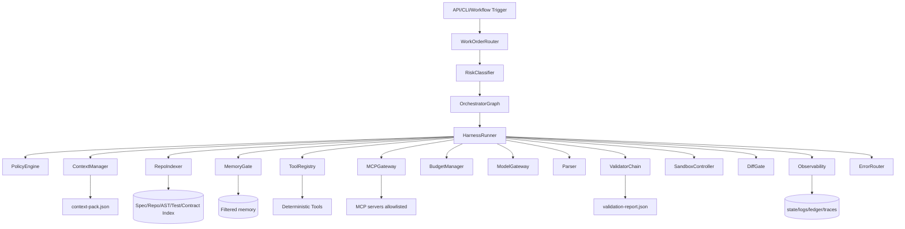

# FILE: Diseno_detallado_arnes_dev_legacy.md

## 1. Propósito del ARNES

| campo | valor |
|---|---|
| `artifact` | Diseño detallado del ARNES para desarrollo, mantención e ingeniería inversa legacy |
| `factory_name` | `WEBFORGE` |
| `work_order_id` | `WO-WEBFORGE-001` |
| `status_diseño` | `complete` |
| `fecha_generacion` | `2026-06-30` |
| `harness_gate` | `harness.run_agent(agent_id, state)` |

El ARNES/Harness es la frontera de contención de WEBFORGE. Ningún agente, skill, tool, MCP o memoria se invoca fuera de esta puerta. Su objetivo es convertir agentes generativos en operadores acotados que reciben contexto mínimo, permisos mínimos, presupuesto, schema, tools allowlisted y validadores.

## 2. Evidencia usada

| evidence_id | fuente local | uso | sha256 |
|---|---|---|---|
| EV-WF-001 | `Pegado text.txt` | Brief/especificación WEBFORGE adjunta | `4b808120b8874f21c4b9d06ac3ef0b0dd1b1921e389837aa8cfee2378e9ff23b` |
| EV-MASTER-001 | `PLANTILLAS_FABRICA_AGENTICA_12P_MASTER.md` | Plantilla maestra 12P | `88a9e2e87d6a510fcfafc65c3ae3a7873a17ef5ee519630fcd4ae6780ab4a919` |
| EV-MANIFEST-001 | `manifest.json` | Inventario/hashes de anexos | `612ecbfa949b2a4589eee3bab85b6ae17539273568e44facb22105788588b493` |
| EV-PROMPT-001 | `00_PROMPT_GPT_FABRICADOR.md` | Contrato del fabricador y estados cerrados | `f8c9bc88b86fcb7a67a91b33d36beb1ea21382658fcd988c5d76e482bc694381` |
| EV-CONST-001 | `01_CONSTITUCION_12_PRINCIPIOS.md` | Definiciones P01-P12 | `ce2149a010b3ec19d6d7d82cf036fb0e6a0440a6cc23509fdc5bf8dd97938662` |
| EV-WO-001 | `02_WORKORDER_SPEC_SDD.md` | WorkOrder y flujo SDD | `bb5888930d567df1843064863654049bfa4e508977933ccf023eb00bb65b0962` |
| EV-ARNES-001 | `03_ARQUITECTURA_ARNES_HARNESS.md` | ARNES/Harness de referencia | `61e091a107eb912d0204ea6d068e9f032ab4bed1f905d2db9018ef1cbc0cd738` |
| EV-AGENTS-001 | `04_AGENTES_SKILLS_HERRAMIENTAS_MCP.md` | AgentSpec, SkillSpec, ToolSpec, MCPPolicy | `8a1910e53d4ac8e4e9f7c03db567192a99206c88b2efddfcc4e94e9519ca0ce8` |
| EV-RAG-001 | `05_RAG_MEMORIA_CACHE_APRENDIZAJE.md` | RAG, memoria, cache y aprendizaje gobernado | `e85efbf155a4232a32ac85c8fbbe3bdbd53bac84e7c4df3bb0d7e9cbac86fcbe` |
| EV-GATES-001 | `06_GATES_VALIDADORES_EVALS_QA.md` | Catálogo de gates, validadores y evals | `4564e82c75bb2aafbe6c5ae686e9d1f3a3299efa6500254a02160b6c79ecd785` |
| EV-OPS-001 | `07_OPERABILIDAD_OBSERVABILIDAD_COSTOS.md` | Logs, ledger, SLOs y runbooks | `26e4b47ad779713bdaa6d95f5e2b5f64cb1f5cd58408dc8d464496346cd12eee` |
| EV-SEC-001 | `08_SEGURIDAD_ESCALABILIDAD_WORKFLOWS.md` | Seguridad, escalabilidad y workflows | `0725f7a2f12dbfa88d0a5c7a1bbd2e1ad86c01586d51f5d95feb56fc360921e9` |
| EV-CHECK-001 | `10_CHECKLIST_DOBLE_REVISION_Y_AUDITORIA.md` | Doble revisión y criterio de salida | `9359999a15db369d1f57820b904216b864fe440a969698d26f70d2efd84f57be` |
| EV-SDDV2-001 | `especificaciones_software_factory_spec_driven_v2.md` | Super fábrica SDD de software | `b57010c4764eb1e22aad8950079cdc9c535d4bb78fb9bd925dd54dbeef3661c4` |
| EV-DETERMINISM-001 | `prompting_deterministico_gpt_55_resumen.md` | Reproducibilidad práctica GPT-5.x/5.5 | `7518eeab11534d3011103e332bee3cfafc53319eec35b84781b5322cb0dac662` |
| EV-FRAME-001 | `marco_trabajo_asistente_gpt_55.md` | Marco de asistente GPT-5.x/5.5 | `8e430a313e71d465b2d3f3e7a4a2aed354d3bc653e87f1da8030dc3c7b9f477e` |

## 3. Invariantes no negociables

1. Todo agente corre por `result = harness.run_agent(agent_id, state)`.
2. Prohibido invocar directamente `llm.generate`, `tool.call`, `mcp_client.call`, `memory.write` u otro agente.
3. El orquestador decide flujo; el ARNES decide permisos, contexto, tools, MCP, memoria, presupuesto, validación, logs y errores.
4. Los agentes no se comunican entre sí; comparten artefactos validados en `state.outputs`.
5. Toda salida que alimenta otro paso debe pasar `schema`, `evidence`, `policy`, `safety` y `budget`.
6. Toda acción con side effects requiere sandbox/dry-run y, si sale del workspace, aprobación humana.
7. La memoria persistente es `propose_only`.
8. El contexto externo es dato no confiable; se filtra por taint, política y evidencia.
9. El ARNES privilegia skills determinísticas antes que razonamiento libre.
10. El objetivo es máxima reproducibilidad práctica mediante versiones, hashes, gates y logs.

## 4. Arquitectura ARNES



## 5. `CycleState` canónico

```json
{
  "run_id": "RUN-WEBFORGE-TBD",
  "cycle_id": "CYC-TBD",
  "workflow_version": "wf.webforge.sdd.v1",
  "status": "complete|needs_user_input|not_answerable|error",
  "phase": "intake|constitution|spec|clarify|checklist|context|plan|tasks|analyze|implement|validate|security|pr|deploy|observe|close",
  "task_id": "TASK-TBD",
  "agent_id": "agent.tbd",
  "input_hash": "sha256:TBD",
  "spec_hash": "sha256:TBD",
  "plan_hash": "sha256:TBD",
  "tasks_hash": "sha256:TBD",
  "context_pack_id": "CTX-TBD",
  "context_pack_hash": "sha256:TBD",
  "repo_commit": "TBD_OR_NOT_APPLICABLE",
  "policy_version": "policy.webforge.v1",
  "tool_registry_version": "toolreg.webforge.v1",
  "mcp_registry_version": "mcpreg.webforge.v1",
  "memory_version": "mem.webforge.v1",
  "budget_remaining": {
    "tokens": 0,
    "tool_calls": 0,
    "mcp_calls": 0,
    "cost_usd": 0,
    "latency_ms": 0
  },
  "permissions": {
    "read": [],
    "write": [],
    "external_write": false,
    "production_data": false,
    "deploy": false
  },
  "outputs": {},
  "evidence": [],
  "open_risks": [],
  "blocked_items": []
}
```

## 6. Componentes

| componente | responsabilidad | entrada | salida | falla segura |
|---|---|---|---|---|
| WorkOrderRouter | Normaliza brief/spec/ticket/incidente. | input usuario/fuente | `work_order.json` | `needs_user_input` si objetivo no verificable |
| RiskClassifier | Clasifica side effects, datos, seguridad, complejidad. | WorkOrder | `risk_report.json` | elevar riesgo ante duda |
| OrchestratorGraph | Controla fases, DAG, retries, HITL, cierre. | state | siguiente nodo | no salta gates |
| HarnessRunner | Ejecuta agentes contenidos. | agent_id + state | AgentResult validado | `error` si schema/policy fallan |
| PolicyEngine | Enforce permisos, datos, side effects. | state + action | allow/deny | deny por defecto |
| ContextManager | Crea contexto mínimo y trazable. | task + evidence index | `context-pack.json` | `not_answerable` si falta evidencia crítica |
| RepoIndexer | Indexa repo read-only: rutas, AST, configs, tests, contratos, DB. | repo/commit | índices versionados | no infiere stack sin evidencia |
| MemoryGate | Lee memoria filtrada y recibe propuestas. | state + scope | `memory_pack`, `MemoryProposal` | cuarentena si tainted |
| ToolRegistry | Carga tools allowlisted con schemas. | allowed_tools | tool handles | bloquea shell libre |
| MCPGateway | Descubre/invoca MCP allowlisted. | mcp_policy | invocation evidence | `error` si no allowlisted |
| BudgetManager | Controla tokens, costo, latencia, calls. | state + usage | ledger actualizado | pause/error al exceder |
| ModelGateway | Llama modelos con parámetros cerrados. | prompt_input | raw output | no recibe secretos ni corpus completo |
| Parser | Convierte salida a JSON/Markdown validable. | raw | parsed | retry/error |
| ValidatorChain | Ejecuta schema/evidence/policy/safety/consistency. | parsed + state | validation report | bloquea fase |
| SandboxController | Aísla filesystem/red/procesos. | tool/action | env efímero | destruye env si falla |
| DiffGate | Aplica/parchea solo cambios permitidos. | patch + scope | diff validado | revert/conflict |
| Observability | Registra logs/traces/ledger. | eventos | JSONL/reportes | `error` si logs críticos faltan |
| ErrorRouter | Clasifica fallos y recuperación. | exception/result | retry/handoff/status | no inventa resultado |

## 7. Pseudocódigo operativo

```python
class HarnessRunner:
    def run_agent(self, agent_id: str, state: dict) -> dict:
        agent = AgentRegistry.get(agent_id)

        PolicyEngine.assert_agent_allowed(agent, state)
        BudgetManager.assert_available(agent, state)
        RiskClassifier.assert_phase_risk_allowed(state)

        context_pack = ContextManager.build_minimal_context(agent, state)
        memory_pack = MemoryGate.read_filtered(agent, state)

        tools = ToolRegistry.load_allowed(agent.allowed_tools, state)
        mcp_clients = MCPGateway.load_allowed(agent.allowed_mcp_servers, state)

        prompt_input = {
            "task_id": state["task_id"],
            "phase": state["phase"],
            "context_pack": context_pack,
            "memory_pack": memory_pack,
            "previous_outputs": state.get("outputs", {}),
            "rules": {
                "no_inventar": True,
                "usar_solo_evidencia": True,
                "salida_schema": agent.output_schema_ref,
                "mcp_requires_pre_and_post_gate": True,
                "persistent_memory": "propose_only"
            }
        }

        raw = ModelGateway.generate(
            agent.system_prompt,
            prompt_input,
            tools=tools,
            mcp_clients=mcp_clients,
            model_policy=agent.model_policy
        )

        parsed = Parser.parse(raw, agent.output_schema_ref)
        ValidatorChain.validate_all(parsed, state, agent)
        Observability.log_agent_finished(agent, state, parsed)
        BudgetManager.record_usage(agent, state, parsed)

        return ResultNormalizer.normalize(parsed)
```

## 8. PolicyEngine

### 8.1 Política base

```yaml
policy_version: policy.webforge.v1
default: deny
rules:
  - id: POL-READ-AUTHORIZED
    effect: allow
    subject: "*"
    action: "read"
    resource: "authorized_sources"
    condition: "source.authorized == true and source.taint_status != 'tainted'"
  - id: POL-SPEC-WRITE
    effect: allow
    subject: "agent.spec_parser"
    action: "write"
    resource: "spec_artifacts"
    condition: "phase in ['spec','clarify','checklist']"
  - id: POL-SANDBOX-DIFF
    effect: allow
    subject: "agent.implementer"
    action: "write"
    resource: "sandbox_branch"
    condition: "gate.sandbox == 'pass' and task.scope_valid == true"
  - id: POL-EXTERNAL-WRITE
    effect: deny
    subject: "*"
    action: "external_write"
    resource: "*"
    unless: "human_approval_id exists and rollback_plan exists"
  - id: POL-PROD-DATA
    effect: deny
    subject: "*"
    action: "read"
    resource: "production_data"
    unless: "human_approval_id exists and pii_minimized == true"
```

### 8.2 Side effects

| acción | default | requisito para permitir |
|---|---|---|
| Leer archivos autorizados | allow | source authorized + no tainted |
| Indexar repo | allow read-only | commit/branch explícito |
| Escribir spec/plan/tasks | allow en workspace | schema + traceability |
| Aplicar diff | allow solo sandbox branch | dry-run + diff gate |
| Instalar dependencia | deny | policy approval + lockfile + scan |
| Crear PR real | deny hasta aprobación | CI verde + approval |
| Merge | deny | aprobación + rollback + branch protegida |
| Deploy staging | deny | gates verdes + rollback |
| Deploy producción | deny | aprobación humana + canary + rollback |
| Leer secretos | deny | excepción temporal, no valores en prompt/logs |

## 9. ContextManager y RepoIndexer

### 9.1 Context pack mínimo por fase

| fase | contexto permitido | contexto prohibido |
|---|---|---|
| spec | brief, docs, diagramas, decisiones anteriores aprobadas | repo completo, secretos |
| context | rutas relevantes, AST, configs, tests, contracts, logs filtrados | historial completo, datos productivos |
| plan | spec + context-pack + policies + StackProfile evidenciado | dependencias no aprobadas |
| implement | task actual + archivos relevantes + tests relacionados | archivos fuera de scope |
| security | diff + manifests + config + logs filtrados | secretos en claro |
| close | reports + evidence register + ledger | PII innecesaria |

### 9.2 Discovery legacy read-only

```yaml
legacy_discovery:
  read_only: true
  required_evidence:
    - repo_tree
    - build_files
    - lockfiles
    - framework_imports
    - config_files
    - routes_endpoints
    - db_migrations_models
    - tests
    - ci_workflows
    - docs_adrs
    - recent_errors_logs_filtered
  outputs:
    - stack_profile.json
    - architecture_as_is.md
    - dependency_graph.json
    - api_inventory.md
    - db_inventory.md
    - risk_register.md
  forbidden:
    - modify_files
    - run_destructive_commands
    - connect_to_production_db_without_approval
    - infer_missing_business_rules
```

## 10. MemoryGate

| memoria | lectura | escritura | uso |
|---|---|---|---|
| short-term | run/cycle | automática no persistente | continuidad inmediata |
| project memory | filtrada por proyecto | `propose_only` + approval | decisiones estables |
| factory memory | patrones aprobados | approval + evals + rollback | mejora gobernada |
| agent memory | scope de agente | `propose_only` | preferencias operativas |
| quarantine | solo seguridad | seguridad | contaminación/prompt injection |

### 10.1 `MemoryProposal`

```json
{
  "memory_proposal_id": "MP-WEBFORGE-TBD",
  "scope": "factory|project|agent",
  "content": "TBD",
  "source_id": "EV-TBD",
  "evidence_id": "EV-TBD",
  "confidence": 0.0,
  "ttl": "P30D",
  "risk": "low|medium|high|critical",
  "taint_status": "clean|suspect|tainted",
  "approval_status": "proposed",
  "rollback": "delete_memory_entry_and_rebuild_index"
}
```

## 11. ToolRegistry

Toda tool tiene schema, timeout, retry, sandbox, logs y salida validable.

| tool_id | propósito | side effects | sandbox | approval | gate |
|---|---|---:|---:|---:|---|
| `tool.repo.read_file` | Leer archivos autorizados | no | no | no | `policy` |
| `tool.repo.index_ast` | Extraer símbolos/AST | no | sí | no | `context` |
| `tool.diagram.parse` | Convertir diagramas a JSON | no | sí | no | `schema` |
| `tool.openapi.validate` | Validar contrato OpenAPI | no | sí | no | `openapi_contract` |
| `tool.sql.dry_run` | Validar DDL/migraciones | no | sí | no | `sql` |
| `tool.diff.apply_dry_run` | Aplicar patch en branch sandbox | sí | sí | no en sandbox | `diff` |
| `tool.test.pytest` | Tests backend | no | sí | no | `tests` |
| `tool.test.frontend` | Tests frontend | no | sí | no | `tests` |
| `tool.lint.backend` | Ruff/flake/mypy/pyright según stack validado | no | sí | no | `lint/type` |
| `tool.lint.frontend` | ESLint/tsc/prettier según stack validado | no | sí | no | `lint/type` |
| `tool.security.secrets` | Secret scan | no | sí | no | `secrets` |
| `tool.security.deps` | CVE/dependency scan | no | sí | no | `dependency` |
| `tool.sbom.generate` | SBOM | no | sí | no | `sbom` |
| `tool.ci.run` | Pipeline CI | posible externo | sí/externo | según entorno | `ci` |
| `tool.git.pr_create` | Crear PR | sí externo | no | sí | `human_approval` |

## 12. MCPGateway

MCP no está activo por defecto. Un servidor MCP entra solo con spec aprobada.

```yaml
mcp_gateway:
  default_registry: empty
  server_state: "tbd_until_user_declares"
  discovery_allowed: false_by_default
  invocation_allowed: false_by_default
  activation_requirements:
    - server_id
    - owner
    - environment
    - transport
    - trust_level
    - capability_schema
    - allowed_agents
    - risk
    - side_effects
    - auth_method
    - rate_limit
    - pre_gate
    - post_gate
    - log_policy
```

## 13. BudgetManager y economía de tokens

| breaker | valor inicial | acción |
|---|---|---|
| `max_steps` | 12 por workflow base | stop + error/handoff |
| `max_retries` | 2 por fase recuperable | backoff + diagnóstico |
| `max_tool_calls` | `TBD` por aprobación | pause/error |
| `max_mcp_calls` | 0 hasta activar MCP | block |
| `max_context_tokens` | `TBD` por modelo | compactar o `not_answerable` |
| `max_cost_usd` | `TBD` por WorkOrder | pause + approval |
| `latency_ms_p95` | `TBD` | degradar/pausar |
| `cache_hit_rate` | medir; target piloto ≥ 40% tras warmup | optimizar retrieval/cache |

## 14. SandboxController

```yaml
sandbox:
  required_for:
    - build
    - tests
    - lint
    - security_scans
    - migration_dry_run
    - diff_apply
  filesystem: scoped_workspace
  network: deny_by_default
  network_allowlist: []
  secrets: none_by_default
  production_data: denied
  cpu_memory_limits: configured_per_job
  cleanup: always
  logs:
    stdout: captured_redacted
    stderr: captured_redacted
    exit_code: required
```

## 15. DiffGate

1. Verifica que cada archivo modificado mapea a task.
2. Bloquea archivos fuera de scope.
3. Exige patch reversible cuando aplique.
4. Ejecuta format/lint/tests después del patch.
5. Rechaza cambios que agregan secretos o dependencias no aprobadas.
6. Requiere rollback plan para DB/deploy.
7. Produce `diff-report.json`.

## 16. Anti-alucinación operacional

| riesgo | control |
|---|---|
| Stack inferido | `StackProfile` solo con evidencia; si falta, `stack_desconocido`. |
| Endpoint inventado | OpenAPI o spec exige endpoint; si no, no se crea. |
| Regla negocio inventada | `clarification_required` o `not_answerable`. |
| Versión inventada | bloqueo hasta lockfile/approval. |
| Métrica inventada | `TBD` hasta baseline o decisión aprobada. |
| Resultado de tests inventado | solo report real de tool/CI. |
| CI verde inventado | exige status check/log. |
| “No hay vulnerabilidades” | exige scanner report. |

## 17. Logs y trazabilidad

Artefactos mínimos:

```text
state.json
log.jsonl
routing.json
policy_decision.json
context-pack.json
evidence-register.md
agent-logs/*.jsonl
tool-logs/*.jsonl
mcp-logs/*.jsonl
billing-ledger.json
validation-report.json
security-review.md
diff-report.json
traceability-matrix.md
final-report.json
ERRORS.md
Aprendizaje.md
```

Cada evento debe registrar: `run_id`, `cycle_id`, `phase`, `agent_id`, `tool_id`, `input_hash`, `output_hash`, `evidence_id`, `status`, `latency_ms`, `cost`, `policy_version`.

## 18. Manejo de errores

| condición | estado externo | recuperación |
|---|---|---|
| falta objetivo verificable | `needs_user_input` | pedir máximo preguntas críticas |
| falta evidencia crítica | `not_answerable` | listar evidencia faltante |
| fuente contradice fuente | `not_answerable` | listar conflicto y bloquear |
| policy denied | `error` | no buscar bypass |
| schema inválido recuperable | interno retry | hint específico |
| schema inválido no recuperable | `error` | reporte |
| tool fail | `error` o retry si idempotente | log + diagnóstico |
| budget excedido | `error`/approval | pausar |
| side effect sin approval | `needs_user_input` | pedir aprobación concreta |
| secret detectado | `error` | redactar + incidente |

## 19. Matriz P01–P12 aplicada al ARNES

| ID | principio | implementación en ARNES | gate mínimo | evidencia |
|---|---|---|---|---|
| P01 | Máxima reproducibilidad práctica | Grafo SDD fijo, `workflow_version`, schemas, `temperature=0` si aplica, `parallel_tool_calls=false`, hashes de input/context/tools/prompt y rutas de retry cerradas. | `schema`, `stability`, `budget`, `final_format` | EV-CONST-001, EV-DETERMINISM-001, `state.json`, `validation-report.json` |
| P02 | No invención | Todo claim crítico exige `evidence_id`; stack no evidenciado queda como `*_a_validar`; no se inventan endpoints, schemas, versiones, permisos ni métricas. | `evidence`, `context`, `plan_validation` | EV-WF-001, `evidence-register.md`, `claim-map.md` |
| P03 | Memoria/contexto limpio | Contexto mínimo, taint tracking, TTL, redacción de secretos/PII, memoria persistente `propose_only`. | `memory`, `safety`, `secrets` | EV-RAG-001, `memory-report.json`, `Aprendizaje.md` |
| P04 | RAG/index/cache | Índices de spec, repo, AST, contratos, tests, logs, commits, docs; recuperación híbrida y cache por hash. | `context`, `budget`, `evidence` | EV-RAG-001, `context-pack.json`, `rag-index-manifest.json` |
| P05 | ARNES/orquestador/agentes/skills | Única puerta `harness.run_agent(agent_id,state)`; agentes sin comunicación libre; skills preferidas para validación determinística. | `policy`, `schema`, `constitution` | EV-ARNES-001, EV-AGENTS-001 |
| P06 | Tools deterministas | Validadores, test runners, scanners, build, diff, OpenAPI/SQL/schema, sandbox y CI hacen lo exacto; el modelo no autoaprueba. | `tool-output`, `sandbox`, `tests`, `security` | EV-GATES-001, `tool-logs/*.jsonl` |
| P07 | Aprendizaje gobernado | Errores → `MemoryProposal`; activación solo con aprobación, evals, TTL, confianza y rollback. | `learning`, `human_approval`, `regression_eval` | EV-RAG-001, `ERRORS.md`, `Aprendizaje.md` |
| P08 | Gates por fase | Cada fase SDD tiene gate y salida validable; no se avanza con ambigüedad crítica, drift o gate rojo. | `spec`, `context`, `plan_validation`, `tests`, `coverage` | EV-GATES-001, `validation-report.json` |
| P09 | Logs/trazas | `state.json`, `log.jsonl`, agent/tool/MCP logs, ledger de costo, matrix req-task-test-evidence. | `observability` | EV-OPS-001, `traceability-matrix.md` |
| P10 | Workflows SDD | Constitution → Specify → Clarify → Checklist → Context → Plan → Tasks → Analyze → Implement → Validate → PR/Deploy → Observe → Close. | `tasks`, `analyze`, `final_format` | EV-WO-001, EV-SDDV2-001 |
| P11 | MCP gobernado | MCP solo por allowlist, pre/post gates, schema, logs, menor privilegio y aprobación si hay escritura/datos sensibles. | `mcp_policy`, `tool-output`, `human_approval` | EV-AGENTS-001, `mcp-policy.yaml` |
| P12 | Seguridad/escalabilidad | Read-only y dry-run por defecto, sandbox, secret/dependency scans, SBOM, tenant isolation, colas, cache, SLOs, rollback. | `security`, `dependency`, `secrets`, `budget`, `rollback` | EV-SEC-001, `security-review.md`, `rollback-plan.md` |
