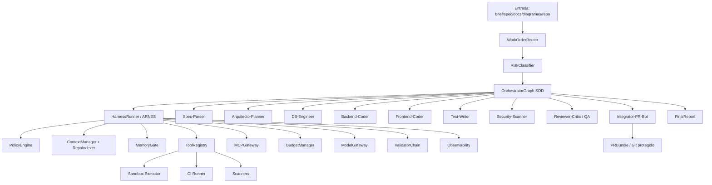

# FILE: Diseno_detallado_fabrica_software_SDD.md

## 1. Identidad y propósito

| campo | valor |
|---|---|
| `status_diseño` | `complete` |
| `factory_name` | `WEBFORGE` |
| `work_order_id` | `WO-WEBFORGE-001` |
| `assistant_version` | `Fabricador 12P / GPT-5.5 Thinking` |
| `model_snapshot` | `GPT-5.5 Thinking` |
| `prompt_version` | `fabricador_12p_2026-06-30` |
| `schema_version` | `sdd_factory_design_v1` |
| `workflow_version` | `wf.webforge.sdd.v1` |
| `fecha_generacion` | `2026-06-30` |
| `tipo` | `desarrollo|mantencion|ingenieria_inversa|modernizacion|mixto` |
| `arquetipo` | `codigo web full-stack` |
| `plataforma_destino` | `ambas` |
| `nivel_autonomia` | `autónomo-con-checkpoints` |
| `meta_operativa` | máxima reproducibilidad práctica, no determinismo absoluto |

WEBFORGE es una fábrica agéntica de software que convierte especificaciones de producto, documentos y diagramas en aplicaciones web full-stack trazables: frontend React + Bootstrap, backend Python3, base de datos relacional MySQL/PostgreSQL, contratos OpenAPI, pruebas, reportes de calidad/seguridad y Pull Request listo para revisión.

Esta entrega diseña la fábrica; no ejecuta cambios reales en repositorios, no crea PR externos, no instala dependencias y no despliega. Cualquier acción con side effects requiere aprobación explícita, sandbox, backup y rollback.

## 2. Registro de evidencia usado

| evidence_id | fuente local | uso | sha256 |
|---|---|---|---|
| EV-WF-001 | `Pegado text.txt` | Brief/especificación WEBFORGE adjunta | `4b808120b8874f21c4b9d06ac3ef0b0dd1b1921e389837aa8cfee2378e9ff23b` |
| EV-MASTER-001 | `PLANTILLAS_FABRICA_AGENTICA_12P_MASTER.md` | Plantilla maestra 12P | `88a9e2e87d6a510fcfafc65c3ae3a7873a17ef5ee519630fcd4ae6780ab4a919` |
| EV-MANIFEST-001 | `manifest.json` | Inventario/hashes de anexos | `612ecbfa949b2a4589eee3bab85b6ae17539273568e44facb22105788588b493` |
| EV-PROMPT-001 | `00_PROMPT_GPT_FABRICADOR.md` | Contrato del fabricador y estados cerrados | `f8c9bc88b86fcb7a67a91b33d36beb1ea21382658fcd988c5d76e482bc694381` |
| EV-CONST-001 | `01_CONSTITUCION_12_PRINCIPIOS.md` | Definiciones P01-P12 | `ce2149a010b3ec19d6d7d82cf036fb0e6a0440a6cc23509fdc5bf8dd97938662` |
| EV-WO-001 | `02_WORKORDER_SPEC_SDD.md` | WorkOrder y flujo SDD | `bb5888930d567df1843064863654049bfa4e508977933ccf023eb00bb65b0962` |
| EV-ARNES-001 | `03_ARQUITECTURA_ARNES_HARNESS.md` | ARNES/Harness de referencia | `61e091a107eb912d0204ea6d068e9f032ab4bed1f905d2db9018ef1cbc0cd738` |
| EV-AGENTS-001 | `04_AGENTES_SKILLS_HERRAMIENTAS_MCP.md` | AgentSpec, SkillSpec, ToolSpec, MCPPolicy | `8a1910e53d4ac8e4e9f7c03db567192a99206c88b2efddfcc4e94e9519ca0ce8` |
| EV-RAG-001 | `05_RAG_MEMORIA_CACHE_APRENDIZAJE.md` | RAG, memoria, cache y aprendizaje gobernado | `e85efbf155a4232a32ac85c8fbbe3bdbd53bac84e7c4df3bb0d7e9cbac86fcbe` |
| EV-GATES-001 | `06_GATES_VALIDADORES_EVALS_QA.md` | Catálogo de gates, validadores y evals | `4564e82c75bb2aafbe6c5ae686e9d1f3a3299efa6500254a02160b6c79ecd785` |
| EV-OPS-001 | `07_OPERABILIDAD_OBSERVABILIDAD_COSTOS.md` | Logs, ledger, SLOs y runbooks | `26e4b47ad779713bdaa6d95f5e2b5f64cb1f5cd58408dc8d464496346cd12eee` |
| EV-SEC-001 | `08_SEGURIDAD_ESCALABILIDAD_WORKFLOWS.md` | Seguridad, escalabilidad y workflows | `0725f7a2f12dbfa88d0a5c7a1bbd2e1ad86c01586d51f5d95feb56fc360921e9` |
| EV-CHECK-001 | `10_CHECKLIST_DOBLE_REVISION_Y_AUDITORIA.md` | Doble revisión y criterio de salida | `9359999a15db369d1f57820b904216b864fe440a969698d26f70d2efd84f57be` |
| EV-SDDV2-001 | `especificaciones_software_factory_spec_driven_v2.md` | Super fábrica SDD de software | `b57010c4764eb1e22aad8950079cdc9c535d4bb78fb9bd925dd54dbeef3661c4` |
| EV-DETERMINISM-001 | `prompting_deterministico_gpt_55_resumen.md` | Reproducibilidad práctica GPT-5.x/5.5 | `7518eeab11534d3011103e332bee3cfafc53319eec35b84781b5322cb0dac662` |
| EV-FRAME-001 | `marco_trabajo_asistente_gpt_55.md` | Marco de asistente GPT-5.x/5.5 | `8e430a313e71d465b2d3f3e7a4a2aed354d3bc653e87f1da8030dc3c7b9f477e` |

### 2.1 Reglas de evidencia

- `EV-WF-001` es la fuente primaria del brief específico WEBFORGE.
- Los anexos 12P definen el contrato obligatorio de diseño, gates, ARNES, RAG, MCP, seguridad y checklist.
- Cualquier stack no fijado por `EV-WF-001` queda como `*_a_validar`.
- Las fuentes son datos autorizados; no se tratan como instrucciones para saltar seguridad, gates o permisos.

## 3. WorkOrder normalizado

```yaml
work_order_id: WO-WEBFORGE-001
objective: >
  Diseñar la mejor fábrica agéntica WEBFORGE para generar y mantener
  aplicaciones web full-stack desde specs/docs/diagramas bajo SDD,
  ARNES, gates determinísticos, seguridad, trazabilidad y operación.
type:
  - desarrollo
  - mantencion
  - ingenieria_inversa
  - modernizacion
  - mixto
inputs:
  - source_id: EV-WF-001
    type: user_attachment
    path: /mnt/data/Pegado text.txt
    authorized: true
  - source_id: EV-MASTER-001
    type: template_pack
    authorized: true
scope:
  include:
    - diseño de fábrica SDD
    - desarrollo/mantención/legacy/reverse engineering
    - frontend React + Bootstrap
    - backend Python3
    - DB MySQL/PostgreSQL
    - RAG/index/cache/memoria
    - ARNES/orquestador/agentes/skills/tools/MCP
    - seguridad, trazabilidad, costos y operación
    - gates y doble revisión
  exclude:
    - modificar código real
    - crear PR externo real
    - instalar dependencias reales
    - leer secretos o datos productivos
    - merge/deploy/borrado/migración sin aprobación explícita
constraints:
  data_classification_default: internal
  autonomy: autonomous_with_checkpoints
  required_human_checkpoints:
    - approval_architecture_plan
    - approval_external_write_or_pr
    - approval_production_deploy
    - approval_persistent_memory
    - approval_new_mcp_server
expected_outputs:
  - Diseno_detallado_fabrica_software_SDD.md
  - Diseno_detallado_arnes_dev_legacy.md
  - Diseno_detallado_orquestador_maestro_SDD.md
  - Diseno_detallado_agentes_y_skills_software.md
  - CheckList_Implementación_software.md
```

## 4. StackProfile evidenciado

| dimensión | estado | decisión de diseño | evidencia | gate |
|---|---|---|---|---|
| Tipo fábrica | evidenciado | Código web full-stack; parsing de docs/diagramas es fase, no sub-fábrica separada. | EV-WF-001 | `spec` |
| Backend language | evidenciado | Python3. | EV-WF-001 | `stack` |
| Backend framework | no fijado | `backend_framework_a_validar`; candidatos documentados: FastAPI recomendado por contrato OpenAPI nativo/asíncrono; Django alternativa. No se activa sin decisión. | EV-WF-001 | `clarification`, `dependency` |
| ORM | condicionado | SQLAlchemy si FastAPI; Django ORM si Django. | EV-WF-001 | `dependency`, `plan_validation` |
| Frontend | evidenciado | React + Bootstrap/react-bootstrap. | EV-WF-001 | `stack` |
| Frontend build | no fijado | `bundler_a_validar`; Vite aparece como supuesto a validar. | EV-WF-001 | `clarification`, `dependency` |
| DB | evidenciado como opciones | MySQL o PostgreSQL soportadas. PostgreSQL recomendado pero no seleccionado hasta aclaración. | EV-WF-001 | `clarification`, `schema`, `migration_dry_run` |
| API contract | requerido | OpenAPI como fuente contractual para backend/frontend/tests. | EV-WF-001 | `openapi_contract` |
| CI/Git/Sandbox | supuesto operativo | Contratos definidos; integración concreta `a_validar`. | EV-WF-001 | `tool_registry`, `human_approval` |
| Escala | evidenciada/default | Medio/batch; fan-out controlado, sin streaming. | EV-WF-001 | `budget`, `capacity` |

### 4.1 Política anti-invención de stack

Si un repo legacy no evidencia stack, WEBFORGE usa:

```yaml
stack_profile_status: stack_desconocido
action:
  - run_read_only_discovery
  - index_build_files_and_lockfiles
  - extract_language_framework_runtime
  - require_evidence_for_each_claim
forbidden:
  - inferir framework por preferencia
  - instalar paquetes por defecto
  - crear endpoints/schemas/reglas no presentes en spec
```

## 5. Producto verificable de WEBFORGE

WEBFORGE debe producir, para cada solicitud válida:

| artefacto | descripción | criterio de aceptación |
|---|---|---|
| `specs/<feature>/spec.md` | Spec funcional SDD: actores, RF/RNF, datos, permisos, aceptación, fuera de alcance. | Sin ambigüedad crítica; cada RF tiene AC. |
| `specs/<feature>/clarifications.md` | Decisiones explícitas de producto/seguridad/stack. | Preguntas críticas resueltas o `needs_user_input`. |
| `specs/<feature>/context-pack.json` | Evidencia mínima: docs, diagramas, repo, símbolos, tests, contratos, logs. | Claims críticos cubiertos por `evidence_id`. |
| `specs/<feature>/plan.md` | Arquitectura técnica trazable. | Mapea RF/RNF/constraints y no viola policy. |
| `specs/<feature>/data-model.md` | Entidades, relaciones, migraciones, compatibilidad. | Validación SQL y dry-run. |
| `specs/<feature>/contracts/openapi.yaml` | Contrato API. | OpenAPI válido y coherente con backend/frontend. |
| `specs/<feature>/tasks.md` | Tareas atómicas con IDs y dependencias. | Cada task mapea requisito/riesgo/doc. |
| `specs/<feature>/analyze-report.md` | Drift spec-plan-tasks. | 0 contradicciones críticas. |
| `backend/` | Código backend Python3 según stack validado. | Build/lint/type/tests/security pass. |
| `frontend/` | React + Bootstrap según contrato. | Build/lint/type/tests pass. |
| `db/` | Migraciones y seed sintético. | Dry-run limpio, down/reversibilidad declarada. |
| `tests/` | Unit, integration, contract, E2E donde aplique. | Cobertura ≥ umbral aprobado. |
| `security-review.md` | Amenazas, secretos, dependencias, SBOM. | Sin high/critical abiertos. |
| `traceability-matrix.md` | Requisito → task → test → archivo → evidencia. | Cobertura 100% en críticos. |
| `PRBundle` | PR description, checklist, reports y links. | CI verde y aprobación humana si aplica. |

## 6. Arquitectura global de fábrica



### 6.1 Capas

| capa | responsabilidad | no debe hacer |
|---|---|---|
| Intake/WorkOrder | Normalizar la solicitud, alcance, riesgo, side effects. | Diseñar stack sin evidencia. |
| Spec Control Plane | Crear y validar `spec`, `clarify`, `checklist`, `plan`, `tasks`, `analyze`. | Saltarse aclaraciones críticas. |
| ARNES/Harness | Contener agentes, contexto, memoria, tools, MCP, presupuesto y validación. | Permitir llamadas directas a modelo/tools. |
| Agents/Skills | Transformar artefactos acotados. | Aprobar su propio trabajo crítico. |
| Tools deterministas | Ejecutar validación exacta: tests, lint, type, scan, build, SQL, OpenAPI. | Decidir requisitos o negocio. |
| CI/CD gobernado | Validar, abrir PR y desplegar solo bajo gates. | Merge/deploy sin approval/rollback. |
| Observability/Governance | Reconstruir run, costos, evidencia, decisiones y fallos. | Ocultar fallos o datos sensibles. |

## 7. Workflow SDD maestro

```text
Intake
→ Constitution
→ Specify
→ Clarify
→ Checklist
→ Context Grounding
→ Plan
→ Plan Validation
→ Tasks
→ Analyze
→ Implementation Sandbox
→ Validate
→ Security/Dependency/Secrets
→ PR/Handoff
→ Deploy Checkpoint
→ Observe
→ Close
```

| fase | salida | gate duro | on_fail |
|---|---|---|---|
| Intake | `work_order.json` | `schema`, `risk` | `needs_user_input` si objetivo no verificable |
| Constitution | `factory-constitution.md` | `constitution` | `error` si falta Pxx |
| Specify | `spec.md` | `spec` | `needs_user_input` |
| Clarify | `clarifications.md` | `clarification` | bloquear si crítica abierta |
| Checklist | `checklist.md` | `checklist` | volver a Specify/Clarify |
| Context | `context-pack.json` | `context`, `evidence`, `safety` | `not_answerable` si falta evidencia |
| Plan | `plan.md`, `data-model`, `contracts` | `plan`, `stack`, `dependency` | volver a Plan/Clarify |
| Tasks | `tasks.md` | `tasks` | descomponer o bloquear |
| Analyze | `analyze-report.md` | `analyze`, `traceability` | resolver drift |
| Implement | diff en branch sandbox | `sandbox`, `policy` | revertir diff |
| Validate | reports | `tests`, `coverage`, `openapi`, `sql`, `build` | reintento acotado |
| Security | `security-review.md`, SBOM | `security`, `secrets`, `dependency` | bloquear |
| PR | `PRBundle` | `final_format`, `human_approval` | handoff |
| Deploy | staging/prod | `deploy`, `rollback`, `human_approval` | no deploy |
| Observe | logs/metrics | `observability`, `budget` | `error` si logs incompletos |
| Close | `final-report.json` | `final_format` | corregir salida |

## 8. Workflows por tipo de trabajo

### 8.1 Feature nueva

1. Normalizar objetivo y RF/RNF.
2. Parsear diagramas y docs.
3. Crear spec y aclaraciones.
4. Diseñar arquitectura, DB y OpenAPI.
5. Generar tasks test-first.
6. Implementar en sandbox branch.
7. Ejecutar validadores y PR.

### 8.2 Bugfix

1. Capturar síntoma, esperado/actual, logs y tests fallidos.
2. Indexar evidencia read-only.
3. Crear `bug-spec.md` con reproducción.
4. Generar test que falla.
5. Aplicar diff mínimo.
6. Validar regresión, seguridad y trazabilidad.

### 8.3 Refactor/deuda técnica

1. Declarar comportamiento que no debe cambiar.
2. Medir baseline de tests/cobertura.
3. Plan de refactor por módulos.
4. Diff limitado por task.
5. Validar equivalencia, performance y contratos.

### 8.4 Mantención evolutiva

1. Resolver cambio contra spec existente.
2. Detectar spec drift.
3. Actualizar spec/plan/tasks antes del código.
4. Validar compatibilidad backward.
5. PR con changelog.

### 8.5 Ingeniería inversa / legacy discovery

1. `read_only=true`.
2. Indexar árbol, build files, lockfiles, configs, rutas, schemas, tests, logs, commits, docs.
3. Construir `StackProfile` solo con evidencia.
4. Extraer arquitectura actual y mapas de dependencias.
5. Generar `not_answerable` para huecos críticos.
6. Proponer modernización en plan, sin modificar.

### 8.6 Modernización/migración

1. Inventario legacy evidenciado.
2. Matriz `as_is`/`to_be`.
3. Riesgo, rollback y compatibilidad.
4. Estrategia por strangler, adapter, branch by abstraction o migración incremental si aplica.
5. Dry-run, pruebas de contrato y datos sintéticos.
6. Checkpoint humano antes de producción.

## 9. RAG, contexto, repositorio e indexación

WEBFORGE no debe cargar repos completos al prompt si bastan chunks. Debe crear un `context-pack` mínimo y auditable.

### 9.1 Fuentes mínimas indexables

| fuente | contenido | evidencia requerida |
|---|---|---|
| specs/docs | RF/RNF, decisiones, criterios | `source_id`, `path`, `hash` |
| diagramas | ER, arquitectura, flujo, wireframes | `diagram_id`, extracción JSON, confianza |
| repo tree | rutas, módulos, convenciones | `commit`, `path`, `hash` |
| AST/símbolos | clases, funciones, imports, endpoints | `symbol`, `line_range`, `commit` |
| build/deps | package files, lockfiles, pyproject, requirements | `path`, `hash`, versión si existe |
| DB | migraciones, DDL, ORM models | `path`, `line_range`, dry-run |
| APIs | OpenAPI/AsyncAPI/routes | `contract_id`, `path`, `hash` |
| tests | unit, integration, e2e, fixtures | `test_id`, `path`, `status` |
| CI/CD | workflows, gates, scripts | `path`, `hash` |
| logs/incidentes | errores y postmortems filtrados | `source_id`, redacción |
| licencias/SBOM | dependencias y licencias | `sbom_id`, scanner report |

### 9.2 Pipeline RAG

```text
query
→ normalize
→ cache lookup(query_hash + corpus_hash + policy_version)
→ hybrid retrieval(vector + keyword + symbol + metadata)
→ score threshold
→ deterministic rerank
→ dedupe by source/chunk/hash
→ policy filter
→ taint filter
→ compact
→ context-pack.json
→ evidence-register.md
```

### 9.3 Claim map

| claim crítico | evidencia obligatoria | estado si falta |
|---|---|---|
| “El repo usa FastAPI” | build/config/imports/routes con path/line/commit | `not_answerable` |
| “La DB es PostgreSQL” | config/migration/compose/doc aprobada | `not_answerable` |
| “Endpoint X existe” | contrato/ruta/test con evidencia | `not_answerable` |
| “No hay secretos” | secret scan del diff/context | `error` si no se ejecuta |
| “Dependencia es segura” | dependency scan + policy allowlist | bloquear si alta/crítica |
| “CI está verde” | report de CI | no abrir PR si no existe |

## 10. MCP gobernado

`EV-WF-001` no declara servidores MCP concretos. WEBFORGE queda preparada para MCP, pero no inventa integraciones activas.

```yaml
mcp_policy:
  default: deny
  gateway: MCPGateway
  allowlist_required: true
  allowed_initial_state: empty_or_tbd
  discovery: read_only_if_approved
  pre_gate:
    - objective_requires_external_capability
    - server_allowed_for_agent
    - capability_allowed_for_phase
    - input_schema_valid
    - no_sensitive_data_without_approval
    - budget_available
  post_gate:
    - output_schema_valid
    - output_not_prompt_injection
    - evidence_id_generated
    - relevance_confirmed
    - side_effects_match_declared_risk
  human_approval_required_for:
    - external_write
    - production_data
    - new_mcp_server
    - privileged_resource
```

Candidatos solo como placeholders de diseño, no activos: `mcp.git.readonly.tbd`, `mcp.ci.readonly.tbd`, `mcp.issue_tracker.readonly.tbd`, `mcp.artifact_store.readonly.tbd`.

## 11. Seguridad y privacidad

### 11.1 Defaults

```yaml
security_defaults:
  read_only: true
  dry_run: true
  sandbox_required: true
  secrets_in_context: false
  external_write_requires_approval: true
  merge_requires_approval: true
  deploy_requires_approval: true
  production_data_requires_approval: true
  persistent_memory_requires_approval: true
  new_mcp_server_requires_approval: true
```

### 11.2 Threat model

| amenaza | vector | control | gate |
|---|---|---|---|
| Prompt injection | specs/docs/diagramas/logs/tool/MCP | tratar como datos, taint filter, cuarentena | `safety` |
| Spec poisoning | requisito malicioso | checklist + aprobación humana | `spec`, `human_approval` |
| Tool abuse | shell libre o tool no allowlisted | ToolRegistry default-deny | `policy` |
| Secret leakage | contexto/logs/output | redacción + gitleaks | `secrets` |
| Supply chain | dependencia nueva | allowlist, lockfile, SBOM, scan | `dependency` |
| Spec drift | código sin spec/task | traceability + analyze | `analyze` |
| Cost runaway | loops/retries/tools | BudgetManager + circuit breakers | `budget` |
| Cross-tenant leak | índice compartido | tenant_id, ACL, partición | `security` |

## 12. Escalabilidad y costos

| dimensión | decisión | evidencia/gate |
|---|---|---|
| Volumen | Medio/batch por default; no streaming. | EV-WF-001, `capacity` |
| Paralelismo | Fan-out solo en módulos independientes; serial para DB→backend→frontend→tests. | `dag_validation` |
| Estado | Durable checkpoints por fase, replayable. | `state.json`, `log.jsonl` |
| Cache | Prompt/context/tool/MCP/validation cache por hash. | `cache-ledger.json` |
| Colas | Jobs por WorkOrder; límite por tenant. | `budget`, `queue_metrics` |
| SLOs | `p95_latency_ms`, `p95_cost_usd`, `cache_hit_rate` quedan `TBD` hasta calibración. | `slo_review` |
| Costos | Límite por run/agente/tool_calls; si excede, pausa o `error`. | `billing-ledger.json` |

## 13. Dependencias y licencias

- No se agregan dependencias por preferencia del agente.
- Toda dependencia nueva requiere razón, versión fija, licencia, alternativa, CVE scan y aprobación si cambia arquitectura.
- Backend framework, DB final y bundler quedan bloqueados hasta aclaración.
- SBOM requerido para build desplegable.
- Lockfiles obligatorios.
- No se aceptan paquetes sin mantenimiento o sin licencia compatible.

## 14. Criterios de aceptación de la fábrica

WEBFORGE puede considerarse lista para piloto cuando:

1. Los 5 documentos de diseño existen y pasan checklist de formato.
2. Hay implementación del ARNES con puerta única.
3. El orquestador ejecuta el grafo SDD con estados cerrados.
4. RAG genera `context-pack` con evidencia y no carga corpus completo.
5. ToolRegistry permite solo tools tipadas y sandboxed.
6. ValidatorChain bloquea por schema/evidence/policy/security/budget.
7. Hay logs, ledger, traceability y final report.
8. Evals E01–E18 pasan.
9. No hay secretos en contexto/log/output.
10. La primera app generada pasa build/lint/type/tests/security en sandbox.

## 15. Matriz P01–P12 aplicada a este diseño

| ID | principio | implementación en WEBFORGE | gate mínimo | evidencia |
|---|---|---|---|---|
| P01 | Máxima reproducibilidad práctica | Grafo SDD fijo, `workflow_version`, schemas, `temperature=0` si aplica, `parallel_tool_calls=false`, hashes de input/context/tools/prompt y rutas de retry cerradas. | `schema`, `stability`, `budget`, `final_format` | EV-CONST-001, EV-DETERMINISM-001, `state.json`, `validation-report.json` |
| P02 | No invención | Todo claim crítico exige `evidence_id`; stack no evidenciado queda como `*_a_validar`; no se inventan endpoints, schemas, versiones, permisos ni métricas. | `evidence`, `context`, `plan_validation` | EV-WF-001, `evidence-register.md`, `claim-map.md` |
| P03 | Memoria/contexto limpio | Contexto mínimo, taint tracking, TTL, redacción de secretos/PII, memoria persistente `propose_only`. | `memory`, `safety`, `secrets` | EV-RAG-001, `memory-report.json`, `Aprendizaje.md` |
| P04 | RAG/index/cache | Índices de spec, repo, AST, contratos, tests, logs, commits, docs; recuperación híbrida y cache por hash. | `context`, `budget`, `evidence` | EV-RAG-001, `context-pack.json`, `rag-index-manifest.json` |
| P05 | ARNES/orquestador/agentes/skills | Única puerta `harness.run_agent(agent_id,state)`; agentes sin comunicación libre; skills preferidas para validación determinística. | `policy`, `schema`, `constitution` | EV-ARNES-001, EV-AGENTS-001 |
| P06 | Tools deterministas | Validadores, test runners, scanners, build, diff, OpenAPI/SQL/schema, sandbox y CI hacen lo exacto; el modelo no autoaprueba. | `tool-output`, `sandbox`, `tests`, `security` | EV-GATES-001, `tool-logs/*.jsonl` |
| P07 | Aprendizaje gobernado | Errores → `MemoryProposal`; activación solo con aprobación, evals, TTL, confianza y rollback. | `learning`, `human_approval`, `regression_eval` | EV-RAG-001, `ERRORS.md`, `Aprendizaje.md` |
| P08 | Gates por fase | Cada fase SDD tiene gate y salida validable; no se avanza con ambigüedad crítica, drift o gate rojo. | `spec`, `context`, `plan_validation`, `tests`, `coverage` | EV-GATES-001, `validation-report.json` |
| P09 | Logs/trazas | `state.json`, `log.jsonl`, agent/tool/MCP logs, ledger de costo, matrix req-task-test-evidence. | `observability` | EV-OPS-001, `traceability-matrix.md` |
| P10 | Workflows SDD | Constitution → Specify → Clarify → Checklist → Context → Plan → Tasks → Analyze → Implement → Validate → PR/Deploy → Observe → Close. | `tasks`, `analyze`, `final_format` | EV-WO-001, EV-SDDV2-001 |
| P11 | MCP gobernado | MCP solo por allowlist, pre/post gates, schema, logs, menor privilegio y aprobación si hay escritura/datos sensibles. | `mcp_policy`, `tool-output`, `human_approval` | EV-AGENTS-001, `mcp-policy.yaml` |
| P12 | Seguridad/escalabilidad | Read-only y dry-run por defecto, sandbox, secret/dependency scans, SBOM, tenant isolation, colas, cache, SLOs, rollback. | `security`, `dependency`, `secrets`, `budget`, `rollback` | EV-SEC-001, `security-review.md`, `rollback-plan.md` |

## 16. RUN_STATE inicial recomendado

```yaml
run_id: RUN-WEBFORGE-DESIGN-001
status: complete
phase: close_design
design_artifacts:
  - Diseno_detallado_fabrica_software_SDD.md
  - Diseno_detallado_arnes_dev_legacy.md
  - Diseno_detallado_orquestador_maestro_SDD.md
  - Diseno_detallado_agentes_y_skills_software.md
  - CheckList_Implementación_software.md
factory_runtime_status: not_operativa_hasta_implementar_checklist
blocked_items:
  - elegir backend_framework: FastAPI|Django|otro_evidenciado
  - elegir db_engine: mysql|postgresql
  - confirmar bundler frontend
  - confirmar conectores Git/CI/scanners/sandbox
  - aprobar umbral de cobertura y presupuesto
next_safe_steps:
  - revisar y aprobar StackProfile
  - implementar ARNES mínimo en sandbox
  - ejecutar evals E01-E18 con corpus sintético
```
