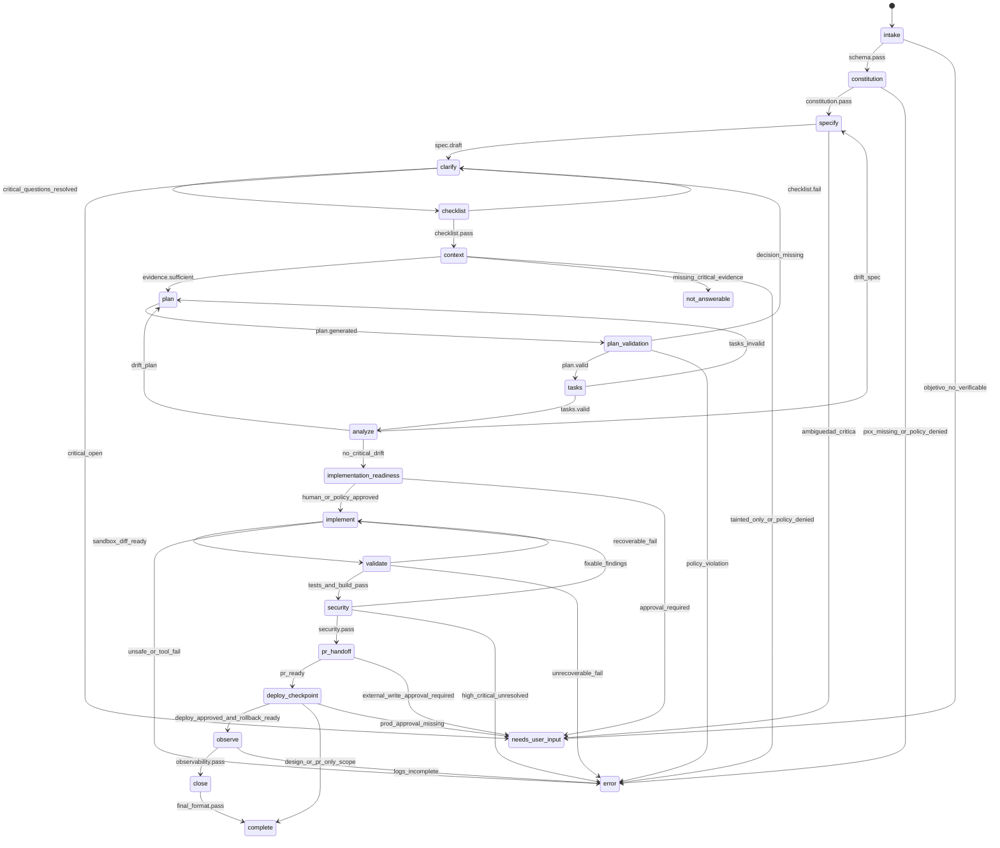
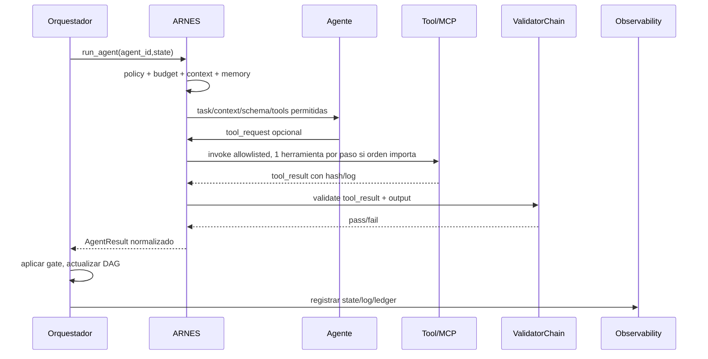

# FILE: Diseno_detallado_orquestador_maestro_SDD.md

## 1. Propósito

| campo | valor |
|---|---|
| `artifact` | Diseño detallado del Orquestador Maestro SDD |
| `factory_name` | `WEBFORGE` |
| `work_order_id` | `WO-WEBFORGE-001` |
| `status_diseño` | `complete` |
| `fecha_generacion` | `2026-06-30` |
| `workflow_version` | `wf.webforge.sdd.v1` |
| `exit_states` | `complete`, `needs_user_input`, `not_answerable`, `error` |

El Orquestador Maestro es el único componente que decide el flujo de WEBFORGE. No genera contenido libre ni ejecuta herramientas directamente; despacha agentes por ARNES, aplica gates y consolida artefactos. Su responsabilidad es convertir una entrada en un run SDD auditable: spec, contexto, plan, tareas, análisis, implementación contenida, validación, seguridad, PR/handoff y cierre.

## 2. Evidencia usada

| evidence_id | fuente local | uso | sha256 |
|---|---|---|---|
| EV-WF-001 | `Pegado text.txt` | Brief/especificación WEBFORGE adjunta | `4b808120b8874f21c4b9d06ac3ef0b0dd1b1921e389837aa8cfee2378e9ff23b` |
| EV-MASTER-001 | `PLANTILLAS_FABRICA_AGENTICA_12P_MASTER.md` | Plantilla maestra 12P | `88a9e2e87d6a510fcfafc65c3ae3a7873a17ef5ee519630fcd4ae6780ab4a919` |
| EV-MANIFEST-001 | `manifest.json` | Inventario/hashes de anexos | `612ecbfa949b2a4589eee3bab85b6ae17539273568e44facb22105788588b493` |
| EV-PROMPT-001 | `00_PROMPT_GPT_FABRICADOR.md` | Contrato del fabricador y estados cerrados | `f8c9bc88b86fcb7a67a91b33d36beb1ea21382658fcd988c5d76e482bc694381` |
| EV-CONST-001 | `01_CONSTITUCION_12_PRINCIPIOS.md` | Definiciones P01-P12 | `ce2149a010b3ec19d6d7d82cf036fb0e6a0440a6cc23509fdc5bf8dd97938662` |
| EV-WO-001 | `02_WORKORDER_SPEC_SDD.md` | WorkOrder y flujo SDD | `bb5888930d567df1843064863654049bfa4e508977933ccf023eb00bb65b0962` |
| EV-ARNES-001 | `03_ARQUITECTURA_ARNES_HARNESS.md` | ARNES/Harness de referencia | `61e091a107eb912d0204ea6d068e9f032ab4bed1f905d2db9018ef1cbc0cd738` |
| EV-AGENTS-001 | `04_AGENTES_SKILLS_HERRAMIENTAS_MCP.md` | AgentSpec, SkillSpec, ToolSpec, MCPPolicy | `8a1910e53d4ac8e4e9f7c03db567192a99206c88b2efddfcc4e94e9519ca0ce8` |
| EV-RAG-001 | `05_RAG_MEMORIA_CACHE_APRENDIZAJE.md` | RAG, memoria, cache y aprendizaje gobernado | `e85efbf155a4232a32ac85c8fbbe3bdbd53bac84e7c4df3bb0d7e9cbac86fcbe` |
| EV-GATES-001 | `06_GATES_VALIDADORES_EVALS_QA.md` | Catálogo de gates, validadores y evals | `4564e82c75bb2aafbe6c5ae686e9d1f3a3299efa6500254a02160b6c79ecd785` |
| EV-OPS-001 | `07_OPERABILIDAD_OBSERVABILIDAD_COSTOS.md` | Logs, ledger, SLOs y runbooks | `26e4b47ad779713bdaa6d95f5e2b5f64cb1f5cd58408dc8d464496346cd12eee` |
| EV-SEC-001 | `08_SEGURIDAD_ESCALABILIDAD_WORKFLOWS.md` | Seguridad, escalabilidad y workflows | `0725f7a2f12dbfa88d0a5c7a1bbd2e1ad86c01586d51f5d95feb56fc360921e9` |
| EV-CHECK-001 | `10_CHECKLIST_DOBLE_REVISION_Y_AUDITORIA.md` | Doble revisión y criterio de salida | `9359999a15db369d1f57820b904216b864fe440a969698d26f70d2efd84f57be` |
| EV-SDDV2-001 | `especificaciones_software_factory_spec_driven_v2.md` | Super fábrica SDD de software | `b57010c4764eb1e22aad8950079cdc9c535d4bb78fb9bd925dd54dbeef3661c4` |
| EV-DETERMINISM-001 | `prompting_deterministico_gpt_55_resumen.md` | Reproducibilidad práctica GPT-5.x/5.5 | `7518eeab11534d3011103e332bee3cfafc53319eec35b84781b5322cb0dac662` |
| EV-FRAME-001 | `marco_trabajo_asistente_gpt_55.md` | Marco de asistente GPT-5.x/5.5 | `8e430a313e71d465b2d3f3e7a4a2aed354d3bc653e87f1da8030dc3c7b9f477e` |

## 3. Grafo SDD maestro



## 4. Tabla de fases

| fase | objetivo | agente principal | salida | gates | término |
|---|---|---|---|---|---|
| `intake` | Normalizar WorkOrder, alcance, side effects. | `agent.intake` | `work_order.json` | `schema`, `risk`, `budget` | objetivo verificable |
| `constitution` | Aplicar P01-P12 y prohibiciones. | `agent.constitution` | `constitution.md` | `constitution` | 12P sin huecos |
| `specify` | RF/RNF, actores, AC, fuera de alcance. | `agent.spec_parser` | `spec.md` | `spec`, `schema` | spec testeable |
| `clarify` | Cerrar decisiones críticas. | `agent.clarifier` | `clarifications.md` | `clarification` | sin preguntas críticas |
| `checklist` | Verificar calidad de requisitos. | `agent.requirements_qa` | `checklist.md` | `checklist` | critical=pass |
| `context` | Recuperar evidencia autorizada. | `agent.context_rag` | `context-pack.json` | `context`, `evidence`, `safety` | evidencia suficiente |
| `plan` | Arquitectura, DB, API, UI, DAG técnico. | `agent.architect_planner` | `plan.md`, contracts, data model | `plan`, `stack`, `dependency` | plan trazable |
| `tasks` | Tareas atómicas test-first. | `agent.task_planner` | `tasks.md` | `tasks` | cada task mapea requisito |
| `analyze` | Detectar drift spec-plan-tasks. | `agent.consistency_reviewer` | `analyze-report.md` | `analyze`, `traceability` | 0 críticos |
| `implement` | Ejecutar tasks en sandbox branch. | coders/workers | diff + task status | `sandbox`, `diff`, `policy` | diff válido |
| `validate` | Build/lint/type/tests/coverage/OpenAPI/SQL. | `agent.qa` + tools | reports | `tests`, `coverage`, `openapi`, `sql` | todo pass |
| `security` | Threat model, secrets, deps, SBOM. | `agent.security` | `security-review.md` | `security`, `secrets`, `dependency`, `sbom` | sin high/critical |
| `pr_handoff` | Ensamblar PR o handoff. | `agent.integrator_pr` | `PRBundle` | `ci`, `human_approval`, `final_format` | PR listo o handoff |
| `deploy_checkpoint` | Evaluar deploy. | `agent.release_sre` | deploy/rollback plan | `deploy`, `rollback`, `human_approval` | aprobado o scope termina |
| `observe` | Logs, métricas, costos. | `agent.observability_cost` | ledger, traces | `observability`, `budget` | logs completos |
| `close` | Final report y memoria propuesta. | Orquestador | `final-report.json` | `final_format`, `learning` | estado cerrado |

## 5. Routing por tipo de tarea

| tipo WorkOrder | workflow | agentes | gates adicionales |
|---|---|---|---|
| `feature` | `wf.feature_fullstack` | spec, architect, DB, backend, frontend, tests, QA, security, integrator | OpenAPI, UI, contract tests, coverage |
| `bugfix` | `wf.bugfix_regression` | context, reproducer, backend/frontend coder según evidencia, tests, QA | failing test first, regression |
| `refactor` | `wf.refactor_safe` | context, architect, implementer, QA | equivalence, coverage baseline, no behavior drift |
| `security` | `wf.security_hardening` | security, deps, implementer, QA | threat model, secrets, dependency, SBOM |
| `performance` | `wf.performance` | context, architect, implementer, QA/SRE | benchmark baseline, p95, budget |
| `doc` | `wf.docs_sdd` | spec/docs/QA | source evidence, no invented decisions |
| `legacy_discovery` | `wf.legacy_readonly` | context/reverse, architect, security | read-only, evidence coverage |
| `modernization` | `wf.modernization_incremental` | reverse, architect, data/API, QA, SRE | rollback, compatibility, contract tests |
| `mixed` | `wf.composite_dag` | dynamic but scope-closed | per-node gate aggregation |

## 6. Routing por StackProfile

```yaml
routing_rules:
  backend:
    python3:
      framework_fastapi_validated:
        agents: [agent.backend_python, agent.openapi_contract, agent.pytest]
        tools: [tool.lint.backend, tool.test.pytest, tool.openapi.validate]
      framework_django_validated:
        agents: [agent.backend_python, agent.db_engineer, agent.pytest]
        tools: [tool.lint.backend, tool.test.pytest, tool.sql.dry_run]
      framework_unknown:
        route: wf.legacy_readonly
        status_if_missing: not_answerable
  frontend:
    react_bootstrap:
      agents: [agent.frontend_react, agent.frontend_tests]
      tools: [tool.lint.frontend, tool.test.frontend, tool.build.frontend]
  database:
    postgresql:
      agents: [agent.db_engineer]
      tools: [tool.sql.dry_run, tool.migration.validate]
    mysql:
      agents: [agent.db_engineer]
      tools: [tool.sql.dry_run, tool.migration.validate]
    unknown:
      route: clarification_or_discovery
```

## 7. Ciclo agéntico



## 8. Estrategia de paralelismo

| zona | paralelismo permitido | razón |
|---|---|---|
| Parsing de diagramas/docs | sí, fan-out por documento | independiente |
| Indexación repo | sí, por tipo de índice | lectura read-only |
| DB model → backend → frontend | no, ordenado | dependencias semánticas |
| Backend endpoints independientes | sí si OpenAPI y DB base congelados | módulos independientes |
| Frontend páginas independientes | sí si contrato API congelado | componentes aislables |
| Tests | sí por suite si no comparten recursos | eficiencia |
| Security/dependency/secrets | sí tras diff estable | independientes |
| PR/deploy | no | side effects y aprobación |

Regla: si hay duda de dependencia, serializar.

## 9. Retries y recuperación

| fallo | retry | acción |
|---|---:|---|
| schema inválido recuperable | 1-2 | retry con error específico |
| tool timeout idempotente | 1 | retry con backoff |
| test fallido por cambio propio | 2 | volver a coder con fallos exactos |
| dependency vulnerability | 0 | bloquear y rediseñar/approval |
| secret detected | 0 | bloquear, redactar, incidente |
| context missing | 1 retrieval alternativo | `not_answerable` si sigue |
| prompt injection detected | 0 | cuarentena + continuar si evidencia suficiente |
| budget exceeded | 0 | pausa/approval/error |
| human approval missing | 0 | `needs_user_input` |
| deploy gate fail | 0 | no deploy |

## 10. HITL

Checkpoints humanos obligatorios:

1. `architecture_plan_approval`: antes de implementar cuando hay stack, datos, seguridad o arquitectura no trivial.
2. `external_write_approval`: antes de crear PR externo real, issues o writes.
3. `dependency_approval`: nueva dependencia o cambio framework.
4. `persistent_memory_approval`: activar aprendizaje.
5. `production_data_approval`: leer datos reales/productivos.
6. `production_deploy_approval`: cualquier despliegue productivo.
7. `new_mcp_server_approval`: agregar servidor/capability MCP.

Formato de aprobación:

```json
{
  "approval_id": "APP-WEBFORGE-TBD",
  "approver": "TBD",
  "scope": "architecture|external_write|dependency|memory|prod_data|deploy|mcp",
  "expires_at": "TBD",
  "rollback_plan_id": "RB-TBD",
  "conditions": [],
  "status": "approved|rejected|expired"
}
```

## 11. Gestión de memoria y drift

### 11.1 Memoria

- El orquestador no lee memoria completa.
- `MemoryGate` entrega memoria filtrada por scope y TTL.
- Las lecciones se guardan como propuesta, no como regla activa.
- Las memorias tainted se cuarentenan y nunca entran al prompt.

### 11.2 Drift

WEBFORGE ejecuta `analyze` en tres momentos:

1. Antes de implementación: spec-plan-tasks.
2. Después de diff: changed-files-task-tests.
3. Antes de cierre: final-report-evidence.

```yaml
drift_gate:
  code_changes_without_task: 0
  tasks_without_requirement_or_risk: 0
  requirements_without_tests: 0
  behavior_changes_without_spec_update: 0
  docs_contradict_spec: 0
```

## 12. Calidad y término

### 12.1 Condición `complete`

El orquestador solo devuelve `complete` si:

- el scope está satisfecho;
- todos los gates críticos aplicables están `pass`;
- no hay `blocking_issues`;
- riesgos residuales están documentados;
- final format usa estados cerrados;
- evidence coverage de claims críticos es 100%;
- logs y ledger son reconstruibles;
- no hay secretos en output/log/context.

### 12.2 Estados cerrados

| estado | uso |
|---|---|
| `complete` | Diseño o ejecución dentro del scope completado con gates aplicables. |
| `needs_user_input` | Falta decisión/aprobación esencial. |
| `not_answerable` | Falta evidencia crítica o fuentes conflictivas. |
| `error` | Fallo de schema, policy, seguridad, presupuesto, tool, formato o logs. |

## 13. `workflow.yaml` de referencia

```yaml
workflow_id: wf.webforge.sdd.v1
version: 1.0.0
entry_conditions:
  - work_order.schema_valid
exit_states: [complete, needs_user_input, not_answerable, error]
max_steps: 12
max_retries: 2
parallel_tool_calls: false
nodes:
  - id: intake
    type: deterministic
    output_schema: WorkOrder
    gates: [schema, budget]
  - id: constitution
    type: validator
    output_schema: Constitution
    gates: [constitution]
  - id: specify
    type: agent
    agent_id: agent.spec_parser
    gates: [schema, spec, evidence]
  - id: context
    type: rag
    agent_id: agent.context_rag
    gates: [context, evidence, safety]
  - id: plan
    type: agent
    agent_id: agent.architect_planner
    gates: [plan, stack, dependency]
  - id: tasks
    type: agent
    agent_id: agent.task_planner
    gates: [tasks, traceability]
  - id: analyze
    type: validator
    agent_id: agent.consistency_reviewer
    gates: [analyze, policy]
  - id: implement
    type: sandbox
    agent_group: implementers
    gates: [sandbox, diff, policy]
  - id: validate
    type: tools
    gates: [build, lint, type, tests, coverage, openapi, sql]
  - id: security
    type: tools
    gates: [security, secrets, dependency, sbom]
  - id: close
    type: deterministic
    gates: [observability, budget, final_format]
```

## 14. Matriz P01–P12 aplicada al orquestador

| ID | principio | implementación en Orquestador Maestro | gate mínimo | evidencia |
|---|---|---|---|---|
| P01 | Máxima reproducibilidad práctica | Grafo SDD fijo, `workflow_version`, schemas, `temperature=0` si aplica, `parallel_tool_calls=false`, hashes de input/context/tools/prompt y rutas de retry cerradas. | `schema`, `stability`, `budget`, `final_format` | EV-CONST-001, EV-DETERMINISM-001, `state.json`, `validation-report.json` |
| P02 | No invención | Todo claim crítico exige `evidence_id`; stack no evidenciado queda como `*_a_validar`; no se inventan endpoints, schemas, versiones, permisos ni métricas. | `evidence`, `context`, `plan_validation` | EV-WF-001, `evidence-register.md`, `claim-map.md` |
| P03 | Memoria/contexto limpio | Contexto mínimo, taint tracking, TTL, redacción de secretos/PII, memoria persistente `propose_only`. | `memory`, `safety`, `secrets` | EV-RAG-001, `memory-report.json`, `Aprendizaje.md` |
| P04 | RAG/index/cache | Índices de spec, repo, AST, contratos, tests, logs, commits, docs; recuperación híbrida y cache por hash. | `context`, `budget`, `evidence` | EV-RAG-001, `context-pack.json`, `rag-index-manifest.json` |
| P05 | ARNES/orquestador/agentes/skills | Única puerta `harness.run_agent(agent_id,state)`; agentes sin comunicación libre; skills preferidas para validación determinística. | `policy`, `schema`, `constitution` | EV-ARNES-001, EV-AGENTS-001 |
| P06 | Tools deterministas | Validadores, test runners, scanners, build, diff, OpenAPI/SQL/schema, sandbox y CI hacen lo exacto; el modelo no autoaprueba. | `tool-output`, `sandbox`, `tests`, `security` | EV-GATES-001, `tool-logs/*.jsonl` |
| P07 | Aprendizaje gobernado | Errores → `MemoryProposal`; activación solo con aprobación, evals, TTL, confianza y rollback. | `learning`, `human_approval`, `regression_eval` | EV-RAG-001, `ERRORS.md`, `Aprendizaje.md` |
| P08 | Gates por fase | Cada fase SDD tiene gate y salida validable; no se avanza con ambigüedad crítica, drift o gate rojo. | `spec`, `context`, `plan_validation`, `tests`, `coverage` | EV-GATES-001, `validation-report.json` |
| P09 | Logs/trazas | `state.json`, `log.jsonl`, agent/tool/MCP logs, ledger de costo, matrix req-task-test-evidence. | `observability` | EV-OPS-001, `traceability-matrix.md` |
| P10 | Workflows SDD | Constitution → Specify → Clarify → Checklist → Context → Plan → Tasks → Analyze → Implement → Validate → PR/Deploy → Observe → Close. | `tasks`, `analyze`, `final_format` | EV-WO-001, EV-SDDV2-001 |
| P11 | MCP gobernado | MCP solo por allowlist, pre/post gates, schema, logs, menor privilegio y aprobación si hay escritura/datos sensibles. | `mcp_policy`, `tool-output`, `human_approval` | EV-AGENTS-001, `mcp-policy.yaml` |
| P12 | Seguridad/escalabilidad | Read-only y dry-run por defecto, sandbox, secret/dependency scans, SBOM, tenant isolation, colas, cache, SLOs, rollback. | `security`, `dependency`, `secrets`, `budget`, `rollback` | EV-SEC-001, `security-review.md`, `rollback-plan.md` |
