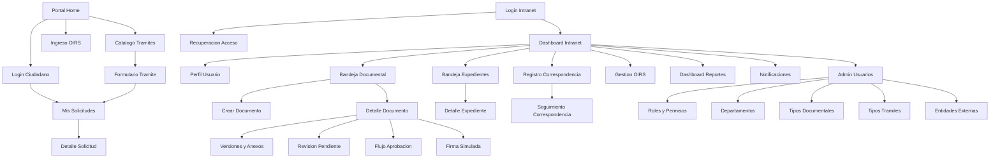

# Mapa de Pantallas y Navegacion

## SIGED-Lampa

Version: `v0.1`

Estado: `Base UX funcional`

Fuentes:

- [Especificacion_Funcional_SIGED_Lampa.md](C:\Users\lmata\Documents\Universidad\Agentes\Nueva Fabrica Software Web\Especificacion_Funcional_SIGED_Lampa.md:416)
- [Inventario_Endpoints_SIGED_Lampa.md](C:\Users\lmata\Documents\Universidad\Agentes\Nueva Fabrica Software Web\Inventario_Endpoints_SIGED_Lampa.md:1)

## 1. Proposito

Este documento define la estructura de navegacion de la aplicacion web `SIGED-Lampa`, cubriendo las 30 pantallas base comprometidas en la especificacion funcional. Su objetivo es:

- ordenar la experiencia web de intranet y portal ciudadano;
- fijar rutas, accesos y transiciones principales;
- vincular cada pantalla con actor, modulo y endpoints;
- facilitar implementacion de frontend, pruebas E2E y demo final.

## 2. Principios de navegacion

- todo el sistema sera exclusivamente web;
- la navegacion se separa en `intranet` y `portal ciudadano`;
- cada actor vera solo las rutas autorizadas;
- las pantallas transaccionales deben tener breadcrumbs;
- los flujos criticos deben resolverse en no mas de 4 pasos visibles;
- las acciones sensibles deben confirmar antes de ejecutar.

## 3. Zonas del producto

| Zona | Prefijo de ruta | Publico |
|---|---|---|
| Portal publico | `/` | ciudadano anonimo |
| Portal ciudadano autenticado | `/portal` | ciudadano |
| Intranet municipal | `/intranet` | funcionario |
| Administracion | `/intranet/admin` | administrador |
| Reportes | `/intranet/reports` | analista o jefatura |

## 4. Mapa general de navegacion

## 5. Catalogo de rutas y pantallas

| Codigo | Pantalla | Ruta sugerida | Zona | Actor principal | Modulo |
|---|---|---|---|---|---|
| P-01 | Login intranet | `/intranet/login` | intranet | funcionario | M01 |
| P-02 | Login ciudadano | `/login` | portal | ciudadano | M01 |
| P-03 | Recuperacion de acceso | `/recover` | compartida | usuario | M01 |
| P-04 | Perfil de usuario | `/intranet/profile` | intranet | usuario interno | M01 |
| P-05 | Dashboard intranet | `/intranet/dashboard` | intranet | funcionario | M01 |
| P-06 | Gestion de usuarios | `/intranet/admin/users` | administracion | administrador | M02 |
| P-07 | Gestion de roles y permisos | `/intranet/admin/roles` | administracion | administrador | M02 |
| P-08 | Gestion de departamentos | `/intranet/admin/departments` | administracion | administrador | M02 |
| P-09 | Tipos documentales | `/intranet/admin/document-types` | administracion | administrador | M02 |
| P-10 | Tipos de tramites | `/intranet/admin/procedure-types` | administracion | administrador | M02 |
| P-11 | Entidades externas | `/intranet/admin/external-entities` | administracion | administrador | M02 |
| P-12 | Bandeja documental | `/intranet/documents` | intranet | funcionario | M03 |
| P-13 | Crear documento | `/intranet/documents/new` | intranet | funcionario | M03 |
| P-14 | Detalle de documento | `/intranet/documents/:id` | intranet | funcionario | M03 |
| P-15 | Versiones y anexos | `/intranet/documents/:id/assets` | intranet | funcionario | M03 |
| P-16 | Revision pendiente | `/intranet/reviews/:id` | intranet | revisor | M04 |
| P-17 | Flujo de aprobacion | `/intranet/documents/:id/approvals` | intranet | jefatura | M04 |
| P-18 | Firma simulada | `/intranet/documents/:id/signature` | intranet | firmante | M04 |
| P-19 | Bandeja de expedientes | `/intranet/expedients` | intranet | funcionario | M05 |
| P-20 | Detalle de expediente | `/intranet/expedients/:id` | intranet | funcionario | M05 |
| P-21 | Registro de correspondencia | `/intranet/correspondence/new` | intranet | oficina de partes | M06 |
| P-22 | Seguimiento de correspondencia | `/intranet/correspondence` | intranet | funcionario | M06 |
| P-23 | Portal ciudadano home | `/` | portal | ciudadano | M07 |
| P-24 | Catalogo de tramites | `/tramites` | portal | ciudadano | M07 |
| P-25 | Formulario de tramite | `/tramites/:id/apply` | portal | ciudadano | M07 |
| P-26 | Mis solicitudes | `/portal/requests` | portal autenticado | ciudadano | M07 |
| P-27 | Ingreso OIRS | `/oirs` | portal | ciudadano | M08 |
| P-28 | Gestion de OIRS | `/intranet/oirs` | intranet | operador OIRS | M08 |
| P-29 | Dashboard de reportes | `/intranet/reports/dashboard` | reportes | analista | M09 |
| P-30 | Bandeja de notificaciones | `/notifications` o `/intranet/notifications` | compartida | usuario | M10 |

## 6. Detalle funcional por pantalla

| Codigo | Objetivo | Acciones principales | Endpoints dominantes |
|---|---|---|---|
| P-01 | autenticar funcionario | ingresar credenciales, validar 2FA | `API-001` |
| P-02 | autenticar ciudadano | login ciudadano | `API-002` |
| P-03 | recuperar acceso | solicitar recuperacion | `API-003` |
| P-04 | ver y editar perfil | actualizar datos y preferencias | `API-004`, `API-005` |
| P-05 | resumir trabajo pendiente | navegar a modulos, ver KPIs | `API-039`, `API-040` |
| P-06 | administrar usuarios | listar, crear, editar | `API-006`, `API-007`, `API-008` |
| P-07 | administrar roles | ver roles y reasignar permisos | `API-009`, `API-010` |
| P-08 | administrar estructura | listar y crear departamentos | `API-011`, `API-012` |
| P-09 | administrar catalogo documental | listar y crear tipos | `API-013`, `API-014` |
| P-10 | administrar tipos de tramite | ABM de tramites | endpoint futuro derivado de `procedure_types` |
| P-11 | administrar entidades externas | ABM de remitentes y destinatarios | endpoint futuro derivado de `external_entities` |
| P-12 | operar bandeja documental | buscar, filtrar, abrir documento | `API-015` |
| P-13 | crear documento | completar formulario y guardar | `API-016` |
| P-14 | revisar documento | ver metadata, timeline y acciones | `API-017`, `API-018` |
| P-15 | gestionar anexos y versiones | subir archivo, generar version | `API-019`, `API-020` |
| P-16 | responder revision | aprobar o pedir cambios | `API-022` |
| P-17 | secuenciar VB | solicitar y monitorear aprobaciones | `API-023` |
| P-18 | registrar firma | ejecutar firma simulada | `API-024` |
| P-19 | listar expedientes | buscar expedientes y abrir detalle | `API-025` |
| P-20 | ver expediente | revisar documentos y timeline | `API-027`, `API-028` |
| P-21 | registrar ingreso o salida | crear correspondencia | `API-030` |
| P-22 | seguir correspondencia | listar, derivar, vincular respuesta | `API-029`, `API-031`, `API-032` |
| P-23 | presentar portal | informar, enlazar tramites y OIRS | `API-033` |
| P-24 | explorar tramites | buscar y seleccionar tramite | `API-033` |
| P-25 | iniciar tramite | completar formulario y adjuntos | `API-034` |
| P-26 | seguir solicitudes | listar solicitudes propias | `API-035`, `API-036` |
| P-27 | ingresar OIRS | enviar consulta, reclamo o sugerencia | `API-037` |
| P-28 | operar bandeja OIRS | responder y cerrar casos | `API-038` |
| P-29 | monitorear indicadores | filtrar panel y descargar resumen | `API-039` |
| P-30 | revisar alertas | listar notificaciones y marcar leidas | `API-040` |

## 7. Flujos de navegacion criticos

### 7.1 Flujo documental interno

1. `P-01` Login intranet
2. `P-05` Dashboard intranet
3. `P-12` Bandeja documental
4. `P-13` Crear documento
5. `P-14` Detalle de documento
6. `P-15` Versiones y anexos
7. `P-16` Revision pendiente
8. `P-17` Flujo de aprobacion
9. `P-18` Firma simulada

### 7.2 Flujo expediente interno

1. `P-05` Dashboard intranet
2. `P-19` Bandeja de expedientes
3. `P-20` Detalle de expediente
4. desde `P-20`, abrir `P-14` para revisar documentos asociados

### 7.3 Flujo correspondencia

1. `P-05` Dashboard intranet
2. `P-21` Registro de correspondencia
3. `P-22` Seguimiento de correspondencia
4. desde `P-22`, abrir documento respuesta en `P-14`

### 7.4 Flujo ciudadano de tramite

1. `P-23` Portal ciudadano home
2. `P-24` Catalogo de tramites
3. `P-02` Login ciudadano si aplica
4. `P-25` Formulario de tramite
5. `P-26` Mis solicitudes

### 7.5 Flujo ciudadano OIRS

1. `P-23` Portal ciudadano home
2. `P-27` Ingreso OIRS
3. operador municipal entra por `P-28` Gestion de OIRS

## 8. Menus sugeridos

### 8.1 Menu intranet

- Dashboard
- Documentos
- Expedientes
- Correspondencia
- OIRS
- Reportes
- Notificaciones
- Perfil

### 8.2 Menu administracion

- Usuarios
- Roles y permisos
- Departamentos
- Tipos documentales
- Tipos de tramites
- Entidades externas

### 8.3 Menu portal ciudadano

- Inicio
- Tramites
- OIRS
- Mis solicitudes
- Notificaciones
- Mi cuenta

## 9. Reglas UX y comportamiento

- si el usuario no autenticado entra a una ruta protegida, debe redirigirse a login;
- al iniciar sesion, el usuario debe volver a la ultima ruta autorizada o a su dashboard;
- `P-14` y `P-20` deben incorporar breadcrumbs;
- `P-25` y `P-27` deben guardar borrador local solo en navegador si es necesario;
- la intranet y el portal ciudadano deben diferenciarse visualmente;
- toda accion de cierre, firma o eliminacion logica debe pedir confirmacion.

## 10. Riesgos y decisiones abiertas

- `P-10` y `P-11` requieren endpoints administrativos complementarios que aun no estan en el set minimo de 40;
- `P-30` puede resolverse con una sola ruta compartida o con dos entradas visuales distintas segun actor;
- si el tiempo aprieta, algunas pantallas administrativas pueden compartir componentes de tabla y formulario.

## 11. Derivados inmediatos

- wireframes de baja fidelidad;
- mapa de componentes por pantalla;
- plan E2E por flujo critico;
- matriz pantalla-endpoint-tabla;
- backlog frontend por vista.
