# Modelo ER Detallado

## SIGED-Lampa

Version: `v0.1`

Estado: `Base de implementacion`

Fuente principal: [Especificacion_Funcional_SIGED_Lampa.md](C:\Users\lmata\Documents\Universidad\Agentes\Nueva Fabrica Software Web\Especificacion_Funcional_SIGED_Lampa.md:1)

## 1. Proposito

Este documento detalla el modelo entidad-relacion objetivo para `SIGED-Lampa`, la aplicacion web de gestion documental municipal. Su objetivo es bajar la especificacion funcional a un esquema implementable sobre base de datos relacional.

Este modelo:

- respeta las 40 tablas definidas en la rubrica;
- ordena las tablas por dominio funcional;
- fija llaves primarias y relaciones principales;
- define campos base y restricciones sugeridas;
- deja lista la base para ORM, migraciones y pruebas.

## 2. Convenciones de modelado

- motor objetivo sugerido: `PostgreSQL`;
- PK por defecto: `id BIGSERIAL PRIMARY KEY`;
- FK con sufijo `_id`;
- fechas operativas: `created_at`, `updated_at`;
- borrado logico cuando aplique: `deleted_at`;
- estados criticos controlados por catalogos o `CHECK`;
- identificadores publicos: `uuid` o `code` cuando el actor externo no deba exponer el `id`.

## 3. Dominios del modelo

| Dominio | Tablas |
|---|---|
| Seguridad | 1-7 |
| Organizacion | 8-9 |
| Gestion documental | 10-21 |
| Expedientes | 22-24 |
| Correspondencia | 25-27 |
| Portal ciudadano | 28-33 |
| OIRS | 34-35 |
| Publicacion y agenda | 36-38 |
| Notificaciones y auditoria | 39-40 |

## 4. Diagrama relacional resumido

```mermaid
erDiagram
    USERS ||--o{ USER_ROLES : has
    ROLES ||--o{ USER_ROLES : grants
    ROLES ||--o{ ROLE_PERMISSIONS : maps
    PERMISSIONS ||--o{ ROLE_PERMISSIONS : includes
    USERS ||--o{ SESSIONS : opens
    USERS ||--o| TWO_FACTOR_SETTINGS : configures
    DEPARTMENTS ||--o{ USERS : contains
    DOCUMENT_TYPES ||--o{ DOCUMENTS : classifies
    DOCUMENT_STATUSES ||--o{ DOCUMENTS : controls
    USERS ||--o{ DOCUMENTS : creates
    DOCUMENTS ||--o{ DOCUMENT_VERSIONS : versions
    DOCUMENTS ||--o{ DOCUMENT_ATTACHMENTS : attaches
    DOCUMENTS ||--o{ DOCUMENT_COMMENTS : comments
    DOCUMENTS ||--o{ DOCUMENT_REVIEW_REQUESTS : sends
    DOCUMENT_REVIEW_REQUESTS ||--o{ DOCUMENT_REVIEW_RESPONSES : answers
    DOCUMENTS ||--o{ DOCUMENT_APPROVALS : requests
    DOCUMENTS ||--o{ DOCUMENT_SIGNATURES : signs
    SIGNATURE_PROFILES ||--o{ DOCUMENT_SIGNATURES : supports
    EXPEDIENTS ||--o{ EXPEDIENT_DOCUMENTS : groups
    DOCUMENTS ||--o{ EXPEDIENT_DOCUMENTS : belongs
    EXPEDIENTS ||--o{ EXPEDIENT_EVENTS : tracks
    EXTERNAL_ENTITIES ||--o{ CORRESPONDENCE : originates
    CORRESPONDENCE ||--o{ CORRESPONDENCE_RECIPIENTS : targets
    CORRESPONDENCE ||--o{ CORRESPONDENCE_ROUTES : routes
    CITIZEN_ACCOUNTS ||--o| CITIZEN_PROFILES : profiles
    PROCEDURE_TYPES ||--o{ PUBLISHED_PROCEDURES : publishes
    PUBLISHED_PROCEDURES ||--o{ CITIZEN_REQUESTS : receives
    CITIZEN_ACCOUNTS ||--o{ CITIZEN_REQUESTS : creates
    CITIZEN_REQUESTS ||--o{ CITIZEN_REQUEST_ATTACHMENTS : attaches
    CITIZEN_ACCOUNTS ||--o{ OIRS_CASES : submits
    OIRS_CASES ||--o{ OIRS_MESSAGES : tracks
    USERS ||--o{ NOTIFICATIONS : receives
    USERS ||--o{ AUDIT_EVENTS : performs
```

## 5. Campos transversales recomendados

Las tablas transaccionales deberian incluir, segun corresponda:

- `created_at TIMESTAMP NOT NULL`
- `updated_at TIMESTAMP NOT NULL`
- `created_by BIGINT NULL`
- `updated_by BIGINT NULL`
- `deleted_at TIMESTAMP NULL`
- `is_active BOOLEAN NOT NULL DEFAULT TRUE`

## 6. Diccionario detallado por tabla

### 6.1 Seguridad

| Tabla | Proposito | PK | FKs principales | Campos clave recomendados |
|---|---|---|---|---|
| `users` | funcionarios y operadores internos | `id` | `department_id -> departments.id` | `uuid`, `username`, `email`, `password_hash`, `full_name`, `job_title`, `status`, `last_login_at` |
| `roles` | roles de acceso | `id` | - | `code`, `name`, `description`, `is_system` |
| `permissions` | permisos atomicos | `id` | - | `code`, `name`, `module_code`, `description` |
| `user_roles` | relacion usuario-rol | `id` | `user_id -> users.id`, `role_id -> roles.id` | `assigned_at`, `assigned_by` |
| `role_permissions` | relacion rol-permiso | `id` | `role_id -> roles.id`, `permission_id -> permissions.id` | `granted_at`, `granted_by` |
| `sessions` | sesiones activas e historicas | `id` | `user_id -> users.id` | `token_hash`, `ip_address`, `user_agent`, `started_at`, `expires_at`, `revoked_at` |
| `two_factor_settings` | configuracion de 2FA | `id` | `user_id -> users.id` | `method`, `secret_hash`, `phone_masked`, `enabled_at`, `disabled_at` |

Restricciones sugeridas:

- `users.username` unico;
- `users.email` unico;
- `roles.code` unico;
- `permissions.code` unico;
- `user_roles` unico por `user_id, role_id`;
- `role_permissions` unico por `role_id, permission_id`;
- `two_factor_settings.user_id` unico.

### 6.2 Organizacion

| Tabla | Proposito | PK | FKs principales | Campos clave recomendados |
|---|---|---|---|---|
| `departments` | unidades municipales | `id` | `parent_department_id -> departments.id`, `manager_user_id -> users.id` | `code`, `name`, `description`, `cost_center`, `status` |
| `external_entities` | personas juridicas u organismos externos | `id` | - | `entity_type`, `name`, `tax_id`, `email`, `phone`, `address`, `contact_name` |

Restricciones sugeridas:

- `departments.code` unico;
- `external_entities.tax_id` unico cuando exista;
- `parent_department_id <> id`.

### 6.3 Gestion documental

| Tabla | Proposito | PK | FKs principales | Campos clave recomendados |
|---|---|---|---|---|
| `document_types` | clasificacion documental | `id` | - | `code`, `name`, `description`, `retention_days`, `requires_signature` |
| `document_templates` | plantillas de documentos | `id` | `document_type_id -> document_types.id` | `code`, `name`, `template_path`, `version_label`, `is_active` |
| `document_statuses` | estados del documento | `id` | - | `code`, `name`, `sort_order`, `is_terminal` |
| `documents` | documento principal | `id` | `document_type_id -> document_types.id`, `status_id -> document_statuses.id`, `owner_user_id -> users.id`, `department_id -> departments.id`, `current_version_id -> document_versions.id` | `uuid`, `folio`, `title`, `summary`, `confidentiality_level`, `origin_type`, `due_date`, `published_at` |
| `document_versions` | versionado formal | `id` | `document_id -> documents.id`, `author_user_id -> users.id` | `version_number`, `content_snapshot`, `change_summary`, `is_major`, `generated_at` |
| `document_attachments` | anexos binarios | `id` | `document_id -> documents.id`, `uploaded_by -> users.id` | `file_name`, `mime_type`, `storage_path`, `file_size`, `checksum_sha256` |
| `document_comments` | comentarios colaborativos | `id` | `document_id -> documents.id`, `author_user_id -> users.id`, `version_id -> document_versions.id` | `comment_type`, `body`, `is_resolved`, `resolved_at`, `resolved_by` |
| `document_review_requests` | solicitudes de revision | `id` | `document_id -> documents.id`, `requested_by -> users.id`, `reviewer_user_id -> users.id` | `review_round`, `instructions`, `status`, `sent_at`, `due_at` |
| `document_review_responses` | respuesta del revisor | `id` | `review_request_id -> document_review_requests.id`, `reviewer_user_id -> users.id` | `decision`, `observations`, `responded_at`, `requires_changes` |
| `document_approvals` | cadena de visto bueno | `id` | `document_id -> documents.id`, `approver_user_id -> users.id`, `requested_by -> users.id` | `sequence_order`, `status`, `requested_at`, `decided_at`, `decision_note` |
| `document_signatures` | firma simulada o integrable | `id` | `document_id -> documents.id`, `signer_user_id -> users.id`, `signature_profile_id -> signature_profiles.id` | `signature_mode`, `signed_at`, `signature_hash`, `signature_status` |
| `signature_profiles` | perfil de firma | `id` | `user_id -> users.id` | `display_name`, `position_label`, `provider`, `certificate_alias`, `is_default` |

Restricciones sugeridas:

- `document_types.code` unico;
- `document_templates.code` unico;
- `document_statuses.code` unico;
- `documents.uuid` unico;
- `documents.folio` unico cuando pase a estado emitido;
- `document_versions` unico por `document_id, version_number`;
- `document_review_requests` con `reviewer_user_id <> requested_by`;
- `document_approvals` unico por `document_id, approver_user_id, sequence_order`.

### 6.4 Expedientes

| Tabla | Proposito | PK | FKs principales | Campos clave recomendados |
|---|---|---|---|---|
| `expedients` | contenedor de caso o tramite interno | `id` | `department_id -> departments.id`, `owner_user_id -> users.id` | `uuid`, `code`, `subject`, `description`, `status`, `opened_at`, `closed_at` |
| `expedient_documents` | relacion expediente-documento | `id` | `expedient_id -> expedients.id`, `document_id -> documents.id`, `linked_by -> users.id` | `relation_type`, `linked_at`, `is_primary` |
| `expedient_events` | timeline de trazabilidad | `id` | `expedient_id -> expedients.id`, `actor_user_id -> users.id`, `document_id -> documents.id` | `event_type`, `event_label`, `payload_json`, `occurred_at` |

Restricciones sugeridas:

- `expedients.uuid` unico;
- `expedients.code` unico;
- `expedient_documents` unico por `expedient_id, document_id`;
- `closed_at >= opened_at`.

### 6.5 Correspondencia

| Tabla | Proposito | PK | FKs principales | Campos clave recomendados |
|---|---|---|---|---|
| `correspondence` | ingreso o salida de correspondencia | `id` | `origin_entity_id -> external_entities.id`, `document_id -> documents.id`, `created_by -> users.id` | `tracking_code`, `direction`, `subject`, `received_at`, `sent_at`, `priority`, `status` |
| `correspondence_recipients` | destinatarios asociados | `id` | `correspondence_id -> correspondence.id`, `external_entity_id -> external_entities.id`, `department_id -> departments.id` | `recipient_type`, `delivery_channel`, `delivery_status` |
| `correspondence_routes` | derivaciones internas | `id` | `correspondence_id -> correspondence.id`, `from_department_id -> departments.id`, `to_department_id -> departments.id`, `assigned_user_id -> users.id` | `route_status`, `routed_at`, `accepted_at`, `closed_at`, `instructions` |

Restricciones sugeridas:

- `correspondence.tracking_code` unico;
- `direction` en `INBOUND`, `OUTBOUND`;
- `to_department_id <> from_department_id`.

### 6.6 Portal ciudadano

| Tabla | Proposito | PK | FKs principales | Campos clave recomendados |
|---|---|---|---|---|
| `citizen_accounts` | acceso del ciudadano | `id` | - | `uuid`, `email`, `password_hash`, `status`, `last_login_at`, `email_verified_at` |
| `citizen_profiles` | datos personales del ciudadano | `id` | `citizen_account_id -> citizen_accounts.id` | `national_id`, `full_name`, `birth_date`, `phone`, `address`, `commune` |
| `procedure_types` | catalogo base de tramites | `id` | `owner_department_id -> departments.id` | `code`, `name`, `description`, `requires_login`, `estimated_days` |
| `published_procedures` | version publicada del tramite | `id` | `procedure_type_id -> procedure_types.id`, `published_by -> users.id` | `slug`, `title`, `instructions`, `requirements_html`, `is_active`, `published_at` |
| `citizen_requests` | solicitud ciudadana | `id` | `citizen_account_id -> citizen_accounts.id`, `published_procedure_id -> published_procedures.id`, `assigned_department_id -> departments.id`, `expedient_id -> expedients.id` | `tracking_code`, `status`, `submitted_at`, `resolved_at`, `resolution_summary` |
| `citizen_request_attachments` | anexos de solicitud | `id` | `citizen_request_id -> citizen_requests.id` | `file_name`, `mime_type`, `storage_path`, `file_size`, `checksum_sha256` |

Restricciones sugeridas:

- `citizen_accounts.email` unico;
- `citizen_profiles.citizen_account_id` unico;
- `citizen_profiles.national_id` unico;
- `procedure_types.code` unico;
- `published_procedures.slug` unico;
- `citizen_requests.tracking_code` unico.

### 6.7 OIRS

| Tabla | Proposito | PK | FKs principales | Campos clave recomendados |
|---|---|---|---|---|
| `oirs_cases` | caso OIRS | `id` | `citizen_account_id -> citizen_accounts.id`, `assigned_department_id -> departments.id`, `assigned_user_id -> users.id` | `tracking_code`, `category`, `channel`, `subject`, `status`, `submitted_at`, `closed_at` |
| `oirs_messages` | intercambio de mensajes OIRS | `id` | `oirs_case_id -> oirs_cases.id`, `author_user_id -> users.id`, `author_citizen_id -> citizen_accounts.id` | `message_direction`, `body`, `attachment_path`, `sent_at`, `read_at` |

Restricciones sugeridas:

- `oirs_cases.tracking_code` unico;
- al menos uno de `author_user_id` o `author_citizen_id` debe existir;
- `closed_at >= submitted_at`.

### 6.8 Publicacion y agenda

| Tabla | Proposito | PK | FKs principales | Campos clave recomendados |
|---|---|---|---|---|
| `news_posts` | noticias municipales | `id` | `author_user_id -> users.id` | `slug`, `title`, `summary`, `content_html`, `published_at`, `status` |
| `public_notices` | avisos visibles al ciudadano | `id` | `author_user_id -> users.id` | `title`, `body_html`, `start_at`, `end_at`, `notice_type`, `status` |
| `calendar_events` | hitos de agenda | `id` | `department_id -> departments.id`, `owner_user_id -> users.id` | `title`, `description`, `start_at`, `end_at`, `audience`, `location`, `status` |

Restricciones sugeridas:

- `news_posts.slug` unico;
- `end_at >= start_at` para avisos y eventos.

### 6.9 Notificaciones y auditoria

| Tabla | Proposito | PK | FKs principales | Campos clave recomendados |
|---|---|---|---|---|
| `notifications` | mensajes al usuario | `id` | `user_id -> users.id`, `citizen_account_id -> citizen_accounts.id` | `channel`, `title`, `body`, `link_url`, `is_read`, `sent_at`, `read_at` |
| `audit_events` | evidencia de acciones del sistema | `id` | `actor_user_id -> users.id`, `actor_citizen_id -> citizen_accounts.id` | `event_name`, `module_code`, `entity_type`, `entity_id`, `ip_address`, `payload_json`, `occurred_at` |

Restricciones sugeridas:

- `notifications` debe apuntar a usuario interno o ciudadano;
- `audit_events.entity_type` y `module_code` no nulos;
- `occurred_at` obligatorio.

## 7. Relaciones de negocio criticas

### 7.1 Seguridad y acceso

- un `user` puede tener muchos `roles`;
- un `role` puede tener muchos `permissions`;
- un `user` puede tener una configuracion activa de `two_factor_settings`;
- `sessions` conserva la trazabilidad de acceso.

### 7.2 Documentos y flujo

- cada `document` pertenece a un `document_type` y a un `document_status`;
- cada `document` puede tener multiples `document_versions`, `document_attachments` y `document_comments`;
- las revisiones, aprobaciones y firmas nacen desde `documents`;
- el documento puede terminar vinculado a `expedients`, `correspondence` o solicitudes ciudadanas.

### 7.3 Expedientes y trazabilidad

- un `expedient` agrupa multiples `documents`;
- `expedient_events` registra eventos del expediente y puede enlazar un documento especifico;
- `audit_events` complementa la trazabilidad tecnica transversal.

### 7.4 Ciudadano y atencion

- un `citizen_account` tiene un `citizen_profile`;
- un `published_procedure` deriva de un `procedure_type`;
- un ciudadano crea `citizen_requests` y `oirs_cases`;
- solicitudes y OIRS pueden derivar a departamentos internos y generar expediente.

## 8. Reglas de integridad recomendadas

- no permitir `documents.current_version_id` apuntando a una version de otro documento;
- no permitir `document_signatures` si el estado documental no habilita firma;
- no permitir `citizen_requests.resolved_at` cuando `status` no sea terminal;
- no permitir `correspondence.sent_at` cuando `direction = INBOUND`;
- no permitir `document_review_responses` sin una `document_review_requests` abierta;
- no permitir `notifications.is_read = TRUE` si `read_at` es nulo.

## 9. Indices sugeridos

- `users(username)`, `users(email)`;
- `documents(folio)`, `documents(status_id)`, `documents(document_type_id)`;
- `document_versions(document_id, version_number DESC)`;
- `expedients(code)`, `expedient_events(expedient_id, occurred_at DESC)`;
- `correspondence(tracking_code)`, `correspondence(status)`;
- `citizen_requests(tracking_code)`, `citizen_requests(citizen_account_id, submitted_at DESC)`;
- `oirs_cases(tracking_code)`, `oirs_cases(status)`;
- `notifications(user_id, is_read)`;
- `audit_events(module_code, occurred_at DESC)`.

## 10. Orden recomendado de migraciones

1. `roles`, `permissions`, `departments`, `external_entities`
2. `users`, `user_roles`, `role_permissions`, `sessions`, `two_factor_settings`
3. `document_types`, `document_templates`, `document_statuses`
4. `documents`, `document_versions`, `document_attachments`, `document_comments`
5. `document_review_requests`, `document_review_responses`, `document_approvals`, `signature_profiles`, `document_signatures`
6. `expedients`, `expedient_documents`, `expedient_events`
7. `correspondence`, `correspondence_recipients`, `correspondence_routes`
8. `citizen_accounts`, `citizen_profiles`, `procedure_types`, `published_procedures`
9. `citizen_requests`, `citizen_request_attachments`, `oirs_cases`, `oirs_messages`
10. `news_posts`, `public_notices`, `calendar_events`, `notifications`, `audit_events`

## 11. Salidas derivadas inmediatas

Desde este documento se deberia construir a continuacion:

- esquema SQL inicial;
- modelos ORM;
- migraciones versionadas;
- seeds de catalogos base;
- matriz tabla-endpoint-caso de uso;
- plan de pruebas de persistencia.
