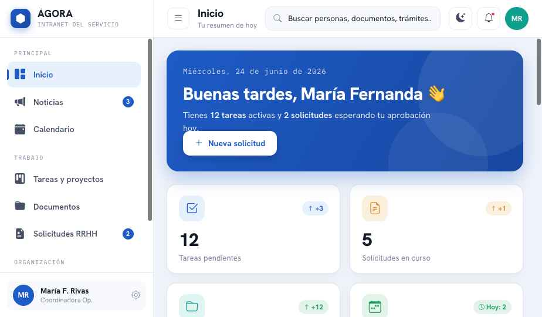

# ÁGORA — Intranet Institucional (Frontend de referencia)

Frontend completo y funcional de una intranet para una institución pública / de gobierno.
Pensado como **referencia de implementación**: un único componente, sistema de diseño con
tokens, 8 módulos navegables, modo claro/oscuro, animaciones, iconos y diseño responsivo.

**Regla WEBFORGE:** esta carpeta es la plantilla frontend obligatoria para todos los
proyectos. La fábrica debe declarar su uso en cada proyecto, versión y sandbox DEV/QA.



---

## 1. Cómo abrirlo

| Archivo | Para qué sirve |
|---|---|
| `dist/intranet-agora-standalone.html` | **Demo offline.** Un solo archivo, sin dependencias. Ábrelo con doble clic en cualquier navegador. Úsalo para mostrar el resultado. |
| `Intranet Agora.dc.html` + `support.js` | **Fuente editable.** El componente real. Requiere `support.js` en la misma carpeta. Sirve un servidor estático (`npx serve`) y ábrelo, o edítalo. |

> Para presentar: usa el standalone. Para modificar o leer el código: usa el `.dc.html`.

---

## 2. Qué incluye (8 módulos)

1. **Inicio** — saludo dinámico según la hora, 4 KPIs, accesos rápidos, documentos recientes, próximos eventos, tareas del día, equipo en línea.
2. **Noticias** — noticia destacada + tarjetas con filtros por categoría.
3. **Calendario** — grilla mensual (con "hoy" y puntos de eventos) + agenda del día.
4. **Tareas y proyectos** — tablero Kanban de 4 columnas (etiquetas, progreso, responsables).
5. **Documentos** — carpetas + archivos, con vista **grilla / lista** conmutable.
6. **Solicitudes RRHH** — tipos de trámite + lista con estados (aprobada, en revisión, pendiente, rechazada) y pasos.
7. **Directorio** — búsqueda en vivo por nombre/cargo + filtro por área.
8. **Indicadores** — KPIs, gráfico de barras, dona (conic-gradient) y cumplimiento por unidad.

**Escenarios interactivos:** toggle claro/oscuro, sidebar colapsable, vista móvil con menú deslizable + backdrop, notificaciones desplegables, búsqueda/filtros, accesos rápidos que navegan entre módulos.

---

## 3. Sistema de diseño (resumen)

- **Tipografía:** `Hanken Grotesk` (UI/títulos) + `IBM Plex Mono` (etiquetas, fechas, datos).
- **Iconos:** [Bootstrap Icons](https://icons.getbootstrap.com/) (`<i class="bi bi-...">`).
- **Color:** todo vía **CSS custom properties** (tokens). Dos temas: claro (`:root`) y oscuro (`[data-theme="dark"]`). Cambiar la marca = cambiar `--brand`.
- **Layout:** grids fluidos (`auto-fit` / `auto-fill` + `minmax`) y flex con `flex-wrap` → responsivo sin media queries (salvo el off-canvas móvil).
- **Animaciones:** `fadeInUp` en cada cambio de módulo, `popIn` en dropdowns, hover lift en tarjetas.

Los tokens completos y las convenciones están en **`AGENTS.md`**.

---

## 4. Llevarlo a producción (React + Bootstrap)

Este prototipo está estructurado para traducirse 1:1 a **React + React-Bootstrap**.
La guía de mapeo (componente por componente, tokens, datos → API) está en
**`HANDOFF-REACT.md`**.

---

## 5. Estructura del repositorio

```
.
├── Intranet Agora.dc.html        # Componente fuente (editable)
├── support.js                    # Runtime necesario para el .dc.html
├── dist/
│   └── intranet-agora-standalone.html   # Demo offline, un solo archivo
├── review/                       # Capturas de cada pantalla
├── README.md                     # Este archivo
├── AGENTS.md                     # Guía para agentes de IA (tokens, convenciones, cómo extender)
└── HANDOFF-REACT.md              # Mapeo a React + Bootstrap para implementación
```
