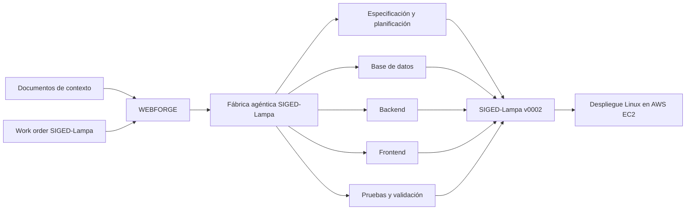

# WEBFORGE y SIGED-Lampa

Fábrica agéntica de software y sistema municipal de gestión documental desarrollado como producto demostrativo mediante un proceso reproducible, trazable y gobernado por agentes especializados.

| Acceso | Destino |
| --- | --- |
| Sistema online declarado | [SIGED-Lampa en AWS EC2](http://34.226.69.214) |
| Documentación final | [PDF de entrega](./docs/ENTREGA_FINAL/01_Documentacion_Proyecto_SIGED_Lampa.pdf) |
| Código del producto | [`project/siged-lampa/versions/v0002/`](./project/siged-lampa/versions/v0002/) |
| Código de WEBFORGE | [`webforge/`](./webforge/) |

## Estado del proyecto

| Componente | Estado | Ubicación |
| --- | --- | --- |
| WEBFORGE | Implementado como runtime local gobernado | [`webforge/`](./webforge/) |
| Fábrica SIGED-Lampa | Instancia configurada, planificada y con evidencias | [`project/siged-lampa/`](./project/siged-lampa/) |
| Producto SIGED-Lampa | Versión funcional `v0002` | [`project/siged-lampa/versions/v0002/`](./project/siged-lampa/versions/v0002/) |
| Despliegue | Online declarado en Linux sobre AWS EC2; la evidencia local de ejecución debe verificarse por separado | [Sistema online](http://34.226.69.214) |
| Documentación | Técnica en Markdown y entrega final en PDF | [`docs/`](./docs/) |
| Pruebas | Suites automatizadas y reportes versionados | [`v0002/runs/phase7ar6c/`](./project/siged-lampa/versions/v0002/runs/phase7ar6c/) |

La documentación final registra 41 tablas de dominio, 98 operaciones API, 35 pantallas, 60 reglas y 100 validaciones para `v0002`. También registra cobertura inferior a 100% y limitaciones de verificación de despliegue; por ello este repositorio no declara el proyecto como completamente terminado.

## WEBFORGE, la fábrica SIGED-Lampa y el producto final

### WEBFORGE

WEBFORGE es el framework reutilizable de fábrica de software del repositorio. Recibe una orden de trabajo y fuentes de contexto para ejecutar un flujo local por fases: intake, constitución, especificación, contexto, planificación, tareas, análisis, implementación, validación, seguridad, handoff, checkpoint de despliegue, observación y cierre. El runtime mantiene work orders, contexto, planificación, evidencia, trazabilidad y validaciones mediante el orquestador y el arnés de ejecución.

La planificación modela agentes especializados, decisiones, un DAG, handoffs y gates. Las políticas controlan herramientas, presupuestos y escrituras externas; la memoria es de ámbito de proyecto. WEBFORGE también posee un `MCPGateway` gobernado por allowlist y registro de invocaciones. Estas capacidades no implican que todos los agentes internos usen automáticamente servidores MCP ni que el DAG de planificación se ejecute como un conjunto autónomo de workers.

WEBFORGE no está limitado a SIGED-Lampa: puede procesar otros proyectos con sus propias fuentes y work orders.

Referencias de implementación: [`webforge/orchestrator.py`](./webforge/orchestrator.py), [`webforge/harness.py`](./webforge/harness.py), [`webforge/policy.py`](./webforge/policy.py), [`webforge/models.py`](./webforge/models.py) y [`examples/work_order_factory.json`](./examples/work_order_factory.json).

### Fábrica agéntica SIGED-Lampa

La fábrica SIGED-Lampa es la instancia de WEBFORGE especializada en el problema municipal. Usa una orden de trabajo específica y documentos de dominio para normalizar requisitos, construir una especificación, producir arquitectura, diseñar datos y contratos, planificar backend y frontend, definir pruebas, validar resultados y registrar evidencia.

Sus artefactos viven bajo [`project/siged-lampa/`](./project/siged-lampa/): fuentes, especificación, arquitectura, memoria y aprendizaje aislados, versiones, sandboxes DEV/QA y trazabilidad de proyecto. Las corridas en [`runs/siged-lampa-latest/`](./runs/siged-lampa-latest/) documentan evidencia del runtime; no sustituyen la versión final del producto. Los sandboxes existentes corresponden a materializaciones históricas y deben diferenciarse de `v0002`.

Referencias: [`examples/work_order_siged_lampa.json`](./examples/work_order_siged_lampa.json), [`project/siged-lampa/sources/`](./project/siged-lampa/sources/), [`project/siged-lampa/versions/`](./project/siged-lampa/versions/) y [`project/siged-lampa/sandboxes/`](./project/siged-lampa/sandboxes/).

### SIGED-Lampa v0002

SIGED-Lampa es el producto de software funcional consolidado mediante la fábrica. `v0002` reúne portal público, portal ciudadano, intranet municipal, administración, documentos, expedientes, correspondencia, OIRS, notificaciones y reportes. Implementa frontend, backend, PostgreSQL, API REST, Docker y configuración de despliegue para EC2.

> WEBFORGE es la plataforma de fabricación, la fábrica SIGED-Lampa es su configuración específica y SIGED-Lampa v0002 es el producto generado y consolidado.



## Documentos fuente y contexto del proyecto

Los documentos Markdown de la raíz y sus copias canónicas en [`project/siged-lampa/sources/`](./project/siged-lampa/sources/) fueron entradas de contexto para la fábrica. No son código ejecutable ni resultados generados automáticamente: describen el dominio para comprender el problema, normalizar requisitos, identificar entidades, generar tareas, diseñar arquitectura y API, construir pantallas y mantener trazabilidad.

| Documento | Propósito | Uso dentro de la fábrica |
| --- | --- | --- |
| [Especificación funcional](./project/siged-lampa/sources/Especificacion_Funcional_SIGED_Lampa.md) | Contexto funcional, alcance, actores, módulos, casos de uso, reglas, requisitos y restricciones. | Normalización, especificación, planificación y trazabilidad. |
| [Inventario de endpoints](./project/siged-lampa/sources/Inventario_Endpoints_SIGED_Lampa.md) | Inventario inicial de servicios, métodos, rutas, actores, permisos y relación API-funcionalidad. | Contratos backend, API y pruebas. |
| [Mapa de pantallas y navegación](./project/siged-lampa/sources/Mapa_Pantallas_Navegacion_SIGED_Lampa.md) | Pantallas requeridas, superficies, navegación pública, portal ciudadano, intranet, administración y rutas. | Diseño frontend, rutas y flujos E2E. |
| [Modelo ER detallado](./project/siged-lampa/sources/Modelo_ER_Detallado_SIGED_Lampa.md) | Entidades, relaciones, atributos, claves y estructura inicial de persistencia. | Diseño PostgreSQL, migraciones y restricciones. |

También se conservan las fuentes originales en la raíz: [especificación](./Especificacion_Funcional_SIGED_Lampa.md), [endpoints](./Inventario_Endpoints_SIGED_Lampa.md), [pantallas](./Mapa_Pantallas_Navegacion_SIGED_Lampa.md) y [modelo ER](./Modelo_ER_Detallado_SIGED_Lampa.md).

### Tipos de documentos del repositorio

| Tipo | Ubicación | Descripción |
| --- | --- | --- |
| Fuentes de contexto | Raíz y [`project/siged-lampa/sources/`](./project/siged-lampa/sources/) | Documentos de dominio entregados a la fábrica. |
| Documentación de WEBFORGE | [`docs/`](./docs/) | Arquitectura, agentes, ejecución y evolución de la fábrica. |
| Artefactos de ejecución | [`runs/`](./runs/) | Evidencias producidas durante corridas. |
| Versiones del producto | [`project/siged-lampa/versions/`](./project/siged-lampa/versions/) | Implementaciones versionadas del producto. |
| Documentación final | [`docs/ENTREGA_FINAL/`](./docs/ENTREGA_FINAL/) | Documentos consolidados para evaluación. |
| Sistema funcional | [`project/siged-lampa/versions/v0002/`](./project/siged-lampa/versions/v0002/) | Código final documentado de SIGED-Lampa. |

`runs/` contiene evidencia histórica de ejecución y planificación. No reemplaza al código, contratos ni migraciones finales de `v0002`.

## Documentación final

- [Documentación completa del proyecto SIGED-Lampa](./docs/ENTREGA_FINAL/01_Documentacion_Proyecto_SIGED_Lampa.pdf)
- [Matriz de cumplimiento de rúbrica](./docs/ENTREGA_FINAL/01_Matriz_Cumplimiento_Rubrica.pdf)
- [Inventario de evidencias](./docs/ENTREGA_FINAL/01_Inventario_Evidencias.pdf)
- [Diseño, plan y resultados de pruebas](./docs/ENTREGA_FINAL/02_Diseno_Plan_y_Resultados_de_Pruebas_SIGED_Lampa.pdf)

| Documento | Formato | Contenido |
| --- | --- | --- |
| [Documentación del proyecto](./docs/ENTREGA_FINAL/01_Documentacion_Proyecto_SIGED_Lampa.pdf) | PDF | Especificación, arquitectura, casos de uso, inventarios y cumplimiento. |
| [Matriz de cumplimiento](./docs/ENTREGA_FINAL/01_Matriz_Cumplimiento_Rubrica.pdf) | PDF | Relación entre rúbrica y evidencias. |
| [Inventario de evidencias](./docs/ENTREGA_FINAL/01_Inventario_Evidencias.pdf) | PDF | Ubicación de respaldos verificables. |

Las versiones Markdown de estos tres documentos no están versionadas en el árbol actual: fueron reemplazadas por los PDF de entrega.

## Documentación técnica de WEBFORGE

| Documento | Descripción |
| --- | --- |
| [Arquitectura de la fábrica](./docs/ARQUITECTURA_FABRICA.md) | Fases, arnés, control de ejecución, evidencias y aislamiento. |
| [Agentes y handoffs](./docs/AGENTES_Y_HANDOFFS.md) | Agentes de planificación, contratos y transferencias de artefactos. |
| [Herramientas y gates](./docs/HERRAMIENTAS_Y_GATES.md) | Registro de herramientas, permisos y controles de calidad. |
| [Ejecución segura](./docs/EJECUCION_SEGURA.md) | Política de rutas, procesos, secretos y allowlist. |
| [Decisiones arquitectónicas SIGED](./docs/DECISIONES_ARQUITECTONICAS_SIGED.md) | ADR y decisiones de alcance para la especialización SIGED. |
| [Plan de implementación SIGED](./docs/PLAN_IMPLEMENTACION_SIGED.md) | Plan histórico de incrementos y gates. |
| [Validaciones de base de datos](./docs/VALIDACIONES_BASE_DATOS.md) | Criterios y mecanismos de validación en persistencia. |
| [Guía PostgreSQL DEV/QA](./docs/GUIA_POSTGRESQL_DEV_QA.md) | Operación local de entornos de datos. |

## Estructura del repositorio

```text
.
├── webforge/                         Runtime genérico de la fábrica
├── examples/                         Órdenes de trabajo de ejemplo
├── docs/                             Documentación técnica y entrega final
│   └── ENTREGA_FINAL/                Tres PDF para evaluación
├── project/
│   └── siged-lampa/
│       ├── sources/                  Fuentes de contexto canónicas
│       ├── memory/                   Memoria aislada del proyecto
│       ├── learning/                 Aprendizaje aislado del proyecto
│       ├── sandboxes/                Entornos DEV y QA aislados
│       └── versions/
│           └── v0002/               Producto SIGED-Lampa documentado
├── runs/                             Evidencias de ejecuciones WEBFORGE
├── skills/                           Skill y reglas operativas de la fábrica
└── PLANTILLA_FRONTEND/               Plantilla frontend obligatoria
```

## Arquitectura de SIGED-Lampa

| Capa | Tecnología real | Ubicación |
| --- | --- | --- |
| Frontend | React 19.1.0, TypeScript 5.8.3, Vite 6.3.5, React Router 7.6.1, Vitest y Playwright | [`v0002/frontend/`](./project/siged-lampa/versions/v0002/frontend/) |
| Backend | Node.js CommonJS, Express 5.2.1, `pg`, Zod 4.3.6, JWT y bcryptjs | [`v0002/backend/`](./project/siged-lampa/versions/v0002/backend/) |
| Base de datos | PostgreSQL 16, migraciones y seeds | [`v0002/database/`](./project/siged-lampa/versions/v0002/database/) |
| Contrato API | OpenAPI 3.0.3 | [`v0002/openapi.yaml`](./project/siged-lampa/versions/v0002/openapi.yaml) |
| Infraestructura | Docker Compose, Nginx y scripts de despliegue | [`v0002/infra/`](./project/siged-lampa/versions/v0002/infra/) |
| CI/CD | Workflow GitHub Actions de validación y despliegue | [`.github/workflows/deploy-ec2.yml`](./.github/workflows/deploy-ec2.yml) |
| Hosting | Linux sobre AWS EC2 | [URL pública declarada](http://34.226.69.214) |

## Funcionalidades principales

SIGED-Lampa implementa módulos de autenticación, portal público, portal ciudadano, documentos, expedientes, correspondencia, OIRS, notificaciones, administración, reportes y auditoría. El alcance verificable se puede consultar desde el [frontend](./project/siged-lampa/versions/v0002/frontend/src/), el [backend](./project/siged-lampa/versions/v0002/backend/src/), el [contrato OpenAPI](./project/siged-lampa/versions/v0002/openapi.yaml) y las [migraciones de base de datos](./project/siged-lampa/versions/v0002/database/migrations/).

## Ejecución de WEBFORGE

Requiere Python con el paquete del repositorio disponible. Desde la raíz, los comandos base son:

```bash
python -m webforge run --project-root . --work-order examples/work_order_factory.json --output runs/latest
python -m webforge principles
```

Para ejecutar la instancia SIGED-Lampa con sus fuentes canónicas:

```powershell
python -m webforge run `
  --project-root . `
  --work-order examples/work_order_siged_lampa.json `
  --output runs/siged-lampa-latest `
  --source project/siged-lampa/sources/Especificacion_Funcional_SIGED_Lampa.md `
  --source project/siged-lampa/sources/Inventario_Endpoints_SIGED_Lampa.md `
  --source project/siged-lampa/sources/Mapa_Pantallas_Navegacion_SIGED_Lampa.md `
  --source project/siged-lampa/sources/Modelo_ER_Detallado_SIGED_Lampa.md
```

Para normalización y planificación independientes están disponibles `python -m webforge normalize`, `python -m webforge plan`, `python -m webforge tools validate` y `python -m webforge doctor`; consulte [`webforge/cli.py`](./webforge/cli.py) para sus argumentos.

## Ejecución de SIGED-Lampa

La versión `v0002` incluye plantillas de entorno, Docker Compose, scripts de migración, seeds y pruebas. Use las plantillas [`.env.example`](./project/siged-lampa/versions/v0002/.env.example), [frontend `.env.example`](./project/siged-lampa/versions/v0002/frontend/.env.example) y [QA `.env.qa.example`](./project/siged-lampa/versions/v0002/infra/qa/.env.qa.example) como referencia; no se deben publicar sus valores locales.

Desde [`project/siged-lampa/versions/v0002/`](./project/siged-lampa/versions/v0002/), una ejecución de desarrollo basada en los archivos versionados utiliza:

```powershell
npm ci
docker compose -f docker-compose.dev.yml up -d
node database/scripts/migrate.js
node database/scripts/seed.js
npm start
```

En otra terminal, desde [`v0002/frontend/`](./project/siged-lampa/versions/v0002/frontend/):

```powershell
npm ci
npm run dev
```

Para pruebas y calidad están disponibles scripts `npm` en el [manifiesto de v0002](./project/siged-lampa/versions/v0002/package.json) y en el [manifiesto frontend](./project/siged-lampa/versions/v0002/frontend/package.json). Consulte también el [README del frontend](./project/siged-lampa/versions/v0002/frontend/README.md), el [README de base de datos](./project/siged-lampa/versions/v0002/database/README.md) y el [runbook operacional](./project/siged-lampa/versions/v0002/docs/RUNBOOK_OPERACIONAL.md).

## Sistema online

- Enlace: [http://34.226.69.214](http://34.226.69.214)
- Plataforma declarada: Linux sobre AWS EC2.
- Versión documentada: `v0002`.
- Mecanismos disponibles: Docker, Nginx, scripts de despliegue y [workflow de GitHub Actions](./.github/workflows/deploy-ec2.yml).
- Contexto: entorno académico y demostrativo. La documentación final distingue la preparación de despliegue de la verificación local de una ejecución EC2 del commit documentado.

## Pruebas y trazabilidad

El repositorio incluye pruebas unitarias, API, integración, base de datos y E2E, además de mapas de endpoints, reglas y validaciones. El [resumen de cierre de pruebas](./project/siged-lampa/versions/v0002/runs/phase7ar6c/phase7ar6c-summary.md), el [mapa de reglas](./project/siged-lampa/versions/v0002/backend/business-rule-map.json), el [mapa de validaciones](./project/siged-lampa/versions/v0002/backend/validation-map.json) y la [verificación OpenAPI-router](./project/siged-lampa/versions/v0002/backend/openapi-router-verification.json) constituyen la evidencia principal.

El repositorio incluye suites automatizadas y reportes de cobertura. Los porcentajes vigentes deben consultarse en los artefactos de pruebas de la versión documentada; la evidencia final no acredita cobertura del 100%.

## Model Context Protocol

El MCP utilizado en el proyecto fue el de GitHub para automatizar el flujo de subir cambios al reposito.

## Autor

**Leandro Matamoros**. Proyecto de contexto académico orientado a demostrar una fábrica agéntica de software, trazabilidad técnica y un producto municipal de gestión documental. Repositorio: [`LeandroEsteban/Agentes`](https://github.com/LeandroEsteban/Agentes).
