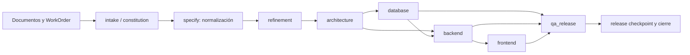
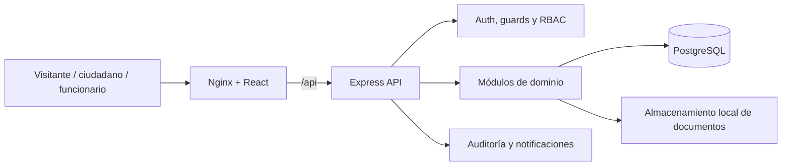
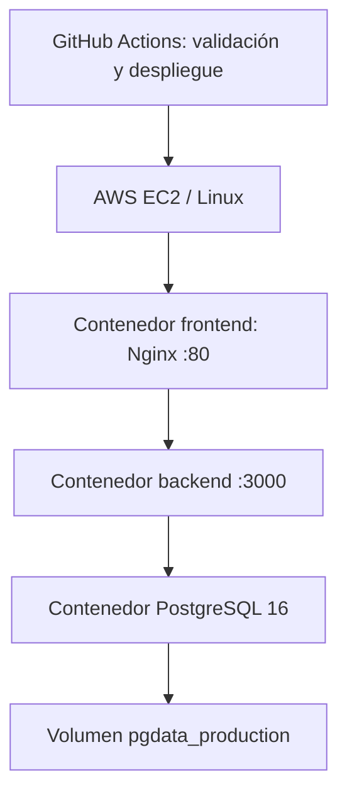
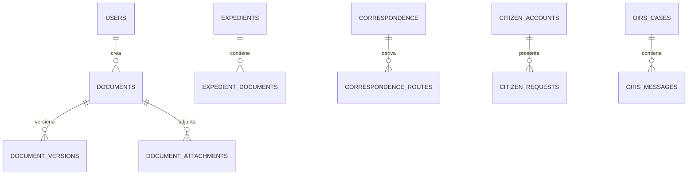

# Documentación del Proyecto SIGED-Lampa

## Sistema Integral de Gestión Electrónica Documental desarrollado mediante la fábrica agéntica WEBFORGE

**Asignatura:** No identificada de forma inequívoca en los artefactos inspeccionados
**Estudiante:** Leandro Matamoros
**Repositorio:** `LeandroEsteban/Agentes`
**Versión del sistema:** `v0002`
**Rama documentada:** `main`
**Commit documentado:** `9539d2fd28acb73182340b298efc022e9b22cc84`
**Fecha de generación:** 2026-07-12
**URL declarada del sistema:** `http://34.226.69.214`
**Estado declarado de entrega:** Versión funcional desplegada en AWS EC2. La evidencia local permite verificar la preparación de despliegue, pero no la ejecución remota de este commit; la verificación EC2 queda pendiente.

---

## Índice

1. [Control documental](#1-control-documental)
2. [Resumen ejecutivo](#2-resumen-ejecutivo)
3. [Introducción y objetivos](#3-introducción-y-objetivos)
4. [WEBFORGE](#4-webforge-fábrica-agéntica)
5. [SIGED-Lampa, alcance y actores](#5-siged-lampa-alcance-y-actores)
6. [Requisitos, casos y flujos](#6-requisitos-casos-y-flujos)
7. [Arquitectura](#7-arquitectura-del-producto)
8. [Datos, API, pantallas, reglas y validaciones](#8-inventarios-técnicos-verificados)
9. [Seguridad, integraciones, calidad y despliegue](#9-operación-y-calidad)
10. [Trazabilidad, checklist y conclusiones](#10-trazabilidad-y-cierre)

## 1. Control documental

| Campo | Valor |
| --- | --- |
| Documento | Documentación del Proyecto SIGED-Lampa |
| Versión documental | 1.0 |
| Versión del sistema | v0002 |
| Repositorio | LeandroEsteban/Agentes |
| Rama | main |
| Commit | 9539d2fd28acb73182340b298efc022e9b22cc84 |
| Fecha | 2026-07-12 |
| Responsable | Leandro Matamoros |
| Estado | Final para evaluación |

| Versión | Fecha | Descripción | Responsable |
| --- | --- | --- | --- |
| 1.0 | 2026-07-12 | Consolidación basada en código, contratos y evidencias finales de v0002. | Leandro Matamoros |

**Criterio de evidencia.** Se priorizaron código y contratos de `v0002`, luego resultados finales `phase7ar6c`; los artefactos previos de `runs/` se usan solo para contexto. Los conteos se obtienen programáticamente al ejecutar `tools/documentation/generate_siged_delivery.py`; el criterio se declara en el propio script.

## 2. Resumen ejecutivo

SIGED-Lampa aborda la necesidad de gestionar de forma integrada documentos institucionales, expedientes, correspondencia, solicitudes ciudadanas y casos OIRS en un contexto municipal. La especificación de origen plantea una solución con intranet institucional, portal ciudadano y una API común [REF-20]. La versión documentada es `project/siged-lampa/versions/v0002`, identificada por el commit `9539d2fd28acb73182340b298efc022e9b22cc84`. Esta documentación no presupone capacidades fuera de ese árbol: contrasta los artefactos de requisitos con rutas, contratos, migraciones, catálogos y pruebas versionadas.

WEBFORGE es la fábrica agéntica que estructura el trabajo desde documentos fuente hacia especificación normalizada, planificación, validaciones y evidencias. Su runtime local usa fases ordenadas, un arnés, políticas de herramientas, presupuesto y gates. También genera un DAG de planificación para refinamiento, arquitectura, base de datos, backend, frontend y QA. Esa distinción es importante: el DAG y los seis agentes especializados están implementados como planificación; el runtime ejecuta handlers de fases en secuencia y no agenda autónomamente aquellas tareas del DAG [REF-14]-[REF-17].

El producto implementa un frontend React/TypeScript con React Router, guards de autenticación, actor y permiso; un backend Node/Express con módulos, validadores y servicios; PostgreSQL mediante migraciones; y composición Docker con Nginx. El catálogo final registra 35 pantallas implementadas y modo de datos real [REF-06]. El contrato OpenAPI, el catálogo operacional y los routers están reconciliados en 98 operaciones únicas, sin discrepancias declaradas [REF-02]-[REF-03]. La base final contiene 41 tablas de dominio: el conteo excluye la tabla técnica `schema_migrations` y se obtiene de las migraciones 002 a 014, por lo que prevalece sobre el `schema.sql` histórico que declara 40.

La trazabilidad de la calidad registra 60 reglas de negocio y 100 validaciones o restricciones, con sus capas, archivos y pruebas en los mapas finales [REF-04] y [REF-05]. El cierre `phase7ar6c` informa 19/19 casos E2E aprobados, 166/166 pruebas unitarias frontend, 134/134 backend y 75/75 Python/base de datos. Las coberturas registradas no son 100%: frontend 87,72% de líneas y 66,00% de funciones; backend 80,84% de líneas y 85,81% de funciones [REF-10]. Por ello la meta académica de cobertura total no se marca como cumplida.

La infraestructura de producción está definida con contenedores PostgreSQL, backend y frontend/Nginx, health checks y volumen persistente [REF-11]. El workflow de la raíz contiene CI y un flujo de despliegue EC2 [REF-13]. Sin embargo, el artefacto de aceptación de `v0002` declara el workflow no ejecutado y estado `pending_github_push` [REF-12]; tampoco se encontró una ejecución remota versionada que pruebe el acceso a la URL indicada. En consecuencia, el documento mantiene la URL y el estado declarados para la entrega, pero clasifica la verificación de sistema online como pendiente. Las integraciones gubernamentales y la firma física/PDF final no se presentan como implementadas; la firma disponible es una simulación académica.

## 3. Introducción y objetivos

### 3.1 Contexto, propósito y alcance académico

La transformación digital municipal requiere que los flujos documentales mantengan datos, responsables, estados y evidencias consultables. SIGED-Lampa se orienta a ese problema mediante superficies públicas, ciudadanas e internas. El alcance académico comprende el diseño y construcción verificable de esas superficies, API, datos, calidad y preparación de operación; no declara operación municipal real ni integra servicios externos sin artefacto ejecutable [REF-20].

El desarrollo aplica una metodología trazable: la fábrica normaliza fuentes, produce planificación y contratos, y el producto se contrasta con migraciones, routers, pantallas, mapas de reglas, validaciones y reportes de prueba. El resto del documento detalla ese encadenamiento.

### 3.2 Objetivo general

Construir y documentar un sistema integral de gestión electrónica documental para el ámbito municipal, generado y gobernado mediante WEBFORGE, con evidencia verificable de requisitos, implementación, datos, interfaz, API, pruebas y preparación de despliegue.

### 3.3 Objetivos específicos

1. Normalizar requisitos documentales y planificar su realización mediante WEBFORGE.
2. Implementar y trazar módulos de autenticación, administración, documentos, expedientes, correspondencia, trámites, solicitudes, OIRS, notificaciones, reportes y contenido público.
3. Exponer contratos API verificables y reconciliarlos con routers.
4. Materializar datos mediante migraciones PostgreSQL y restricciones de integridad.
5. Construir pantallas React con rutas y controles de acceso verificables.
6. Asociar reglas de negocio y validaciones con archivos y pruebas.
7. Ejecutar y registrar pruebas unitarias, API, base de datos y E2E.
8. Preparar una composición Docker, health checks y pipeline de despliegue sin exponer secretos.

## 4. WEBFORGE: fábrica agéntica

### 4.1 Propósito, flujo y gobierno

WEBFORGE recibe un WorkOrder y fuentes documentales, las normaliza y genera especificación, contexto, planificación, tareas, decisiones, contratos, handoffs, gates y ledgers. El runtime real ejecuta secuencialmente `intake -> constitution -> specify -> clarify -> checklist -> context -> plan -> tasks -> analyze -> implement -> validate -> security -> pr_handoff -> deploy_checkpoint -> observe -> close`; es fail-fast. El DAG se construye y valida para la planificación, pero no constituye un planificador de workers ejecutado en paralelo [REF-14], [REF-16].

### 4.2 Agentes especializados de planificación

| Identificador | Especialidad/fase | Entradas | Responsabilidades y salidas | Herramientas declaradas | Gate / handoff |
| --- | --- | --- | --- | --- | --- |
| agent.refinement | normalization | catálogos, hallazgos, WorkOrder | spec refinada y resolución | read_catalog, validate_findings | GATE-ARCH-001 -> architecture |
| agent.architecture | architecture | spec refinada y catálogos | ADR, tareas, DAG, agentes, contratos | generate_adr y validadores | architecture_approved -> DB/backend/frontend/QA |
| agent.database | database | arquitectura, ER, tareas DB | migraciones, seeds, pruebas DB | migración/seed/schema | database_ready -> backend/QA |
| agent.backend | backend | arquitectura, endpoints, reglas | OpenAPI, controladores, pruebas API | OpenAPI/controller/validation | backend_ready -> frontend/QA |
| agent.frontend | frontend | arquitectura, pantallas, endpoints | rutas, componentes, E2E | component/route/validation | frontend_ready -> QA |
| agent.qa_release | QA/release | artefactos DB/backend/frontend | QA, cobertura, readiness | tests/coverage/deploy validation | release_approved -> humano |

Estos seis contratos están definidos en [REF-15]. El manifiesto runtime contiene además 16 agentes de fase, incluidos `agent.intake`, `agent.spec_parser`, `agent.architect_planner`, `agent.implementer`, `agent.qa`, `agent.security`, `agent.release_sre` y `agent.close` [REF-14]. Las herramientas simbólicas de los agentes especializados no se documentan como invocaciones ejecutables autónomas porque no están registradas en el `ToolRegistry` actual.

### 4.3 Handoffs, gates, arnés, política y memoria

Los handoffs de planificación conectan refinamiento-arquitectura, arquitectura con DB/backend/frontend/QA, DB-backend/QA, backend-frontend/QA y frontend-QA; contienen artefactos requeridos y criterios de aceptación [REF-17]. Los gates de arquitectura validan catálogos, ADR, agentes, tareas, DAG, handoffs y baseline. El `HarnessRunner` entrega contexto, memoria filtrada y salidas previas, mientras `PolicyEngine` limita agentes y deniega escritura externa, despliegue y producción sin autorización [REF-19], [REF-18].

El presupuesto modela tokens, llamadas de herramientas/MCP, costo y latencia; la implementación efectiva limita llamadas de herramientas. La memoria es de ámbito de proyecto y `propose-only`; el contexto usa fragmentos locales con redacción y hashes. El cierre técnico exige gates y artefactos requeridos. Estas características se describen como controles locales, no como ejecución autónoma ilimitada.

### 4.4 MCP y GitHub MCP

WEBFORGE tiene `MCPGateway`, allowlist, política de denegación por defecto, registro de invocaciones y presupuesto de llamadas MCP [REF-18]. En la ejecución inspeccionada la allowlist está vacía y no hay invocaciones, por lo que no existe una integración operativa de GitHub MCP dentro del runtime. El archivo `.github/workflows/deploy-ec2.yml` corresponde a GitHub Actions y es una integración separada de la fábrica [REF-13]. No se afirma que agentes internos invoquen GitHub MCP de manera autónoma.

## 5. SIGED-Lampa: alcance y actores

### 5.1 Superficies, módulos y alcance

Las superficies implementadas son portal público, portal ciudadano autenticado, intranet, administración, backend API y base de datos. Los módulos comprobables incluyen autenticación/perfil, administración, documentos, expedientes, correspondencia, trámites y solicitudes, OIRS, notificaciones, reportes y contenido público [REF-02], [REF-06]. La firma es académica simulada; no se documenta firma física ni generación/verificación de PDF final. Se difieren los módulos de facturas/boletas, viajes, permisos/vacaciones, control horario, PMG y aplicación móvil descritos en la fuente [REF-20].

Restricciones reales: integración externa gubernamental no comprobada; infraestructura remota no ejecutada en la evidencia local; cobertura inferior a 100%; y operación bajo HTTP en la URL declarada, sin evidencia local de terminación HTTPS. Las credenciales y secretos se configuran por entorno y no se incluyen en esta documentación.

### 5.2 Actores

| Actor | Tipo | Responsabilidades | Pantallas | Permisos |
| --- | --- | --- | --- | --- |
| Visitante | Funcional | Consulta contenido y trámites públicos. | P-23, P-24, P-27 | No requiere sesión |
| Ciudadano | Funcional | Gestiona solicitudes, OIRS, perfil y notificaciones. | P-02, P-25, P-26, P-31 a P-35 | Actor citizen |
| Funcionario | Funcional | Consulta y gestiona trabajo interno. | P-01, P-04, P-05, P-12 a P-15, P-19, P-20, P-22 | Permisos por operación |
| Administrador | Funcional | Administra usuarios, roles y catálogos. | P-06 a P-11 | admin.access y permisos de catálogo |
| Oficina de partes | Funcional | Registra correspondencia. | P-21, P-22 | correspondence.create/view |
| Revisor | Funcional | Responde revisiones. | P-16 | documents.review |
| Jefatura | Funcional | Decide aprobaciones. | P-17 | documents.approve |
| Firmante | Funcional | Registra firma simulada. | P-18 | documents.sign |
| Operador OIRS | Funcional | Gestiona casos OIRS. | P-28 | oirs.view |
| Analista | Funcional | Consulta reportes. | P-29 | reports.view |
| PostgreSQL/Nginx/Docker | Técnico | Persistencia, proxy y contenedores. | No aplica | No aplica |

## 6. Requisitos, casos y flujos

### 6.1 Catálogo de requisitos funcionales

Los requisitos funcionales se expresan como flujos implementados del catálogo de pantallas; cada fila cita su ruta y la operación consumida. El estado solo se marca implementado cuando el catálogo declara `real` e `implemented`.

| ID | Módulo | Requisito | Actor | Prioridad | Estado | Evidencia |
| --- | --- | --- | --- | --- | --- | --- |
| F-001 | shared | Login intranet | funcionario | Funcional | Implementado | /intranet/login; POST /api/v1/auth/internal-login; [REF-06] |
| F-002 | public | Login ciudadano | ciudadano | Funcional | Implementado | /login; POST /api/v1/auth/citizen-login; [REF-06] |
| F-003 | shared | Recuperacion de acceso | usuario | Funcional | Implementado | /recover; POST /api/v1/auth/recover; [REF-06] |
| F-004 | intranet | Perfil de usuario | funcionario | Funcional | Implementado | /intranet/profile; GET /api/v1/profile/me; [REF-06] |
| F-005 | intranet | Dashboard intranet | funcionario | Funcional | Implementado | /intranet; GET /api/v1/reports/dashboard; [REF-06] |
| F-006 | admin | Gestion de usuarios | administrador | Funcional | Implementado | /intranet/admin/users; GET /api/v1/users; [REF-06] |
| F-007 | admin | Gestion de roles y permisos | administrador | Funcional | Implementado | /intranet/admin/roles; GET /api/v1/roles; [REF-06] |
| F-008 | admin | Gestion de departamentos | administrador | Funcional | Implementado | /intranet/admin/departments; GET /api/v1/departments; [REF-06] |
| F-009 | admin | Tipos documentales | administrador | Funcional | Implementado | /intranet/admin/document-types; GET /api/v1/document-types; [REF-06] |
| F-010 | admin | Tipos de tramites | administrador | Funcional | Implementado | /intranet/admin/procedure-types; GET /api/v1/admin/procedure-types; [REF-06] |
| F-011 | admin | Entidades externas | administrador | Funcional | Implementado | /intranet/admin/external-entities; GET /api/v1/admin/external-entities; [REF-06] |
| F-012 | intranet | Bandeja documental | funcionario | Funcional | Implementado | /intranet/documents; GET /api/v1/documents; [REF-06] |
| F-013 | intranet | Crear documento | funcionario | Funcional | Implementado | /intranet/documents/new; POST /api/v1/documents; [REF-06] |
| F-014 | intranet | Detalle de documento | funcionario | Funcional | Implementado | /intranet/documents/:documentId; GET /api/v1/documents/:id; [REF-06] |
| F-015 | intranet | Versiones y anexos | funcionario | Funcional | Implementado | /intranet/documents/:documentId/versions; GET /api/v1/documents/:id/versions; [REF-06] |
| F-016 | intranet | Revision pendiente | revisor | Funcional | Implementado | /intranet/reviews; GET /api/v1/reviews; [REF-06] |
| F-017 | intranet | Flujo de aprobacion | jefatura | Funcional | Implementado | /intranet/approvals; GET /api/v1/approvals; [REF-06] |
| F-018 | intranet | Firma academica simulada | firmante | Funcional | Implementado | /intranet/documents/:documentId/signature; POST /api/v1/documents/:id/signature; [REF-06] |
| F-019 | intranet | Bandeja de expedientes | funcionario | Funcional | Implementado | /intranet/expedients; GET /api/v1/expedients; [REF-06] |
| F-020 | intranet | Detalle de expediente | funcionario | Funcional | Implementado | /intranet/expedients/:expedientId; GET /api/v1/expedients/:id; [REF-06] |
| F-021 | intranet | Registro de correspondencia | oficina de partes | Funcional | Implementado | /intranet/correspondence/new; POST /api/v1/correspondence; [REF-06] |
| F-022 | intranet | Seguimiento de correspondencia | funcionario | Funcional | Implementado | /intranet/correspondence; GET /api/v1/correspondence; [REF-06] |
| F-023 | public | Portada publica | ciudadano | Funcional | Implementado | /; GET /api/v1/public/tramites; [REF-06] |
| F-024 | public | Catalogo de tramites | ciudadano | Funcional | Implementado | /tramites; GET /api/v1/public/tramites; [REF-06] |
| F-025 | portal | Formulario de tramite | ciudadano | Funcional | Implementado | /portal/requests/new/:procedureId; POST /api/v1/public/tramites/:id/requests; [REF-06] |
| F-026 | portal | Dashboard ciudadano | ciudadano | Funcional | Implementado | /portal; GET /api/v1/citizen/requests; [REF-06] |
| F-027 | portal | Catálogo ciudadano | ciudadano | Funcional | Implementado | /portal/procedures; GET /api/v1/public/tramites; [REF-06] |
| F-028 | portal | Mis solicitudes | ciudadano | Funcional | Implementado | /portal/requests; GET /api/v1/citizen/requests; [REF-06] |
| F-029 | portal | Detalle de solicitud | ciudadano | Funcional | Implementado | /portal/requests/:requestId; GET /api/v1/citizen/requests/:id; [REF-06] |
| F-030 | portal | OIRS ciudadana | ciudadano | Funcional | Implementado | /portal/oirs; GET /api/v1/public/oirs/:id; [REF-06] |
| F-031 | portal | Perfil ciudadano | ciudadano | Funcional | Implementado | /portal/profile; GET /api/v1/profile/me; [REF-06] |
| F-032 | public | Ingreso OIRS | ciudadano | Funcional | Implementado | /oirs; POST /api/v1/public/oirs; [REF-06] |
| F-033 | intranet | Gestion de OIRS | operador OIRS | Funcional | Implementado | /intranet/oirs; GET /api/v1/oirs; [REF-06] |
| F-034 | intranet | Dashboard de reportes | analista | Funcional | Implementado | /intranet/reports; GET /api/v1/reports/dashboard; [REF-06] |
| F-035 | portal | Bandeja de notificaciones | usuario | Funcional | Implementado | /portal/notifications; GET /api/v1/notifications; [REF-06] |

### 6.2 Requisitos no funcionales

| Área | Definición y mecanismo | Evidencia | Estado |
| --- | --- | --- | --- |
| Autenticación | JWT, sesiones internas y ciudadanas revocables; hash bcrypt. | backend/src/auth/tokens.js; backend/src/auth/password.js; backend/src/modules/auth/ | Implementado |
| Autorización | RBAC de permisos, actor y guards de interfaz. | [REF-06]; frontend/src/auth/require-*.tsx | Implementado |
| Integridad | Migraciones, PK, FK, UNIQUE, NOT NULL y CHECK. | [REF-08]; [REF-05] | Implementado |
| Trazabilidad | Mapas de reglas, validaciones, endpoints y DB. | [REF-02], [REF-04], [REF-05] | Implementado |
| Calidad | Suites unitarias, API, DB y E2E con reporte final. | [REF-10] | Implementado con limitaciones |
| Responsive/accesibilidad | React y UI existente; no hay auditoría WCAG versionada. | frontend/src/ | Parcialmente verificable |
| Disponibilidad | Health checks Docker; no hay evidencia de SLA o monitoreo remoto. | [REF-11] | Parcialmente verificable |
| Despliegue | Docker, Nginx y Actions definidos. | [REF-11], [REF-13] | Preparado; ejecución pendiente |

### 6.3 Casos de uso

### CU-001 - Autenticarse como ciudadano

| Campo | Contenido |
| --- | --- |
| Actor principal | Ciudadano |
| Actores secundarios | Sistema SIGED-Lampa |
| Objetivo | Acceder al portal con cuenta ciudadana. |
| Disparador | El actor selecciona la operación en la interfaz. |
| Precondiciones | Sesión y permiso cuando la operación es protegida; datos requeridos válidos. |
| Postcondiciones | La operación queda persistida o el sistema informa el rechazo. |
| Pantallas | P-02, P-26 |
| Endpoints | POST /api/v1/auth/citizen-login |
| Tablas | citizen_accounts, citizen_sessions |
| Reglas | BR-004; VAL-001, VAL-002 |
| Validaciones | Validadores de frontend/backend y restricciones de base de datos aplicables. |

**Flujo principal.**
1. El actor accede a la pantalla indicada.
2. El cliente aplica sus validaciones y envía la operación al endpoint indicado.
3. El backend autentica, autoriza y valida el payload antes de persistir.
4. El resultado o error se presenta en la interfaz y queda sujeto a auditoría cuando corresponde.

**Flujos alternativos.**
1. Si faltan datos o su formato es inválido, la solicitud es rechazada sin completar la operación.
2. Si no hay sesión, rol o permiso aplicable, los guards o el backend niegan el acceso.

**Excepciones.** Estados inválidos, ausencia del recurso, propiedad no acreditada y restricciones de integridad producen respuesta de error; no se documentan como éxito.

**Criterios de aceptación.** La operación usa la ruta y pantalla citadas, aplica las reglas/validaciones asociadas y su prueba o catálogo de evidencia existe.

**Evidencia.** [REF-04], [REF-05], [REF-06] y `project/siged-lampa/versions/v0002/runs/phase7ar6c/e2e-flow-matrix.json` (E2E-01).
### CU-002 - Consultar e iniciar trámite

| Campo | Contenido |
| --- | --- |
| Actor principal | Ciudadano |
| Actores secundarios | Sistema SIGED-Lampa |
| Objetivo | Consultar catálogo público e ingresar una solicitud. |
| Disparador | El actor selecciona la operación en la interfaz. |
| Precondiciones | Sesión y permiso cuando la operación es protegida; datos requeridos válidos. |
| Postcondiciones | La operación queda persistida o el sistema informa el rechazo. |
| Pantallas | P-24, P-25, P-31 |
| Endpoints | GET /api/v1/public/tramites; POST /api/v1/public/tramites/{id}/requests |
| Tablas | published_procedures, citizen_requests |
| Reglas | BR-038; VAL-064 |
| Validaciones | Validadores de frontend/backend y restricciones de base de datos aplicables. |

**Flujo principal.**
1. El actor accede a la pantalla indicada.
2. El cliente aplica sus validaciones y envía la operación al endpoint indicado.
3. El backend autentica, autoriza y valida el payload antes de persistir.
4. El resultado o error se presenta en la interfaz y queda sujeto a auditoría cuando corresponde.

**Flujos alternativos.**
1. Si faltan datos o su formato es inválido, la solicitud es rechazada sin completar la operación.
2. Si no hay sesión, rol o permiso aplicable, los guards o el backend niegan el acceso.

**Excepciones.** Estados inválidos, ausencia del recurso, propiedad no acreditada y restricciones de integridad producen respuesta de error; no se documentan como éxito.

**Criterios de aceptación.** La operación usa la ruta y pantalla citadas, aplica las reglas/validaciones asociadas y su prueba o catálogo de evidencia existe.

**Evidencia.** [REF-04], [REF-05], [REF-06] y `project/siged-lampa/versions/v0002/runs/phase7ar6c/e2e-flow-matrix.json` (E2E-01).
### CU-003 - Consultar solicitud ciudadana

| Campo | Contenido |
| --- | --- |
| Actor principal | Ciudadano |
| Actores secundarios | Sistema SIGED-Lampa |
| Objetivo | Revisar el estado y antecedentes de sus solicitudes. |
| Disparador | El actor selecciona la operación en la interfaz. |
| Precondiciones | Sesión y permiso cuando la operación es protegida; datos requeridos válidos. |
| Postcondiciones | La operación queda persistida o el sistema informa el rechazo. |
| Pantallas | P-32, P-33 |
| Endpoints | GET /api/v1/citizen/requests; GET /api/v1/citizen/requests/{id} |
| Tablas | citizen_requests, citizen_request_attachments |
| Reglas | BR-040; VAL-068 |
| Validaciones | Validadores de frontend/backend y restricciones de base de datos aplicables. |

**Flujo principal.**
1. El actor accede a la pantalla indicada.
2. El cliente aplica sus validaciones y envía la operación al endpoint indicado.
3. El backend autentica, autoriza y valida el payload antes de persistir.
4. El resultado o error se presenta en la interfaz y queda sujeto a auditoría cuando corresponde.

**Flujos alternativos.**
1. Si faltan datos o su formato es inválido, la solicitud es rechazada sin completar la operación.
2. Si no hay sesión, rol o permiso aplicable, los guards o el backend niegan el acceso.

**Excepciones.** Estados inválidos, ausencia del recurso, propiedad no acreditada y restricciones de integridad producen respuesta de error; no se documentan como éxito.

**Criterios de aceptación.** La operación usa la ruta y pantalla citadas, aplica las reglas/validaciones asociadas y su prueba o catálogo de evidencia existe.

**Evidencia.** [REF-04], [REF-05], [REF-06] y `project/siged-lampa/versions/v0002/runs/phase7ar6c/e2e-flow-matrix.json` (E2E-01).
### CU-004 - Ingresar y seguir OIRS

| Campo | Contenido |
| --- | --- |
| Actor principal | Ciudadano |
| Actores secundarios | Sistema SIGED-Lampa |
| Objetivo | Registrar un caso OIRS y consultar su seguimiento. |
| Disparador | El actor selecciona la operación en la interfaz. |
| Precondiciones | Sesión y permiso cuando la operación es protegida; datos requeridos válidos. |
| Postcondiciones | La operación queda persistida o el sistema informa el rechazo. |
| Pantallas | P-27, P-34 |
| Endpoints | POST /api/v1/public/oirs; GET /api/v1/public/oirs/{id} |
| Tablas | oirs_cases, oirs_messages |
| Reglas | BR-043; VAL-073 |
| Validaciones | Validadores de frontend/backend y restricciones de base de datos aplicables. |

**Flujo principal.**
1. El actor accede a la pantalla indicada.
2. El cliente aplica sus validaciones y envía la operación al endpoint indicado.
3. El backend autentica, autoriza y valida el payload antes de persistir.
4. El resultado o error se presenta en la interfaz y queda sujeto a auditoría cuando corresponde.

**Flujos alternativos.**
1. Si faltan datos o su formato es inválido, la solicitud es rechazada sin completar la operación.
2. Si no hay sesión, rol o permiso aplicable, los guards o el backend niegan el acceso.

**Excepciones.** Estados inválidos, ausencia del recurso, propiedad no acreditada y restricciones de integridad producen respuesta de error; no se documentan como éxito.

**Criterios de aceptación.** La operación usa la ruta y pantalla citadas, aplica las reglas/validaciones asociadas y su prueba o catálogo de evidencia existe.

**Evidencia.** [REF-04], [REF-05], [REF-06] y `project/siged-lampa/versions/v0002/runs/phase7ar6c/e2e-flow-matrix.json` (E2E-02).
### CU-005 - Crear documento

| Campo | Contenido |
| --- | --- |
| Actor principal | Funcionario |
| Actores secundarios | Sistema SIGED-Lampa |
| Objetivo | Crear un documento institucional y gestionar su versión inicial. |
| Disparador | El actor selecciona la operación en la interfaz. |
| Precondiciones | Sesión y permiso cuando la operación es protegida; datos requeridos válidos. |
| Postcondiciones | La operación queda persistida o el sistema informa el rechazo. |
| Pantallas | P-12, P-13, P-14 |
| Endpoints | POST /api/v1/documents; GET /api/v1/documents/{id} |
| Tablas | documents, document_versions |
| Reglas | BR-012; VAL-014 |
| Validaciones | Validadores de frontend/backend y restricciones de base de datos aplicables. |

**Flujo principal.**
1. El actor accede a la pantalla indicada.
2. El cliente aplica sus validaciones y envía la operación al endpoint indicado.
3. El backend autentica, autoriza y valida el payload antes de persistir.
4. El resultado o error se presenta en la interfaz y queda sujeto a auditoría cuando corresponde.

**Flujos alternativos.**
1. Si faltan datos o su formato es inválido, la solicitud es rechazada sin completar la operación.
2. Si no hay sesión, rol o permiso aplicable, los guards o el backend niegan el acceso.

**Excepciones.** Estados inválidos, ausencia del recurso, propiedad no acreditada y restricciones de integridad producen respuesta de error; no se documentan como éxito.

**Criterios de aceptación.** La operación usa la ruta y pantalla citadas, aplica las reglas/validaciones asociadas y su prueba o catálogo de evidencia existe.

**Evidencia.** [REF-04], [REF-05], [REF-06] y `project/siged-lampa/versions/v0002/runs/phase7ar6c/e2e-flow-matrix.json` (E2E-03).
### CU-006 - Gestionar versiones y anexos

| Campo | Contenido |
| --- | --- |
| Actor principal | Funcionario |
| Actores secundarios | Sistema SIGED-Lampa |
| Objetivo | Agregar versión y adjuntos a un documento autorizado. |
| Disparador | El actor selecciona la operación en la interfaz. |
| Precondiciones | Sesión y permiso cuando la operación es protegida; datos requeridos válidos. |
| Postcondiciones | La operación queda persistida o el sistema informa el rechazo. |
| Pantallas | P-15 |
| Endpoints | POST /api/v1/documents/{id}/versions; POST /api/v1/documents/{id}/attachments |
| Tablas | document_versions, document_attachments |
| Reglas | BR-016; VAL-020 |
| Validaciones | Validadores de frontend/backend y restricciones de base de datos aplicables. |

**Flujo principal.**
1. El actor accede a la pantalla indicada.
2. El cliente aplica sus validaciones y envía la operación al endpoint indicado.
3. El backend autentica, autoriza y valida el payload antes de persistir.
4. El resultado o error se presenta en la interfaz y queda sujeto a auditoría cuando corresponde.

**Flujos alternativos.**
1. Si faltan datos o su formato es inválido, la solicitud es rechazada sin completar la operación.
2. Si no hay sesión, rol o permiso aplicable, los guards o el backend niegan el acceso.

**Excepciones.** Estados inválidos, ausencia del recurso, propiedad no acreditada y restricciones de integridad producen respuesta de error; no se documentan como éxito.

**Criterios de aceptación.** La operación usa la ruta y pantalla citadas, aplica las reglas/validaciones asociadas y su prueba o catálogo de evidencia existe.

**Evidencia.** [REF-04], [REF-05], [REF-06] y `project/siged-lampa/versions/v0002/runs/phase7ar6c/e2e-flow-matrix.json` (E2E-03).
### CU-007 - Revisar documento

| Campo | Contenido |
| --- | --- |
| Actor principal | Revisor |
| Actores secundarios | Sistema SIGED-Lampa |
| Objetivo | Responder una solicitud de revisión pendiente. |
| Disparador | El actor selecciona la operación en la interfaz. |
| Precondiciones | Sesión y permiso cuando la operación es protegida; datos requeridos válidos. |
| Postcondiciones | La operación queda persistida o el sistema informa el rechazo. |
| Pantallas | P-16 |
| Endpoints | POST /api/v1/documents/{id}/submit-review; POST /api/v1/reviews/{id}/reply |
| Tablas | document_review_requests, document_review_responses |
| Reglas | BR-021; VAL-028 |
| Validaciones | Validadores de frontend/backend y restricciones de base de datos aplicables. |

**Flujo principal.**
1. El actor accede a la pantalla indicada.
2. El cliente aplica sus validaciones y envía la operación al endpoint indicado.
3. El backend autentica, autoriza y valida el payload antes de persistir.
4. El resultado o error se presenta en la interfaz y queda sujeto a auditoría cuando corresponde.

**Flujos alternativos.**
1. Si faltan datos o su formato es inválido, la solicitud es rechazada sin completar la operación.
2. Si no hay sesión, rol o permiso aplicable, los guards o el backend niegan el acceso.

**Excepciones.** Estados inválidos, ausencia del recurso, propiedad no acreditada y restricciones de integridad producen respuesta de error; no se documentan como éxito.

**Criterios de aceptación.** La operación usa la ruta y pantalla citadas, aplica las reglas/validaciones asociadas y su prueba o catálogo de evidencia existe.

**Evidencia.** [REF-04], [REF-05], [REF-06] y `project/siged-lampa/versions/v0002/runs/phase7ar6c/e2e-flow-matrix.json` (E2E-04).
### CU-008 - Aprobar documento

| Campo | Contenido |
| --- | --- |
| Actor principal | Jefatura |
| Actores secundarios | Sistema SIGED-Lampa |
| Objetivo | Emitir decisión de aprobación sobre un documento. |
| Disparador | El actor selecciona la operación en la interfaz. |
| Precondiciones | Sesión y permiso cuando la operación es protegida; datos requeridos válidos. |
| Postcondiciones | La operación queda persistida o el sistema informa el rechazo. |
| Pantallas | P-17 |
| Endpoints | POST /api/v1/documents/{id}/approvals; POST /api/v1/approvals/{id}/decision |
| Tablas | document_approvals |
| Reglas | BR-024; VAL-032 |
| Validaciones | Validadores de frontend/backend y restricciones de base de datos aplicables. |

**Flujo principal.**
1. El actor accede a la pantalla indicada.
2. El cliente aplica sus validaciones y envía la operación al endpoint indicado.
3. El backend autentica, autoriza y valida el payload antes de persistir.
4. El resultado o error se presenta en la interfaz y queda sujeto a auditoría cuando corresponde.

**Flujos alternativos.**
1. Si faltan datos o su formato es inválido, la solicitud es rechazada sin completar la operación.
2. Si no hay sesión, rol o permiso aplicable, los guards o el backend niegan el acceso.

**Excepciones.** Estados inválidos, ausencia del recurso, propiedad no acreditada y restricciones de integridad producen respuesta de error; no se documentan como éxito.

**Criterios de aceptación.** La operación usa la ruta y pantalla citadas, aplica las reglas/validaciones asociadas y su prueba o catálogo de evidencia existe.

**Evidencia.** [REF-04], [REF-05], [REF-06] y `project/siged-lampa/versions/v0002/runs/phase7ar6c/e2e-flow-matrix.json` (E2E-04).
### CU-009 - Firmar documento

| Campo | Contenido |
| --- | --- |
| Actor principal | Firmante |
| Actores secundarios | Sistema SIGED-Lampa |
| Objetivo | Registrar firma académica simulada en el flujo documental. |
| Disparador | El actor selecciona la operación en la interfaz. |
| Precondiciones | Sesión y permiso cuando la operación es protegida; datos requeridos válidos. |
| Postcondiciones | La operación queda persistida o el sistema informa el rechazo. |
| Pantallas | P-18 |
| Endpoints | POST /api/v1/documents/{id}/signatures |
| Tablas | signature_profiles, document_signatures |
| Reglas | BR-027; VAL-038 |
| Validaciones | Validadores de frontend/backend y restricciones de base de datos aplicables. |

**Flujo principal.**
1. El actor accede a la pantalla indicada.
2. El cliente aplica sus validaciones y envía la operación al endpoint indicado.
3. El backend autentica, autoriza y valida el payload antes de persistir.
4. El resultado o error se presenta en la interfaz y queda sujeto a auditoría cuando corresponde.

**Flujos alternativos.**
1. Si faltan datos o su formato es inválido, la solicitud es rechazada sin completar la operación.
2. Si no hay sesión, rol o permiso aplicable, los guards o el backend niegan el acceso.

**Excepciones.** Estados inválidos, ausencia del recurso, propiedad no acreditada y restricciones de integridad producen respuesta de error; no se documentan como éxito.

**Criterios de aceptación.** La operación usa la ruta y pantalla citadas, aplica las reglas/validaciones asociadas y su prueba o catálogo de evidencia existe.

**Evidencia.** [REF-04], [REF-05], [REF-06] y `project/siged-lampa/versions/v0002/runs/phase7ar6c/e2e-flow-matrix.json` (E2E-05).
### CU-010 - Gestionar expediente

| Campo | Contenido |
| --- | --- |
| Actor principal | Funcionario |
| Actores secundarios | Sistema SIGED-Lampa |
| Objetivo | Crear, asociar documento, consultar eventos y cerrar expediente. |
| Disparador | El actor selecciona la operación en la interfaz. |
| Precondiciones | Sesión y permiso cuando la operación es protegida; datos requeridos válidos. |
| Postcondiciones | La operación queda persistida o el sistema informa el rechazo. |
| Pantallas | P-19, P-20 |
| Endpoints | POST /api/v1/expedients; POST /api/v1/expedients/{id}/documents; POST /api/v1/expedients/{id}/close |
| Tablas | expedients, expedient_documents, expedient_events |
| Reglas | BR-030; VAL-043 |
| Validaciones | Validadores de frontend/backend y restricciones de base de datos aplicables. |

**Flujo principal.**
1. El actor accede a la pantalla indicada.
2. El cliente aplica sus validaciones y envía la operación al endpoint indicado.
3. El backend autentica, autoriza y valida el payload antes de persistir.
4. El resultado o error se presenta en la interfaz y queda sujeto a auditoría cuando corresponde.

**Flujos alternativos.**
1. Si faltan datos o su formato es inválido, la solicitud es rechazada sin completar la operación.
2. Si no hay sesión, rol o permiso aplicable, los guards o el backend niegan el acceso.

**Excepciones.** Estados inválidos, ausencia del recurso, propiedad no acreditada y restricciones de integridad producen respuesta de error; no se documentan como éxito.

**Criterios de aceptación.** La operación usa la ruta y pantalla citadas, aplica las reglas/validaciones asociadas y su prueba o catálogo de evidencia existe.

**Evidencia.** [REF-04], [REF-05], [REF-06] y `project/siged-lampa/versions/v0002/runs/phase7ar6c/e2e-flow-matrix.json` (E2E-06).
### CU-011 - Registrar y derivar correspondencia

| Campo | Contenido |
| --- | --- |
| Actor principal | Oficina de partes |
| Actores secundarios | Sistema SIGED-Lampa |
| Objetivo | Registrar, enrutar y cerrar correspondencia. |
| Disparador | El actor selecciona la operación en la interfaz. |
| Precondiciones | Sesión y permiso cuando la operación es protegida; datos requeridos válidos. |
| Postcondiciones | La operación queda persistida o el sistema informa el rechazo. |
| Pantallas | P-21, P-22 |
| Endpoints | POST /api/v1/correspondence; POST /api/v1/correspondence/{id}/route; POST /api/v1/correspondence/{id}/close |
| Tablas | correspondence, correspondence_recipients, correspondence_routes |
| Reglas | BR-034; VAL-052 |
| Validaciones | Validadores de frontend/backend y restricciones de base de datos aplicables. |

**Flujo principal.**
1. El actor accede a la pantalla indicada.
2. El cliente aplica sus validaciones y envía la operación al endpoint indicado.
3. El backend autentica, autoriza y valida el payload antes de persistir.
4. El resultado o error se presenta en la interfaz y queda sujeto a auditoría cuando corresponde.

**Flujos alternativos.**
1. Si faltan datos o su formato es inválido, la solicitud es rechazada sin completar la operación.
2. Si no hay sesión, rol o permiso aplicable, los guards o el backend niegan el acceso.

**Excepciones.** Estados inválidos, ausencia del recurso, propiedad no acreditada y restricciones de integridad producen respuesta de error; no se documentan como éxito.

**Criterios de aceptación.** La operación usa la ruta y pantalla citadas, aplica las reglas/validaciones asociadas y su prueba o catálogo de evidencia existe.

**Evidencia.** [REF-04], [REF-05], [REF-06] y `project/siged-lampa/versions/v0002/runs/phase7ar6c/e2e-flow-matrix.json` (E2E-07).
### CU-012 - Administrar usuarios y permisos

| Campo | Contenido |
| --- | --- |
| Actor principal | Administrador |
| Actores secundarios | Sistema SIGED-Lampa |
| Objetivo | Gestionar usuarios, roles, permisos y catálogos administrativos. |
| Disparador | El actor selecciona la operación en la interfaz. |
| Precondiciones | Sesión y permiso cuando la operación es protegida; datos requeridos válidos. |
| Postcondiciones | La operación queda persistida o el sistema informa el rechazo. |
| Pantallas | P-06 a P-11 |
| Endpoints | GET/POST /api/v1/users; GET /api/v1/roles; PUT /api/v1/roles/{id}/permissions |
| Tablas | users, roles, permissions, user_roles, role_permissions |
| Reglas | BR-001 a BR-006; VAL-001 a VAL-009 |
| Validaciones | Validadores de frontend/backend y restricciones de base de datos aplicables. |

**Flujo principal.**
1. El actor accede a la pantalla indicada.
2. El cliente aplica sus validaciones y envía la operación al endpoint indicado.
3. El backend autentica, autoriza y valida el payload antes de persistir.
4. El resultado o error se presenta en la interfaz y queda sujeto a auditoría cuando corresponde.

**Flujos alternativos.**
1. Si faltan datos o su formato es inválido, la solicitud es rechazada sin completar la operación.
2. Si no hay sesión, rol o permiso aplicable, los guards o el backend niegan el acceso.

**Excepciones.** Estados inválidos, ausencia del recurso, propiedad no acreditada y restricciones de integridad producen respuesta de error; no se documentan como éxito.

**Criterios de aceptación.** La operación usa la ruta y pantalla citadas, aplica las reglas/validaciones asociadas y su prueba o catálogo de evidencia existe.

**Evidencia.** [REF-04], [REF-05], [REF-06] y `project/siged-lampa/versions/v0002/runs/phase7ar6c/e2e-flow-matrix.json` (E2E-08).

### 6.4 Inventario de funcionalidades o flujos

| ID | Módulo | Funcionalidad | Actor | Pantalla | Endpoint | Estado | Evidencia |
| --- | --- | --- | --- | --- | --- | --- | --- |
| F-001 | shared | Login intranet | funcionario | /intranet/login | POST /api/v1/auth/internal-login | Implementado | [REF-06] project/siged-lampa/versions/v0002/frontend/src/config/screen-catalog.ts |
| F-002 | public | Login ciudadano | ciudadano | /login | POST /api/v1/auth/citizen-login | Implementado | [REF-06] project/siged-lampa/versions/v0002/frontend/src/config/screen-catalog.ts |
| F-003 | shared | Recuperacion de acceso | usuario | /recover | POST /api/v1/auth/recover | Implementado | [REF-06] project/siged-lampa/versions/v0002/frontend/src/config/screen-catalog.ts |
| F-004 | intranet | Perfil de usuario | funcionario | /intranet/profile | GET /api/v1/profile/me | Implementado | [REF-06] project/siged-lampa/versions/v0002/frontend/src/config/screen-catalog.ts |
| F-005 | intranet | Dashboard intranet | funcionario | /intranet | GET /api/v1/reports/dashboard | Implementado | [REF-06] project/siged-lampa/versions/v0002/frontend/src/config/screen-catalog.ts |
| F-006 | admin | Gestion de usuarios | administrador | /intranet/admin/users | GET /api/v1/users | Implementado | [REF-06] project/siged-lampa/versions/v0002/frontend/src/config/screen-catalog.ts |
| F-007 | admin | Gestion de roles y permisos | administrador | /intranet/admin/roles | GET /api/v1/roles | Implementado | [REF-06] project/siged-lampa/versions/v0002/frontend/src/config/screen-catalog.ts |
| F-008 | admin | Gestion de departamentos | administrador | /intranet/admin/departments | GET /api/v1/departments | Implementado | [REF-06] project/siged-lampa/versions/v0002/frontend/src/config/screen-catalog.ts |
| F-009 | admin | Tipos documentales | administrador | /intranet/admin/document-types | GET /api/v1/document-types | Implementado | [REF-06] project/siged-lampa/versions/v0002/frontend/src/config/screen-catalog.ts |
| F-010 | admin | Tipos de tramites | administrador | /intranet/admin/procedure-types | GET /api/v1/admin/procedure-types | Implementado | [REF-06] project/siged-lampa/versions/v0002/frontend/src/config/screen-catalog.ts |
| F-011 | admin | Entidades externas | administrador | /intranet/admin/external-entities | GET /api/v1/admin/external-entities | Implementado | [REF-06] project/siged-lampa/versions/v0002/frontend/src/config/screen-catalog.ts |
| F-012 | intranet | Bandeja documental | funcionario | /intranet/documents | GET /api/v1/documents | Implementado | [REF-06] project/siged-lampa/versions/v0002/frontend/src/config/screen-catalog.ts |
| F-013 | intranet | Crear documento | funcionario | /intranet/documents/new | POST /api/v1/documents | Implementado | [REF-06] project/siged-lampa/versions/v0002/frontend/src/config/screen-catalog.ts |
| F-014 | intranet | Detalle de documento | funcionario | /intranet/documents/:documentId | GET /api/v1/documents/:id | Implementado | [REF-06] project/siged-lampa/versions/v0002/frontend/src/config/screen-catalog.ts |
| F-015 | intranet | Versiones y anexos | funcionario | /intranet/documents/:documentId/versions | GET /api/v1/documents/:id/versions | Implementado | [REF-06] project/siged-lampa/versions/v0002/frontend/src/config/screen-catalog.ts |
| F-016 | intranet | Revision pendiente | revisor | /intranet/reviews | GET /api/v1/reviews | Implementado | [REF-06] project/siged-lampa/versions/v0002/frontend/src/config/screen-catalog.ts |
| F-017 | intranet | Flujo de aprobacion | jefatura | /intranet/approvals | GET /api/v1/approvals | Implementado | [REF-06] project/siged-lampa/versions/v0002/frontend/src/config/screen-catalog.ts |
| F-018 | intranet | Firma academica simulada | firmante | /intranet/documents/:documentId/signature | POST /api/v1/documents/:id/signature | Implementado | [REF-06] project/siged-lampa/versions/v0002/frontend/src/config/screen-catalog.ts |
| F-019 | intranet | Bandeja de expedientes | funcionario | /intranet/expedients | GET /api/v1/expedients | Implementado | [REF-06] project/siged-lampa/versions/v0002/frontend/src/config/screen-catalog.ts |
| F-020 | intranet | Detalle de expediente | funcionario | /intranet/expedients/:expedientId | GET /api/v1/expedients/:id | Implementado | [REF-06] project/siged-lampa/versions/v0002/frontend/src/config/screen-catalog.ts |
| F-021 | intranet | Registro de correspondencia | oficina de partes | /intranet/correspondence/new | POST /api/v1/correspondence | Implementado | [REF-06] project/siged-lampa/versions/v0002/frontend/src/config/screen-catalog.ts |
| F-022 | intranet | Seguimiento de correspondencia | funcionario | /intranet/correspondence | GET /api/v1/correspondence | Implementado | [REF-06] project/siged-lampa/versions/v0002/frontend/src/config/screen-catalog.ts |
| F-023 | public | Portada publica | ciudadano | / | GET /api/v1/public/tramites | Implementado | [REF-06] project/siged-lampa/versions/v0002/frontend/src/config/screen-catalog.ts |
| F-024 | public | Catalogo de tramites | ciudadano | /tramites | GET /api/v1/public/tramites | Implementado | [REF-06] project/siged-lampa/versions/v0002/frontend/src/config/screen-catalog.ts |
| F-025 | portal | Formulario de tramite | ciudadano | /portal/requests/new/:procedureId | POST /api/v1/public/tramites/:id/requests | Implementado | [REF-06] project/siged-lampa/versions/v0002/frontend/src/config/screen-catalog.ts |
| F-026 | portal | Dashboard ciudadano | ciudadano | /portal | GET /api/v1/citizen/requests | Implementado | [REF-06] project/siged-lampa/versions/v0002/frontend/src/config/screen-catalog.ts |
| F-027 | portal | Catálogo ciudadano | ciudadano | /portal/procedures | GET /api/v1/public/tramites | Implementado | [REF-06] project/siged-lampa/versions/v0002/frontend/src/config/screen-catalog.ts |
| F-028 | portal | Mis solicitudes | ciudadano | /portal/requests | GET /api/v1/citizen/requests | Implementado | [REF-06] project/siged-lampa/versions/v0002/frontend/src/config/screen-catalog.ts |
| F-029 | portal | Detalle de solicitud | ciudadano | /portal/requests/:requestId | GET /api/v1/citizen/requests/:id | Implementado | [REF-06] project/siged-lampa/versions/v0002/frontend/src/config/screen-catalog.ts |
| F-030 | portal | OIRS ciudadana | ciudadano | /portal/oirs | GET /api/v1/public/oirs/:id | Implementado | [REF-06] project/siged-lampa/versions/v0002/frontend/src/config/screen-catalog.ts |
| F-031 | portal | Perfil ciudadano | ciudadano | /portal/profile | GET /api/v1/profile/me | Implementado | [REF-06] project/siged-lampa/versions/v0002/frontend/src/config/screen-catalog.ts |
| F-032 | public | Ingreso OIRS | ciudadano | /oirs | POST /api/v1/public/oirs | Implementado | [REF-06] project/siged-lampa/versions/v0002/frontend/src/config/screen-catalog.ts |
| F-033 | intranet | Gestion de OIRS | operador OIRS | /intranet/oirs | GET /api/v1/oirs | Implementado | [REF-06] project/siged-lampa/versions/v0002/frontend/src/config/screen-catalog.ts |
| F-034 | intranet | Dashboard de reportes | analista | /intranet/reports | GET /api/v1/reports/dashboard | Implementado | [REF-06] project/siged-lampa/versions/v0002/frontend/src/config/screen-catalog.ts |
| F-035 | portal | Bandeja de notificaciones | usuario | /portal/notifications | GET /api/v1/notifications | Implementado | [REF-06] project/siged-lampa/versions/v0002/frontend/src/config/screen-catalog.ts |

| Métrica | Meta | Resultado verificado | Estado |
| --- | --- | --- | --- |
| Funcionalidades o flujos | 30 | 35 | Cumple |

## 7. Arquitectura del producto

### 7.1 Componentes

El frontend usa React 19.1.0, TypeScript 5.8.3, Vite 6.3.5, React Router 7.6.1, React Hook Form y Zod, conforme al `frontend/package.json`. El backend está organizado por módulos con rutas, controladores, servicios, repositorios y validadores; usa Express, `pg`, Zod, JWT y bcrypt conforme a `package.json` de la versión. PostgreSQL se crea mediante migraciones. Nginx sirve el frontend y enruta `/api/` al backend [REF-11].

### 7.2 Despliegue previsto

La topología está implementada en la composición de producción. El segundo diagrama representa la arquitectura preparada, no una verificación de que EC2 estuviera ejecutando el commit documentado.

## 8. Inventarios técnicos verificados

### 8.1 Base de datos

El inventario siguiente considera `CREATE TABLE` de las migraciones finales y excluye `schema_migrations`, vistas, índices, secuencias y tipos. El resultado es 41 tablas de dominio.

| N.º | Tabla | Módulo | Propósito | Clave primaria | Relaciones principales | Evidencia |
| --- | --- | --- | --- | --- | --- | --- |
| 1 | departments | Organización | Unidades organizacionales | id | - | project/siged-lampa/versions/v0002/database/migrations/002_organization.sql |
| 2 | external_entities | Organización | Destinatarios externos | id | - | project/siged-lampa/versions/v0002/database/migrations/002_organization.sql |
| 3 | roles | Seguridad | Roles internos | id | - | project/siged-lampa/versions/v0002/database/migrations/003_security.sql |
| 4 | permissions | Seguridad | Permisos RBAC | id | - | project/siged-lampa/versions/v0002/database/migrations/003_security.sql |
| 5 | users | Seguridad | Cuentas de funcionarios | id | - | project/siged-lampa/versions/v0002/database/migrations/003_security.sql |
| 6 | user_roles | Seguridad | Asignación usuario-rol | id | - | project/siged-lampa/versions/v0002/database/migrations/003_security.sql |
| 7 | role_permissions | Seguridad | Asignación rol-permiso | id | - | project/siged-lampa/versions/v0002/database/migrations/003_security.sql |
| 8 | sessions | Seguridad | Sesiones internas | id | - | project/siged-lampa/versions/v0002/database/migrations/003_security.sql |
| 9 | two_factor_settings | Seguridad | Configuración de segundo factor | id | - | project/siged-lampa/versions/v0002/database/migrations/003_security.sql |
| 10 | document_types | Gestión documental | Catálogo de tipos | id | - | project/siged-lampa/versions/v0002/database/migrations/004_document_catalogs.sql |
| 11 | document_templates | Gestión documental | Plantillas documentales | id | - | project/siged-lampa/versions/v0002/database/migrations/004_document_catalogs.sql |
| 12 | document_statuses | Gestión documental | Estados de documento | id | - | project/siged-lampa/versions/v0002/database/migrations/004_document_catalogs.sql |
| 13 | documents | Gestión documental | Documento principal | id | - | project/siged-lampa/versions/v0002/database/migrations/005_documents.sql |
| 14 | document_versions | Gestión documental | Versionado | id | - | project/siged-lampa/versions/v0002/database/migrations/005_documents.sql |
| 15 | document_attachments | Gestión documental | Adjuntos | id | - | project/siged-lampa/versions/v0002/database/migrations/005_documents.sql |
| 16 | document_comments | Gestión documental | Comentarios | id | - | project/siged-lampa/versions/v0002/database/migrations/006_document_workflows.sql |
| 17 | document_review_requests | Gestión documental | Solicitudes de revisión | id | - | project/siged-lampa/versions/v0002/database/migrations/006_document_workflows.sql |
| 18 | document_review_responses | Gestión documental | Respuestas de revisión | id | - | project/siged-lampa/versions/v0002/database/migrations/006_document_workflows.sql |
| 19 | signature_profiles | Gestión documental | Perfiles de firma | id | - | project/siged-lampa/versions/v0002/database/migrations/006_document_workflows.sql |
| 20 | document_approvals | Gestión documental | Vistos buenos | id | - | project/siged-lampa/versions/v0002/database/migrations/006_document_workflows.sql |
| 21 | document_signatures | Gestión documental | Firmas académicas | id | - | project/siged-lampa/versions/v0002/database/migrations/006_document_workflows.sql |
| 22 | expedients | Expedientes | Expedientes | id | - | project/siged-lampa/versions/v0002/database/migrations/007_expedients.sql |
| 23 | expedient_documents | Expedientes | Relación expediente-documento | id | - | project/siged-lampa/versions/v0002/database/migrations/007_expedients.sql |
| 24 | expedient_events | Expedientes | Bitácora de expediente | id | - | project/siged-lampa/versions/v0002/database/migrations/007_expedients.sql |
| 25 | correspondence | Correspondencia | Correspondencia | id | - | project/siged-lampa/versions/v0002/database/migrations/008_correspondence.sql |
| 26 | correspondence_recipients | Correspondencia | Destinatarios | id | - | project/siged-lampa/versions/v0002/database/migrations/008_correspondence.sql |
| 27 | correspondence_routes | Correspondencia | Derivaciones | id | - | project/siged-lampa/versions/v0002/database/migrations/008_correspondence.sql |
| 28 | citizen_accounts | Portal ciudadano | Cuentas ciudadanas | id | - | project/siged-lampa/versions/v0002/database/migrations/009_citizen_portal.sql |
| 29 | citizen_profiles | Portal ciudadano | Perfiles ciudadanos | id | - | project/siged-lampa/versions/v0002/database/migrations/009_citizen_portal.sql |
| 30 | procedure_types | Portal ciudadano | Tipos de trámite | id | - | project/siged-lampa/versions/v0002/database/migrations/009_citizen_portal.sql |
| 31 | published_procedures | Portal ciudadano | Trámites publicados | id | - | project/siged-lampa/versions/v0002/database/migrations/009_citizen_portal.sql |
| 32 | citizen_requests | Portal ciudadano | Solicitudes ciudadanas | id | - | project/siged-lampa/versions/v0002/database/migrations/009_citizen_portal.sql |
| 33 | citizen_request_attachments | Portal ciudadano | Adjuntos de solicitudes | id | - | project/siged-lampa/versions/v0002/database/migrations/009_citizen_portal.sql |
| 34 | oirs_cases | OIRS | Casos OIRS | id | - | project/siged-lampa/versions/v0002/database/migrations/010_oirs.sql |
| 35 | oirs_messages | OIRS | Mensajes OIRS | id | - | project/siged-lampa/versions/v0002/database/migrations/010_oirs.sql |
| 36 | news_posts | Contenido público | Noticias | id | - | project/siged-lampa/versions/v0002/database/migrations/011_public_content.sql |
| 37 | public_notices | Contenido público | Avisos | id | - | project/siged-lampa/versions/v0002/database/migrations/011_public_content.sql |
| 38 | calendar_events | Contenido público | Calendario | id | - | project/siged-lampa/versions/v0002/database/migrations/011_public_content.sql |
| 39 | notifications | Soporte | Notificaciones | id | - | project/siged-lampa/versions/v0002/database/migrations/012_notifications_audit.sql |
| 40 | audit_events | Soporte | Auditoría | id | - | project/siged-lampa/versions/v0002/database/migrations/012_notifications_audit.sql |
| 41 | citizen_sessions | Seguridad | Sesiones ciudadanas | id | citizen_accounts | project/siged-lampa/versions/v0002/database/migrations/014_profile_preferences_citizen_sessions.sql |

| Métrica | Meta | Resultado real | Estado |
| --- | --- | --- | --- |
| Tablas | 40 | 41 | Cumple |

### 8.2 Endpoints API

Se cuentan combinaciones únicas método-ruta del catálogo operacional y se contrastan con OpenAPI/routers. Hay 98 operaciones, incluidas operaciones suplementarias y técnicas identificadas por su catálogo; no se duplican por pertenecer a más de un documento.

| ID | Método | Ruta | Módulo | Actor | Permiso | Estado | Evidencia |
| --- | --- | --- | --- | --- | --- | --- | --- |
| API-SUP-004 | GET | /api/v1/admin/external-entities | Administración | internal | admin.access | implemented | backend/modules/external-entities/router.js |
| API-SUP-005 | POST | /api/v1/admin/external-entities | Administración | internal | admin.access | implemented | backend/modules/external-entities/router.js |
| API-SUP-006 | PUT | /api/v1/admin/external-entities/{id} | Administración | internal | admin.access | implemented | backend/modules/external-entities/router.js |
| API-SUP-001 | GET | /api/v1/admin/procedure-types | procedures | internal | tramites.edit | implemented | backend/modules/procedures/router.js |
| API-SUP-002 | POST | /api/v1/admin/procedure-types | procedures | internal | tramites.edit | implemented | backend/modules/procedures/router.js |
| API-SUP-003 | PUT | /api/v1/admin/procedure-types/{id} | procedures | internal | tramites.edit | implemented | backend/modules/procedures/router.js |
| API-SUP-010 | GET | /api/v1/admin/public-content/calendar | Contenido público | internal | admin.access | implemented | backend/modules/public-content/router.js |
| API-SUP-011 | POST | /api/v1/admin/public-content/calendar | Contenido público | internal | admin.access | implemented | backend/modules/public-content/router.js |
| API-SUP-012 | PATCH | /api/v1/admin/public-content/calendar/{id} | Contenido público | internal | admin.access | implemented | backend/modules/public-content/router.js |
| API-SUP-013 | GET | /api/v1/admin/public-content/news | Contenido público | internal | admin.access | implemented | backend/modules/public-content/router.js |
| API-SUP-014 | POST | /api/v1/admin/public-content/news | Contenido público | internal | admin.access | implemented | backend/modules/public-content/router.js |
| API-SUP-015 | PATCH | /api/v1/admin/public-content/news/{id} | Contenido público | internal | admin.access | implemented | backend/modules/public-content/router.js |
| API-SUP-016 | GET | /api/v1/admin/public-content/notices | Contenido público | internal | admin.access | implemented | backend/modules/public-content/router.js |
| API-SUP-017 | POST | /api/v1/admin/public-content/notices | Contenido público | internal | admin.access | implemented | backend/modules/public-content/router.js |
| API-SUP-018 | PATCH | /api/v1/admin/public-content/notices/{id} | Contenido público | internal | admin.access | implemented | backend/modules/public-content/router.js |
| API-SUP-019 | POST | /api/v1/approvals/{id}/decision | document-approvals | internal | documents.review | implemented | backend/modules/document-approvals/router.js |
| API-002 | POST | /api/v1/auth/citizen-login | Autenticación | public | - | implemented | backend/modules/auth/router.js |
| API-SUP-020 | POST | /api/v1/auth/internal-login | Autenticación | public | - | implemented | backend/modules/auth/router.js |
| API-001 | POST | /api/v1/auth/login | Autenticación | public | - | implemented | backend/modules/auth/router.js |
| API-SUP-021 | POST | /api/v1/auth/logout | Autenticación | internal | - | implemented | backend/modules/auth/router.js |
| API-003 | POST | /api/v1/auth/recover | Autenticación | public | - | implemented | backend/modules/auth/router.js |
| API-SUP-022 | GET | /api/v1/citizen/oirs/{id} | OIRS | citizen | - | implemented | backend/modules/oirs/router.js |
| API-SUP-023 | GET | /api/v1/citizen/oirs/{id}/history | OIRS | citizen | - | implemented | backend/modules/oirs/router.js |
| API-SUP-024 | POST | /api/v1/citizen/oirs/{id}/messages | OIRS | citizen | - | implemented | backend/modules/oirs/router.js |
| API-035 | GET | /api/v1/citizen/requests | Solicitudes ciudadanas | citizen | - | implemented | backend/modules/citizen-requests/router.js |
| API-LEG-001 | POST | /api/v1/citizen/requests | Solicitudes ciudadanas | citizen | - | implemented | backend/modules/citizen-requests/router.js |
| API-036 | GET | /api/v1/citizen/requests/{id} | Solicitudes ciudadanas | citizen | - | implemented | backend/modules/citizen-requests/router.js |
| API-SUP-025 | POST | /api/v1/citizen/requests/{id}/cancel | Solicitudes ciudadanas | citizen | - | implemented | backend/modules/citizen-requests/router.js |
| API-SUP-026 | GET | /api/v1/citizen/requests/{id}/history | Solicitudes ciudadanas | citizen | - | implemented | backend/modules/citizen-requests/router.js |
| API-029 | GET | /api/v1/correspondence | Correspondencia | internal | correspondence.view | implemented | backend/modules/correspondence/router.js |
| API-030 | POST | /api/v1/correspondence | Correspondencia | internal | correspondence.create | implemented | backend/modules/correspondence/router.js |
| API-SUP-027 | GET | /api/v1/correspondence/{id} | Correspondencia | internal | correspondence.view | implemented | backend/modules/correspondence/router.js |
| API-SUP-028 | PATCH | /api/v1/correspondence/{id} | Correspondencia | internal | correspondence.edit | implemented | backend/modules/correspondence/router.js |
| API-SUP-029 | POST | /api/v1/correspondence/{id}/close | Correspondencia | internal | correspondence.edit | implemented | backend/modules/correspondence/router.js |
| API-SUP-030 | GET | /api/v1/correspondence/{id}/details | Correspondencia | internal | correspondence.view | implemented | backend/modules/correspondence/router.js |
| API-SUP-031 | GET | /api/v1/correspondence/{id}/history | Correspondencia | internal | correspondence.view | implemented | backend/modules/correspondence/router.js |
| API-032 | POST | /api/v1/correspondence/{id}/link-response | Correspondencia | internal | correspondence.edit | implemented | backend/modules/correspondence/router.js |
| API-031 | POST | /api/v1/correspondence/{id}/route | Correspondencia | internal | correspondence.edit | implemented | backend/modules/correspondence/router.js |
| API-011 | GET | /api/v1/departments | Administración | internal | departments.view | implemented | backend/modules/departments/router.js |
| API-012 | POST | /api/v1/departments | Administración | internal | departments.edit | implemented | backend/modules/departments/router.js |
| API-013 | GET | /api/v1/document-types | procedures | internal | documents.view | implemented | backend/modules/procedures/router.js |
| API-014 | POST | /api/v1/document-types | procedures | internal | admin.access | implemented | backend/modules/procedures/router.js |
| API-015 | GET | /api/v1/documents | Documentos | internal | documents.view | implemented | backend/modules/documents/router.js |
| API-016 | POST | /api/v1/documents | Documentos | internal | documents.create | implemented | backend/modules/documents/router.js |
| API-017 | GET | /api/v1/documents/{id} | Documentos | internal | documents.view | implemented | backend/modules/documents/router.js |
| API-018 | PUT | /api/v1/documents/{id} | Documentos | internal | documents.edit | implemented | backend/modules/documents/router.js |
| API-SUP-032 | GET | /api/v1/documents/{id}/approvals | document-approvals | internal | documents.view | implemented | backend/modules/document-approvals/router.js |
| API-023 | POST | /api/v1/documents/{id}/approvals | document-approvals | internal | documents.edit | implemented | backend/modules/document-approvals/router.js |
| API-SUP-008 | GET | /api/v1/documents/{id}/attachments | Documentos | internal | documents.view | implemented | backend/modules/documents/router.js |
| API-019 | POST | /api/v1/documents/{id}/attachments | Documentos | internal | documents.edit | implemented | backend/modules/documents/router.js |
| API-SUP-033 | GET | /api/v1/documents/{id}/attachments/{attachmentId}/download | Documentos | internal | documents.view | implemented | backend/modules/documents/router.js |
| API-SUP-034 | GET | /api/v1/documents/{id}/comments | Documentos | internal | documents.view | implemented | backend/modules/documents/router.js |
| API-SUP-035 | POST | /api/v1/documents/{id}/comments | Documentos | internal | documents.review | implemented | backend/modules/documents/router.js |
| API-SUP-036 | GET | /api/v1/documents/{id}/history | Documentos | internal | documents.view | implemented | backend/modules/documents/router.js |
| API-SUP-037 | GET | /api/v1/documents/{id}/reviews | document-reviews | internal | documents.view | implemented | backend/modules/document-reviews/router.js |
| API-SUP-038 | GET | /api/v1/documents/{id}/signatures | document-signatures | internal | documents.view | implemented | backend/modules/document-signatures/router.js |
| API-024 | POST | /api/v1/documents/{id}/signatures | document-signatures | internal | documents.sign | implemented | backend/modules/document-signatures/router.js |
| API-021 | POST | /api/v1/documents/{id}/submit-review | document-reviews | internal | documents.edit | implemented | backend/modules/document-reviews/router.js |
| API-SUP-007 | GET | /api/v1/documents/{id}/versions | Documentos | internal | documents.view | implemented | backend/modules/documents/router.js |
| API-020 | POST | /api/v1/documents/{id}/versions | Documentos | internal | documents.edit | implemented | backend/modules/documents/router.js |
| API-025 | GET | /api/v1/expedients | Expedientes | internal | expedients.view | implemented | backend/modules/expedients/router.js |
| API-026 | POST | /api/v1/expedients | Expedientes | internal | expedients.create | implemented | backend/modules/expedients/router.js |
| API-027 | GET | /api/v1/expedients/{id} | Expedientes | internal | expedients.view | implemented | backend/modules/expedients/router.js |
| API-SUP-039 | PATCH | /api/v1/expedients/{id} | Expedientes | internal | expedients.edit | implemented | backend/modules/expedients/router.js |
| API-SUP-040 | POST | /api/v1/expedients/{id}/close | Expedientes | internal | expedients.edit | implemented | backend/modules/expedients/router.js |
| API-SUP-041 | GET | /api/v1/expedients/{id}/details | Expedientes | internal | expedients.view | implemented | backend/modules/expedients/router.js |
| API-028 | POST | /api/v1/expedients/{id}/documents | Expedientes | internal | expedients.edit | implemented | backend/modules/expedients/router.js |
| API-SUP-042 | GET | /api/v1/expedients/{id}/events | Expedientes | internal | expedients.view | implemented | backend/modules/expedients/router.js |
| API-SUP-043 | POST | /api/v1/expedients/{id}/events | Expedientes | internal | expedients.edit | implemented | backend/modules/expedients/router.js |
| API-SUP-044 | GET | /api/v1/expedients/{id}/history | Expedientes | internal | expedients.view | implemented | backend/modules/expedients/router.js |
| API-040 | GET | /api/v1/notifications | Notificaciones | internal_or_citizen | - | implemented | backend/modules/notifications/router.js |
| API-SUP-045 | PATCH | /api/v1/notifications/{id}/read | Notificaciones | internal_or_citizen | - | implemented | backend/modules/notifications/router.js |
| API-SUP-046 | GET | /api/v1/oirs | OIRS | internal | oirs.view | implemented | backend/modules/oirs/router.js |
| API-038 | POST | /api/v1/oirs/{id}/reply | OIRS | internal | oirs.respond | implemented | backend/modules/oirs/router.js |
| API-SUP-047 | PATCH | /api/v1/oirs/{id}/route | OIRS | internal | oirs.respond | implemented | backend/modules/oirs/router.js |
| API-SUP-048 | PATCH | /api/v1/oirs/{id}/status | OIRS | internal | oirs.respond | implemented | backend/modules/oirs/router.js |
| API-004 | GET | /api/v1/profile/me | Autenticación | internal | - | implemented | backend/modules/auth/router.js |
| API-005 | PUT | /api/v1/profile/me | Autenticación | internal | - | implemented | backend/modules/auth/router.js |
| API-SUP-049 | GET | /api/v1/public/calendar | Contenido público | public | - | implemented | backend/modules/public-content/router.js |
| API-SUP-050 | GET | /api/v1/public/news | Contenido público | public | - | implemented | backend/modules/public-content/router.js |
| API-SUP-051 | GET | /api/v1/public/news/{slug} | Contenido público | public | - | implemented | backend/modules/public-content/router.js |
| API-SUP-052 | GET | /api/v1/public/notices | Contenido público | public | - | implemented | backend/modules/public-content/router.js |
| API-037 | POST | /api/v1/public/oirs | OIRS | public | - | implemented | backend/modules/oirs/router.js |
| API-SUP-009 | GET | /api/v1/public/oirs/{id} | OIRS | anonymous_tracking | - | implemented | backend/modules/oirs/router.js |
| API-SUP-053 | GET | /api/v1/public/oirs/{id}/history | OIRS | anonymous_tracking | - | implemented | backend/modules/oirs/router.js |
| API-SUP-054 | POST | /api/v1/public/oirs/{id}/messages | OIRS | anonymous_tracking | - | implemented | backend/modules/oirs/router.js |
| API-033 | GET | /api/v1/public/tramites | procedures | public | - | implemented | backend/modules/procedures/router.js |
| API-SUP-055 | GET | /api/v1/public/tramites/{id} | procedures | public | - | implemented | backend/modules/procedures/router.js |
| API-034 | POST | /api/v1/public/tramites/{id}/requests | Solicitudes ciudadanas | citizen | - | implemented | backend/modules/citizen-requests/router.js |
| API-039 | GET | /api/v1/reports/dashboard | Reportes | internal | reports.view | implemented | backend/modules/reports/router.js |
| API-022 | POST | /api/v1/reviews/{id}/reply | document-reviews | internal | documents.review | implemented | backend/modules/document-reviews/router.js |
| API-009 | GET | /api/v1/roles | Administración | internal | roles.view | implemented | backend/modules/users/router.js |
| API-010 | PUT | /api/v1/roles/{id}/permissions | Administración | internal | roles.edit | implemented | backend/modules/users/router.js |
| API-006 | GET | /api/v1/users | Administración | internal | users.view | implemented | backend/modules/users/router.js |
| API-007 | POST | /api/v1/users | Administración | internal | users.create | implemented | backend/modules/users/router.js |
| API-008 | PUT | /api/v1/users/{id} | Administración | internal | users.edit | implemented | backend/modules/users/router.js |
| API-TECH-001 | GET | /health | Técnicos | public | - | implemented | backend/routes/index.js |
| API-TECH-002 | GET | /health/database | Técnicos | public | - | implemented | backend/routes/index.js |

| Métrica | Meta | Resultado real | Estado |
| --- | --- | --- | --- |
| Endpoints API | 40 | 98 | Cumple |

### 8.3 Pantallas

El catálogo final contiene 35 pantallas; las rutas adicionales de notificaciones no se cuentan como pantalla adicional. Se excluyen componentes y modales sin ruta.

| ID | Ruta | Pantalla | Superficie | Actor | Componente | Estado | Evidencia |
| --- | --- | --- | --- | --- | --- | --- | --- |
| P-01 | /intranet/login | Login intranet | shared | funcionario | LoginPage | implemented | project/siged-lampa/versions/v0002/frontend/src/config/screen-catalog.ts |
| P-02 | /login | Login ciudadano | public | ciudadano | LoginPage | implemented | project/siged-lampa/versions/v0002/frontend/src/config/screen-catalog.ts |
| P-03 | /recover | Recuperacion de acceso | shared | usuario | RecoverPage | implemented | project/siged-lampa/versions/v0002/frontend/src/config/screen-catalog.ts |
| P-04 | /intranet/profile | Perfil de usuario | intranet | funcionario | ProfilePage | implemented | project/siged-lampa/versions/v0002/frontend/src/config/screen-catalog.ts |
| P-05 | /intranet | Dashboard intranet | intranet | funcionario | DashboardPage | implemented | project/siged-lampa/versions/v0002/frontend/src/config/screen-catalog.ts |
| P-06 | /intranet/admin/users | Gestion de usuarios | admin | administrador | UsersPage | implemented | project/siged-lampa/versions/v0002/frontend/src/config/screen-catalog.ts |
| P-07 | /intranet/admin/roles | Gestion de roles y permisos | admin | administrador | RolesPage | implemented | project/siged-lampa/versions/v0002/frontend/src/config/screen-catalog.ts |
| P-08 | /intranet/admin/departments | Gestion de departamentos | admin | administrador | DepartmentsPage | implemented | project/siged-lampa/versions/v0002/frontend/src/config/screen-catalog.ts |
| P-09 | /intranet/admin/document-types | Tipos documentales | admin | administrador | DocumentTypesPage | implemented | project/siged-lampa/versions/v0002/frontend/src/config/screen-catalog.ts |
| P-10 | /intranet/admin/procedure-types | Tipos de tramites | admin | administrador | ProcedureTypesPage | implemented | project/siged-lampa/versions/v0002/frontend/src/config/screen-catalog.ts |
| P-11 | /intranet/admin/external-entities | Entidades externas | admin | administrador | ExternalEntitiesPage | implemented | project/siged-lampa/versions/v0002/frontend/src/config/screen-catalog.ts |
| P-12 | /intranet/documents | Bandeja documental | intranet | funcionario | DocumentsListPage | implemented | project/siged-lampa/versions/v0002/frontend/src/config/screen-catalog.ts |
| P-13 | /intranet/documents/new | Crear documento | intranet | funcionario | DocumentCreatePage | implemented | project/siged-lampa/versions/v0002/frontend/src/config/screen-catalog.ts |
| P-14 | /intranet/documents/:documentId | Detalle de documento | intranet | funcionario | DocumentDetailPage | implemented | project/siged-lampa/versions/v0002/frontend/src/config/screen-catalog.ts |
| P-15 | /intranet/documents/:documentId/versions | Versiones y anexos | intranet | funcionario | DocumentVersionsPage | implemented | project/siged-lampa/versions/v0002/frontend/src/config/screen-catalog.ts |
| P-16 | /intranet/reviews | Revision pendiente | intranet | revisor | ReviewsPage | implemented | project/siged-lampa/versions/v0002/frontend/src/config/screen-catalog.ts |
| P-17 | /intranet/approvals | Flujo de aprobacion | intranet | jefatura | ApprovalsPage | implemented | project/siged-lampa/versions/v0002/frontend/src/config/screen-catalog.ts |
| P-18 | /intranet/documents/:documentId/signature | Firma academica simulada | intranet | firmante | SignaturePage | implemented | project/siged-lampa/versions/v0002/frontend/src/config/screen-catalog.ts |
| P-19 | /intranet/expedients | Bandeja de expedientes | intranet | funcionario | ExpedientsListPage | implemented | project/siged-lampa/versions/v0002/frontend/src/config/screen-catalog.ts |
| P-20 | /intranet/expedients/:expedientId | Detalle de expediente | intranet | funcionario | ExpedientDetailPage | implemented | project/siged-lampa/versions/v0002/frontend/src/config/screen-catalog.ts |
| P-21 | /intranet/correspondence/new | Registro de correspondencia | intranet | oficina de partes | CorrespondenceCreatePage | implemented | project/siged-lampa/versions/v0002/frontend/src/config/screen-catalog.ts |
| P-22 | /intranet/correspondence | Seguimiento de correspondencia | intranet | funcionario | CorrespondenceListPage | implemented | project/siged-lampa/versions/v0002/frontend/src/config/screen-catalog.ts |
| P-23 | / | Portada publica | public | ciudadano | HomePage | implemented | project/siged-lampa/versions/v0002/frontend/src/config/screen-catalog.ts |
| P-24 | /tramites | Catalogo de tramites | public | ciudadano | ProceduresPage | implemented | project/siged-lampa/versions/v0002/frontend/src/config/screen-catalog.ts |
| P-25 | /portal/requests/new/:procedureId | Formulario de tramite | portal | ciudadano | RequestFormPage | implemented | project/siged-lampa/versions/v0002/frontend/src/config/screen-catalog.ts |
| P-26 | /portal | Dashboard ciudadano | portal | ciudadano | CitizenDashboardPage | implemented | project/siged-lampa/versions/v0002/frontend/src/config/screen-catalog.ts |
| P-31 | /portal/procedures | Catálogo ciudadano | portal | ciudadano | CitizenProceduresPage | implemented | project/siged-lampa/versions/v0002/frontend/src/config/screen-catalog.ts |
| P-32 | /portal/requests | Mis solicitudes | portal | ciudadano | CitizenRequestsPage | implemented | project/siged-lampa/versions/v0002/frontend/src/config/screen-catalog.ts |
| P-33 | /portal/requests/:requestId | Detalle de solicitud | portal | ciudadano | CitizenRequestDetailPage | implemented | project/siged-lampa/versions/v0002/frontend/src/config/screen-catalog.ts |
| P-34 | /portal/oirs | OIRS ciudadana | portal | ciudadano | CitizenOirsPage | implemented | project/siged-lampa/versions/v0002/frontend/src/config/screen-catalog.ts |
| P-35 | /portal/profile | Perfil ciudadano | portal | ciudadano | CitizenProfilePage | implemented | project/siged-lampa/versions/v0002/frontend/src/config/screen-catalog.ts |
| P-27 | /oirs | Ingreso OIRS | public | ciudadano | OirsPage | implemented | project/siged-lampa/versions/v0002/frontend/src/config/screen-catalog.ts |
| P-28 | /intranet/oirs | Gestion de OIRS | intranet | operador OIRS | OirsManagementPage | implemented | project/siged-lampa/versions/v0002/frontend/src/config/screen-catalog.ts |
| P-29 | /intranet/reports | Dashboard de reportes | intranet | analista | ReportsPage | implemented | project/siged-lampa/versions/v0002/frontend/src/config/screen-catalog.ts |
| P-30 | /portal/notifications | Bandeja de notificaciones | portal | usuario | NotificationsPage | implemented | project/siged-lampa/versions/v0002/frontend/src/config/screen-catalog.ts |

| Métrica | Meta | Resultado real | Estado |
| --- | --- | --- | --- |
| Pantallas | 30 | 35 | Cumple |

### 8.4 Reglas de negocio

Los mapas finales registran 60 reglas. La columna de prueba conserva la evidencia declarada por el mapa y no convierte una regla en cobertura total de producto.

| ID | Regla | Módulo/capa | Implementación | Prueba | Estado | Evidencia |
| --- | --- | --- | --- | --- | --- | --- |
| BR-001 | Solo usuarios activos pueden iniciar sesion. | database | UNIQUE | test_unique_username | implemented_in_database | database/migrations/003_security.sql |
| BR-002 | Todo usuario debe pertenecer al menos a un rol. | database | UNIQUE | test_user_roles_unique | implemented_in_database | database/migrations/003_security.sql |
| BR-003 | Un usuario no puede acceder a funciones sin permiso explicito. | database | UNIQUE | test_permissions_unique_code | implemented_in_database | database/migrations/003_security.sql |
| BR-004 | Los perfiles ciudadanos y funcionarios no comparten el mismo ambito de autorizacion. | backend | service and validator guard | backend/tests/api/phase5b2a-citizen-services.api.test.js | implemented | backend/src/modules/citizen-requests/service.js |
| BR-005 | Todo departamento debe tener nombre unico. | database | UNIQUE | test_department_code_unique | implemented_in_database | database/migrations/002_organization.sql |
| BR-006 | Todo tipo documental debe tener un codigo unico. | database | UNIQUE | test_document_types_unique | implemented_in_database | database/migrations/004_document_catalogs.sql |
| BR-007 | Todo tramite publicado debe estar asociado a un tipo de tramite vigente. | backend | service and validator guard | backend/tests/api/phase5b2a-admin-rbac.api.test.js | implemented | backend/src/modules/procedures/service.js |
| BR-008 | Toda entidad externa debe tener nombre y canal de contacto. | backend | service and validator guard | backend/tests/api/phase5b2b-document-management.api.test.js | implemented | backend/src/modules/documents/service.js |
| BR-009 | Solo administradores pueden crear roles. | backend | service and validator guard | backend/tests/api/phase5b2a-admin-rbac.api.test.js | implemented | backend/src/modules/users/service.js |
| BR-010 | Solo administradores pueden modificar permisos. | backend | service and validator guard | backend/tests/api/phase5b2a-admin-rbac.api.test.js | implemented | backend/src/modules/users/service.js |
| BR-011 | Las preferencias de notificacion son configurables por usuario. | backend | service and validator guard | backend/tests/api/phase5b2a-admin-rbac.api.test.js | implemented | backend/src/modules/users/service.js |
| BR-012 | El acceso fallido repetido debe gatillar proteccion de seguridad. | backend | service and validator guard | backend/tests/api/phase5b2b-document-management.api.test.js | implemented | backend/src/modules/documents/service.js |
| BR-013 | Todo documento debe pertenecer a un tipo documental. | backend | validates document_type_id existence via repository.typeExists | phase5b2b-document-management.api.test.js:42-61 | implemented | backend/src/modules/documents/service.js |
| BR-014 | La numeracion documental es unica por tipo documental. | database | UNIQUE | test_document_number_unique | implemented_in_database | database/migrations/005_documents.sql |
| BR-015 | Un documento en borrador puede editarse libremente por su creador y usuarios autorizados. | backend | status check: signed/published/archived/cancelled blocked; draft/in_revision/in_approval editable | phase5b2b-document-management.api.test.js:97-105 | implemented | backend/src/modules/documents/service.js |
| BR-016 | Un documento enviado a revision ya no puede cambiar de tipo documental. | backend | full update guard: rejected for signed/published/archived/cancelled statuses | - | implemented | backend/src/modules/documents/service.js |
| BR-017 | Todo anexo debe quedar asociado a una version del documento. | database | FK | test_attachment_version_fk | implemented_in_database | database/migrations/005_documents.sql |
| BR-018 | Todo comentario debe registrar autor y fecha. | backend | author_user_id from actor.id, created_at via DEFAULT now() | phase5b2b-document-management.api.test.js:285-295 | implemented | backend/src/modules/documents/service.js |
| BR-019 | Un documento confidencial solo es visible para usuarios autorizados. | database | CHECK | test_confidentiality_check | implemented_in_database | database/migrations/005_documents.sql |
| BR-020 | Todo documento con urgencia debe generar alerta preventiva. | backend | due_date field available in create/update schemas | - | implemented | backend/src/modules/documents/validators.js |
| BR-021 | Una nueva version debe referenciar explicitamente a la version anterior. | database | CHECK > 0 | test_version_number_check | implemented_in_database | database/migrations/005_documents.sql |
| BR-022 | Un documento finalizado no puede volver a borrador sin accion administrativa. | backend | status check blocks signed/published/archived/cancelled | - | implemented | backend/src/modules/documents/service.js |
| BR-023 | Todo documento archivado debe seguir siendo consultable segun permisos. | backend | deleted_at IS NULL filter, confidentiality level check in service | phase5b2b-document-management.api.test.js:28-40,72-86 | implemented | backend/src/modules/documents/repository.js |
| BR-024 | Todo documento emitido debe contar con codigo de verificacion. | backend | signature_hash via SHA-256(document.uuid:version_id:profile_id:user_id:signedAt) | phase5b2b-document-management.api.test.js:256-272 | implemented | backend/src/modules/document-signatures/service.js |
| BR-025 | Un documento no puede solicitar firma sin haber pasado por revision minima. | backend | status must be 'approved', incomplete approvals check | - | implemented | backend/src/modules/document-signatures/service.js |
| BR-026 | Toda solicitud de revision debe tener responsable. | database | CHECK <> | test_review_different_users | implemented_in_database | database/migrations/006_document_workflows.sql |
| BR-027 | Toda revision respondida debe quedar historizada. | backend | creates document_review_responses record and updates request status | phase5b2b-document-management.api.test.js:179-190 | implemented | backend/src/modules/document-reviews/service.js |
| BR-028 | Un visto bueno pendiente impide el cierre del flujo. | backend | priorPending check ensures sequence order | - | implemented | backend/src/modules/document-approvals/service.js |
| BR-029 | La secuencia de firmantes debe respetar el orden definido. | backend | sequence_order must be consecutive starting from 1 | phase5b2b-document-management.api.test.js:201-213 | implemented | backend/src/modules/document-approvals/validators.js |
| BR-030 | El estado firmado se alcanza solo cuando todos los firmantes requeridos completan su accion. | backend | setStatus transitions to 'signed' only after sign operation | phase5b2b-document-management.api.test.js:256-272 | implemented | backend/src/modules/document-signatures/service.js |
| BR-031 | La firma simulada debe distinguirse de la firma fisica cargada. | backend | signature_mode must be 'simulated' literal | phase5b2b-document-management.api.test.js:256-272 | implemented | backend/src/modules/document-signatures/validators.js |
| BR-032 | Cada evento de firma genera auditoria. | backend | audit.record with event document_signed_simulated | phase5b2b-document-management.api.test.js:372-385 | implemented | backend/src/modules/document-signatures/service.js |
| BR-033 | Un firmante no puede firmar dos veces la misma etapa. | backend | FK to signature_profiles, unique constraint enforced via DB | - | implemented | backend/src/modules/document-signatures/repository.js |
| BR-034 | Un rechazo de revision retorna el documento a su emisor. | backend | setStatus transitions document to 'draft' after any decision | - | implemented | backend/src/modules/document-reviews/service.js |
| BR-035 | Un rechazo de VB bloquea el avance del flujo. | backend | rejected decision sets document back to 'draft' | phase5b2b-document-management.api.test.js:244-254 | implemented | backend/src/modules/document-approvals/service.js |
| BR-036 | Todo documento finalizado debe registrar firmantes y revisores. | backend | audit.record and signature stored with signer details | phase5b2b-document-management.api.test.js:256-272 | implemented | backend/src/modules/document-signatures/service.js |
| BR-037 | Todo expediente debe tener folio unico. | database | UNIQUE | test_expedient_code_unique | implemented_in_database | database/migrations/007_expedients.sql |
| BR-038 | Un documento puede pertenecer a uno o mas expedientes segun regla de negocio. | database | UNIQUE | test_expedient_document_unique | implemented_in_database | database/migrations/007_expedients.sql |
| BR-039 | Todo evento relevante debe quedar en timeline de expediente. | backend | service and validator guard | backend/tests/api/phase5b2c-expedients-correspondence.api.test.js | implemented | backend/src/modules/expedients/service.js |
| BR-040 | El expediente debe reflejar estado agregado de sus documentos principales. | backend | service and validator guard | backend/tests/api/phase5b2c-expedients-correspondence.api.test.js | implemented | backend/src/modules/expedients/service.js |
| BR-041 | Toda accion critica genera evento de auditoria. | backend | audit events recorded for document_created, document_updated, document_version_created, document_attachment_added, document_review_requested, document_review_replied, document_approval_requested, document_approval_decided, document_signed_simulated | phase5b2b-document-management.api.test.js:372-385 | implemented | backend/src/shared/audit.js |
| BR-042 | La busqueda por expediente debe soportar folio, estado, fecha y responsable. | backend | service and validator guard | backend/tests/api/phase5b2c-expedients-correspondence.api.test.js | implemented | backend/src/modules/expedients/service.js |
| BR-043 | Toda correspondencia debe tener origen, destino y estado. | database | CHECK | test_correspondence_direction | implemented_in_database | database/migrations/008_correspondence.sql |
| BR-044 | La correspondencia puede asignarse a varios departamentos. | backend | service and validator guard | backend/tests/api/phase5b2c-expedients-correspondence.api.test.js | implemented | backend/src/modules/correspondence/service.js |
| BR-045 | La correspondencia confidencial restringe acceso por permiso. | backend | service and validator guard | backend/tests/api/phase5b2c-expedients-correspondence.api.test.js | implemented | backend/src/modules/correspondence/service.js |
| BR-046 | Toda correspondencia con plazo debe calcular vencimiento. | backend | service and validator guard | backend/tests/api/phase5b2c-expedients-correspondence.api.test.js | implemented | backend/src/modules/correspondence/service.js |
| BR-047 | La respuesta oficial puede vincularse a uno o varios documentos. | backend | service and validator guard | backend/tests/api/phase5b2b-document-management.api.test.js | implemented | backend/src/modules/documents/service.js |
| BR-048 | Toda derivacion genera notificacion al responsable. | backend | service and validator guard | backend/tests/api/phase5b2c-expedients-correspondence.api.test.js | implemented | backend/src/modules/correspondence/service.js |
| BR-049 | Solo tramites publicados pueden iniciarse desde el portal. | backend | service and validator guard | backend/tests/api/phase5b2a-admin-rbac.api.test.js | implemented | backend/src/modules/procedures/service.js |
| BR-050 | Toda solicitud ciudadana debe tener identificador unico. | database | UNIQUE | test_citizen_request_tracking_unique | implemented_in_database | database/migrations/009_citizen_portal.sql |
| BR-051 | El ciudadano solo puede ver sus propias solicitudes. | backend | service and validator guard | backend/tests/api/phase5b2a-citizen-services.api.test.js | implemented | backend/src/modules/citizen-requests/service.js |
| BR-052 | Todo tramite debe indicar requisitos y estado. | backend | service and validator guard | backend/tests/api/phase5b2a-admin-rbac.api.test.js | implemented | backend/src/modules/procedures/service.js |
| BR-053 | Las noticias visibles en portal provienen de administracion autorizada. | backend | service and validator guard | backend/tests/api/phase5b2c-expedients-correspondence.api.test.js | implemented | backend/src/modules/public-content/service.js |
| BR-054 | Los avisos ciudadanos tienen periodo de vigencia. | database | CHECK >= start_at | test_public_notices_date_check | implemented_in_database | database/migrations/011_public_content.sql |
| BR-055 | Toda solicitud OIRS debe clasificarse por tipo. | backend | service and validator guard | backend/tests/api/phase5b2a-citizen-services.api.test.js | implemented | backend/src/modules/oirs/service.js |
| BR-056 | Todo caso OIRS debe tener estado y responsable. | backend | service and validator guard | backend/tests/api/phase5b2a-citizen-services.api.test.js | implemented | backend/src/modules/oirs/service.js |
| BR-057 | Toda respuesta OIRS debe quedar auditada. | backend | service and validator guard | backend/tests/api/phase5b2a-citizen-services.api.test.js | implemented | backend/src/modules/oirs/service.js |
| BR-058 | El ciudadano debe poder consultar historial de su caso. | backend | service and validator guard | backend/tests/api/phase5b2a-citizen-services.api.test.js | implemented | backend/src/modules/oirs/service.js |
| BR-059 | El cierre de un caso requiere registrar resolucion. | backend | service and validator guard | backend/tests/api/phase5b2a-citizen-services.api.test.js | implemented | backend/src/modules/oirs/service.js |
| BR-060 | Toda derivacion OIRS debe conservar trazabilidad completa. | backend | service and validator guard | backend/tests/api/phase5b2a-citizen-services.api.test.js | implemented | backend/src/modules/oirs/service.js |

| Métrica | Meta | Resultado real | Estado |
| --- | --- | --- | --- |
| Reglas de negocio | 60 | 60 | Cumple |

### 8.5 Validaciones y restricciones

El mapa final contiene 100 entradas únicas. Incluye controles de backend/base de datos y dos resoluciones diferidas hacia frontend; cada entrada conserva su estado real. Se contabilizan independientemente solo cuando se implementan en capas distintas, conforme al mapa de trazabilidad.

| ID | Validación o restricción | Tipo | Capa | Módulo | Archivo o tabla | Prueba | Estado |
| --- | --- | --- | --- | --- | --- | --- | --- |
| VAL-001 | Usuario obligatorio en login. | NOT_NULL | database | - | database/migrations/003_security.sql | test_users_columns | implemented_in_database |
| VAL-002 | Contrasena obligatoria en login. | service and validator guard | backend | - | backend/src/modules/auth/service.js | backend/tests/api/phase5b2a-auth-profile.api.test.js | implemented |
| VAL-003 | Email con formato valido en recuperacion de acceso. | service and validator guard | backend | - | backend/src/modules/documents/service.js | backend/tests/api/phase5b2b-document-management.api.test.js | implemented |
| VAL-004 | Nombre de usuario unico. | UNIQUE | database | - | database/migrations/003_security.sql | test_unique_username | implemented_in_database |
| VAL-005 | Correo institucional unico para funcionarios. | UNIQUE | database | - | database/migrations/003_security.sql | test_unique_email | implemented_in_database |
| VAL-006 | Rol obligatorio al crear usuario. | FK | database | - | database/migrations/003_security.sql | test_user_roles_fk | implemented_in_database |
| VAL-007 | Estado activo/inactivo obligatorio. | NOT_NULL | database | - | database/migrations/003_security.sql | test_users_columns | implemented_in_database |
| VAL-008 | Nombre de departamento obligatorio. | NOT_NULL | database | - | database/migrations/002_organization.sql | test_departments_columns | implemented_in_database |
| VAL-009 | Codigo de departamento unico. | UNIQUE | database | - | database/migrations/002_organization.sql | test_unique_department_code | implemented_in_database |
| VAL-010 | Nombre de entidad externa obligatorio. | service and validator guard | backend | - | backend/src/modules/documents/service.js | backend/tests/api/phase5b2b-document-management.api.test.js | implemented |
| VAL-011 | Tipo documental obligatorio. | FK | database | - | database/migrations/005_documents.sql | test_document_type_fk | implemented_in_database |
| VAL-012 | Titulo del documento obligatorio. | NOT_NULL | database | - | database/migrations/005_documents.sql | test_documents_columns | implemented_in_database |
| VAL-013 | Creador obligatorio. | FK | backend | - | backend/src/modules/documents/service.js | phase5b2b-document-management.api.test.js:42-61 | implemented |
| VAL-014 | Estado documental obligatorio. | FK | database | - | database/migrations/005_documents.sql | test_document_status_fk | implemented_in_database |
| VAL-015 | Version inicial obligatoria. | FK | backend | - | backend/src/modules/documents/service.js | phase5b2b-document-management.api.test.js:42-61 | implemented |
| VAL-016 | Fecha de creacion obligatoria. | NOT_NULL DEFAULT now() | database | - | database/migrations/005_documents.sql | - | implemented_in_database |
| VAL-017 | Numero documental unico por tipo. | UNIQUE | database | - | database/migrations/005_documents.sql | test_unique_document_number | implemented_in_database |
| VAL-018 | Archivo adjunto con extension permitida. | Zod schema | backend | - | backend/src/modules/documents/validators.js | phase5b2b-document-management.api.test.js:131-141 | implemented |
| VAL-019 | Tamanio de adjunto dentro de limite. | CHECK | database | - | database/migrations/005_documents.sql | test_attachment_file_size_check | implemented_in_database |
| VAL-020 | Comentario no vacio. | CHECK | database | - | database/migrations/006_document_workflows.sql | test_comment_body_check | implemented_in_database |
| VAL-021 | Marca de confidencialidad booleana. | CHECK | database | - | database/migrations/005_documents.sql | test_confidentiality_check | implemented_in_database |
| VAL-022 | Fecha de urgencia no puede ser anterior a hoy. | Zod schema | backend | - | backend/src/modules/documents/validators.js | - | implemented |
| VAL-023 | Plantilla documental obligatoria cuando el tipo la exige. | Zod schema | backend | - | backend/src/modules/documents/validators.js | - | implemented |
| VAL-024 | Toda nueva version debe tener origen. | FK | database | - | database/migrations/005_documents.sql | test_document_versions_fk | implemented_in_database |
| VAL-025 | No se puede archivar documento sin estado final. | Service guard | backend | - | backend/src/modules/documents/service.js | - | implemented |
| VAL-026 | Documento final debe tener codigo de verificacion. | SHA-256 hash | backend | - | backend/src/modules/document-signatures/service.js | phase5b2b-document-management.api.test.js:256-272 | implemented |
| VAL-027 | Documento debe pertenecer a un departamento responsable. | FK | database | - | database/migrations/005_documents.sql | test_documents_fk_department | implemented_in_database |
| VAL-028 | Solo usuarios autorizados pueden editar documento confidencial. | Service guard | backend | - | backend/src/modules/documents/service.js | - | implemented |
| VAL-029 | El historial debe registrar accion no vacia. | audit.record | backend | - | backend/src/modules/documents/service.js | phase5b2b-document-management.api.test.js:297-303 | implemented |
| VAL-030 | El PDF final debe existir antes de cierre. | Deferred to frontend/integration layer | backend | - | - | - | deferred_to_frontend |
| VAL-031 | Revisor obligatorio en solicitud de revision. | FK | database | - | database/migrations/006_document_workflows.sql | test_review_requests_fk | implemented_in_database |
| VAL-032 | Fecha limite valida en revision. | Zod schema | backend | - | backend/src/modules/document-reviews/validators.js | - | implemented |
| VAL-033 | Respuesta de revision no puede estar vacia. | Zod schema | backend | - | backend/src/modules/document-reviews/validators.js | - | implemented |
| VAL-034 | VB requiere destinatario. | Zod schema | backend | - | backend/src/modules/document-approvals/validators.js | phase5b2b-document-management.api.test.js:201-213 | implemented |
| VAL-035 | Orden de firmantes debe ser consecutivo. | Zod schema | backend | - | backend/src/modules/document-approvals/validators.js | - | implemented |
| VAL-036 | Firmante no puede repetirse en misma secuencia. | Zod schema | backend | - | backend/src/modules/document-approvals/validators.js | - | implemented |
| VAL-037 | Firma simulada requiere usuario autenticado. | Auth middleware + service guard | backend | - | backend/src/modules/document-signatures/router.js | phase5b2b-document-management.api.test.js:256-272 | implemented |
| VAL-038 | Firma fisica requiere archivo adjunto. | Not implemented in V2 scope | backend | - | - | - | deferred_to_frontend |
| VAL-039 | No se puede firmar documento rechazado. | Service guard | backend | - | backend/src/modules/document-signatures/service.js | - | implemented |
| VAL-040 | No se puede cerrar flujo con firmas pendientes. | Service guard | backend | - | backend/src/modules/document-signatures/service.js | - | implemented |
| VAL-041 | Estado de revision debe ser valido. | Zod schema | backend | - | backend/src/modules/document-reviews/validators.js | - | implemented |
| VAL-042 | Estado de aprobacion debe ser valido. | Zod schema | backend | - | backend/src/modules/document-approvals/validators.js | - | implemented |
| VAL-043 | Comentario de rechazo obligatorio. | Zod schema | backend | - | backend/src/modules/document-approvals/validators.js | - | implemented |
| VAL-044 | Secuencia de firmantes obligatoria cuando el tipo la requiere. | Zod schema | backend | - | backend/src/modules/document-approvals/validators.js | - | implemented |
| VAL-045 | Todo evento de firma requiere timestamp. | NOT NULL DEFAULT now() | backend | - | backend/src/modules/document-signatures/repository.js | phase5b2b-document-management.api.test.js:256-272 | implemented |
| VAL-046 | Folio de expediente unico. | UNIQUE | database | - | database/migrations/007_expedients.sql | test_unique_expedient_code | implemented_in_database |
| VAL-047 | Responsable de expediente obligatorio. | FK | database | - | database/migrations/007_expedients.sql | test_expedients_fk | implemented_in_database |
| VAL-048 | Estado de expediente obligatorio. | service and validator guard | backend | - | backend/src/modules/expedients/service.js | backend/tests/api/phase5b2c-expedients-correspondence.api.test.js | implemented |
| VAL-049 | Documento vinculado debe existir. | service and validator guard | backend | - | backend/src/modules/documents/service.js | backend/tests/api/phase5b2b-document-management.api.test.js | implemented |
| VAL-050 | No se puede duplicar el mismo documento en el mismo expediente. | UNIQUE | database | - | database/migrations/007_expedients.sql | test_expedient_document_unique | implemented_in_database |
| VAL-051 | Evento de expediente requiere tipo de evento. | service and validator guard | backend | - | backend/src/modules/expedients/service.js | backend/tests/api/phase5b2c-expedients-correspondence.api.test.js | implemented |
| VAL-052 | Busqueda por fecha debe usar rango valido. | service and validator guard | backend | - | backend/src/modules/documents/service.js | backend/tests/api/phase5b2b-document-management.api.test.js | implemented |
| VAL-053 | Busqueda por estado debe usar catalogo valido. | service and validator guard | backend | - | backend/src/modules/documents/service.js | backend/tests/api/phase5b2b-document-management.api.test.js | implemented |
| VAL-054 | Expediente debe registrar fecha de apertura. | service and validator guard | backend | - | backend/src/modules/expedients/service.js | backend/tests/api/phase5b2c-expedients-correspondence.api.test.js | implemented |
| VAL-055 | Cierre de expediente requiere estado final. | service and validator guard | backend | - | backend/src/modules/expedients/service.js | backend/tests/api/phase5b2c-expedients-correspondence.api.test.js | implemented |
| VAL-056 | Tipo de correspondencia obligatorio. | CHECK | database | - | database/migrations/008_correspondence.sql | test_correspondence_direction_check | implemented_in_database |
| VAL-057 | Remitente obligatorio. | service and validator guard | backend | - | backend/src/modules/correspondence/service.js | backend/tests/api/phase5b2c-expedients-correspondence.api.test.js | implemented |
| VAL-058 | Destino obligatorio. | service and validator guard | backend | - | backend/src/modules/correspondence/service.js | backend/tests/api/phase5b2c-expedients-correspondence.api.test.js | implemented |
| VAL-059 | Fecha de ingreso obligatoria. | service and validator guard | backend | - | backend/src/modules/documents/service.js | backend/tests/api/phase5b2b-document-management.api.test.js | implemented |
| VAL-060 | Estado de correspondencia obligatorio. | CHECK | database | - | database/migrations/008_correspondence.sql | test_correspondence_status_check | implemented_in_database |
| VAL-061 | Plazo de respuesta no puede ser anterior a fecha de ingreso. | service and validator guard | backend | - | backend/src/modules/correspondence/service.js | backend/tests/api/phase5b2c-expedients-correspondence.api.test.js | implemented |
| VAL-062 | Documento de respuesta vinculado debe existir. | service and validator guard | backend | - | backend/src/modules/documents/service.js | backend/tests/api/phase5b2b-document-management.api.test.js | implemented |
| VAL-063 | Derivacion requiere responsable. | service and validator guard | backend | - | backend/src/modules/correspondence/service.js | backend/tests/api/phase5b2c-expedients-correspondence.api.test.js | implemented |
| VAL-064 | Correspondencia confidencial requiere marca explicita. | service and validator guard | backend | - | backend/src/modules/correspondence/service.js | backend/tests/api/phase5b2c-expedients-correspondence.api.test.js | implemented |
| VAL-065 | Observacion de cierre no vacia. | service and validator guard | backend | - | backend/src/modules/documents/service.js | backend/tests/api/phase5b2b-document-management.api.test.js | implemented |
| VAL-066 | Tramite publicado requiere titulo. | service and validator guard | backend | - | backend/src/modules/procedures/service.js | backend/tests/api/phase5b2a-admin-rbac.api.test.js | implemented |
| VAL-067 | Tramite publicado requiere descripcion. | service and validator guard | backend | - | backend/src/modules/procedures/service.js | backend/tests/api/phase5b2a-admin-rbac.api.test.js | implemented |
| VAL-068 | Tramite requiere estado de publicacion. | service and validator guard | backend | - | backend/src/modules/procedures/service.js | backend/tests/api/phase5b2a-admin-rbac.api.test.js | implemented |
| VAL-069 | Formulario ciudadano requiere campos obligatorios definidos. | service and validator guard | backend | - | backend/src/modules/citizen-requests/service.js | backend/tests/api/phase5b2a-citizen-services.api.test.js | implemented |
| VAL-070 | Solicitud ciudadana requiere identificador unico. | UNIQUE | database | - | database/migrations/009_citizen_portal.sql | test_citizen_request_tracking_unique | implemented_in_database |
| VAL-071 | Ciudadano autenticado obligatorio para tramites privados. | service and validator guard | backend | - | backend/src/modules/citizen-requests/service.js | backend/tests/api/phase5b2a-citizen-services.api.test.js | implemented |
| VAL-072 | Adjuntos ciudadanos con extension permitida. | service and validator guard | backend | - | backend/src/modules/citizen-requests/service.js | backend/tests/api/phase5b2a-citizen-services.api.test.js | implemented |
| VAL-073 | Fecha de envio de solicitud obligatoria. | service and validator guard | backend | - | backend/src/modules/documents/service.js | backend/tests/api/phase5b2b-document-management.api.test.js | implemented |
| VAL-074 | Noticia requiere fecha de publicacion. | service and validator guard | backend | - | backend/src/modules/public-content/service.js | backend/tests/api/phase5b2c-expedients-correspondence.api.test.js | implemented |
| VAL-075 | Aviso requiere vigencia de inicio y fin. | CHECK >= start_at | database | - | database/migrations/011_public_content.sql | test_public_notices_date_check | implemented_in_database |
| VAL-076 | Tipo OIRS obligatorio. | NOT_NULL | database | - | database/migrations/010_oirs.sql | test_oirs_cases_columns | implemented_in_database |
| VAL-077 | Mensaje inicial obligatorio. | CHECK | database | - | database/migrations/010_oirs.sql | test_oirs_message_body_check | implemented_in_database |
| VAL-078 | Canal de ingreso obligatorio. | service and validator guard | backend | - | backend/src/modules/documents/service.js | backend/tests/api/phase5b2b-document-management.api.test.js | implemented |
| VAL-079 | Estado de caso obligatorio. | CHECK | database | - | database/migrations/010_oirs.sql | test_oirs_status_check | implemented_in_database |
| VAL-080 | Responsable interno obligatorio tras derivacion. | service and validator guard | backend | - | backend/src/modules/correspondence/service.js | backend/tests/api/phase5b2c-expedients-correspondence.api.test.js | implemented |
| VAL-081 | Respuesta final no puede ser vacia. | service and validator guard | backend | - | backend/src/modules/documents/service.js | backend/tests/api/phase5b2b-document-management.api.test.js | implemented |
| VAL-082 | Cierre requiere clasificacion de resultado. | service and validator guard | backend | - | backend/src/modules/documents/service.js | backend/tests/api/phase5b2b-document-management.api.test.js | implemented |
| VAL-083 | Ciudadano propietario obligatorio. | CHECK | database | - | database/migrations/010_oirs.sql | test_oirs_auth_or_anonymous_check | implemented_in_database |
| VAL-084 | Archivo adjunto OIRS con extension permitida. | service and validator guard | backend | - | backend/src/modules/oirs/service.js | backend/tests/api/phase5b2a-citizen-services.api.test.js | implemented |
| VAL-085 | Fecha de ingreso obligatoria. | service and validator guard | backend | - | backend/src/modules/documents/service.js | backend/tests/api/phase5b2b-document-management.api.test.js | implemented |
| VAL-086 | Dashboard requiere rango de fechas valido. | service and validator guard | backend | - | backend/src/modules/documents/service.js | backend/tests/api/phase5b2b-document-management.api.test.js | implemented |
| VAL-087 | Filtro de modulo debe pertenecer a catalogo valido. | service and validator guard | backend | - | backend/src/modules/documents/service.js | backend/tests/api/phase5b2b-document-management.api.test.js | implemented |
| VAL-088 | Exportacion requiere formato soportado. | service and validator guard | backend | - | backend/src/modules/documents/service.js | backend/tests/api/phase5b2b-document-management.api.test.js | implemented |
| VAL-089 | Reporte guardado requiere nombre unico por usuario. | service and validator guard | backend | - | backend/src/modules/documents/service.js | backend/tests/api/phase5b2b-document-management.api.test.js | implemented |
| VAL-090 | Notificacion requiere destinatario. | service and validator guard | backend | - | backend/src/modules/users/service.js | backend/tests/api/phase5b2a-admin-rbac.api.test.js | implemented |
| VAL-091 | Notificacion requiere tipo. | service and validator guard | backend | - | backend/src/modules/users/service.js | backend/tests/api/phase5b2a-admin-rbac.api.test.js | implemented |
| VAL-092 | Notificacion requiere estado de lectura valido. | service and validator guard | backend | - | backend/src/modules/users/service.js | backend/tests/api/phase5b2a-admin-rbac.api.test.js | implemented |
| VAL-093 | Alerta por plazo requiere fecha objetivo. | service and validator guard | backend | - | backend/src/modules/correspondence/service.js | backend/tests/api/phase5b2c-expedients-correspondence.api.test.js | implemented |
| VAL-094 | Alerta por urgencia requiere referencia a entidad origen. | service and validator guard | backend | - | backend/src/modules/documents/service.js | backend/tests/api/phase5b2b-document-management.api.test.js | implemented |
| VAL-095 | Mensaje de notificacion no puede estar vacio. | service and validator guard | backend | - | backend/src/modules/users/service.js | backend/tests/api/phase5b2a-admin-rbac.api.test.js | implemented |
| VAL-096 | Todos los IDs deben ser positivos. | BIGSERIAL | database | - | database/migrations/all | test_primary_keys_exist | implemented_in_database |
| VAL-097 | Todas las fechas de cierre deben ser mayores o iguales a fecha de apertura. | CHECK | database | - | database/migrations/007_expedients.sql | test_expedients_closed_at_check | implemented_in_database |
| VAL-098 | Todos los estados deben pertenecer a catalogos cerrados. | UNIQUE | database | - | database/migrations/004_document_catalogs.sql | test_document_statuses_unique | implemented_in_database |
| VAL-099 | Toda entidad auditable debe registrar `created_at`. | NOT_NULL DEFAULT now() | database | - | database/migrations/all | test_all_tables_have_created_at | implemented_in_database |
| VAL-100 | Toda entidad modificable debe registrar `updated_at`. | service and validator guard | backend | - | backend/src/modules/documents/service.js | backend/tests/api/phase5b2b-document-management.api.test.js | implemented |

| Métrica | Meta | Resultado real | Estado |
| --- | --- | --- | --- |
| Validaciones y restricciones | 100 | 100 | Cumple |

## 9. Operación y calidad

### 9.1 Seguridad

La autenticación interna y ciudadana emite JWT con identidad de actor y sesión; el servidor verifica la vigencia y revocación de sesiones. Las contraseñas se procesan con bcrypt. El frontend aplica `RequireAuth`, `RequireActor` y `RequirePermission`; el backend mantiene RBAC y validadores. La propiedad de recursos, transiciones y controles de payload se evidencian en los mapas [REF-04], [REF-05]. Los secretos se cargan desde entorno y este documento no reproduce archivos `.env`, claves o valores de CI. Riesgos: no hay evidencia local de HTTPS, monitoreo de producción, ni auditoría externa de seguridad.

### 9.2 Integraciones

| Integración | Propósito | Estado | Implementación | Restricción |
| --- | --- | --- | --- | --- |
| PostgreSQL | Persistencia | Operativa en composición | Migraciones y Docker Compose | Operación EC2 no verificada |
| Docker/Nginx | Empaquetado y proxy | Configurada | Dockerfiles y compose | Ejecución remota pendiente |
| GitHub Actions | CI y despliegue EC2 | Configurada | .github/workflows/deploy-ec2.yml | No hay ejecución v0002 en evidencia |
| AWS EC2 | Hospedaje previsto | Pendiente de verificación | Documentación y workflow | No hay comprobante remoto local |
| MCP | Gobierno de herramientas | Soportado por fábrica | MCPGateway/allowlist | Allowlist vacía en runtime |
| Clave Única/FirmaGob/SII | Servicios externos | Fuera de alcance/simulado | No hay adaptador ejecutable | No afirmar integración real |

### 9.3 Pruebas y cobertura

| Suite | Ejecutadas | Aprobadas | Fallidas | Cobertura | Evidencia |
| --- | --- | --- | --- | --- | --- |
| E2E funcional | 19 | 19 | 0 | No reportada | [REF-10] |
| Frontend unit | 166 | 166 | 0 | Líneas 87,72%; funciones 66,00%; ramas 76,37% | [REF-10] |
| Backend | 134 | 134 | 0 | Líneas 80,84%; funciones 85,81%; ramas 83,39% | [REF-10] |
| Python/base de datos | 75 | 75 | 0 | No reportada | [REF-10] |

La estrategia incluye unitarias, API, base de datos y E2E. El reporte final declara 10/10 flujos funcionales aprobados y nueve defectos resueltos, pero estado `PASS WITH LIMITATIONS`; no se afirma que los flujos estén libres de defectos fuera de esa ejecución ni que exista cobertura 100%.

### 9.4 Despliegue

La composición de producción usa Linux/EC2 como destino previsto, PostgreSQL 16, backend, frontend Nginx, red privada, volumen de PostgreSQL y health checks [REF-11]. El workflow raíz valida, empaqueta y contempla transferencia/deploy/rollback [REF-13]. La evidencia `phase8a` declara builds y validación de compose aprobados, pero workflow `executed: false` y despliegue pendiente [REF-12]. El rollback se documenta como capacidad del workflow, no como recuperación probada en EC2. Riesgos vigentes: ausencia de respaldo automatizado, monitoreo y evidencia production-like de E2E.

## 10. Trazabilidad y cierre

### 10.1 Matriz resumida

| Caso de uso | Funcionalidad | Pantalla | Endpoint | Tabla | Regla | Validación | Prueba |
| --- | --- | --- | --- | --- | --- | --- | --- |
| CU-001 | Autenticarse como ciudadano | P-02, P-26 | POST /api/v1/auth/citizen-login | citizen_accounts, citizen_sessions | BR-004 |  VAL-001, VAL-002 | E2E-01 |
| CU-002 | Consultar e iniciar trámite | P-24, P-25, P-31 | GET /api/v1/public/tramites; POST /api/v1/public/tramites/{id}/requests | published_procedures, citizen_requests | BR-038 |  VAL-064 | E2E-01 |
| CU-003 | Consultar solicitud ciudadana | P-32, P-33 | GET /api/v1/citizen/requests; GET /api/v1/citizen/requests/{id} | citizen_requests, citizen_request_attachments | BR-040 |  VAL-068 | E2E-01 |
| CU-004 | Ingresar y seguir OIRS | P-27, P-34 | POST /api/v1/public/oirs; GET /api/v1/public/oirs/{id} | oirs_cases, oirs_messages | BR-043 |  VAL-073 | E2E-02 |
| CU-005 | Crear documento | P-12, P-13, P-14 | POST /api/v1/documents; GET /api/v1/documents/{id} | documents, document_versions | BR-012 |  VAL-014 | E2E-03 |
| CU-006 | Gestionar versiones y anexos | P-15 | POST /api/v1/documents/{id}/versions; POST /api/v1/documents/{id}/attachments | document_versions, document_attachments | BR-016 |  VAL-020 | E2E-03 |
| CU-007 | Revisar documento | P-16 | POST /api/v1/documents/{id}/submit-review; POST /api/v1/reviews/{id}/reply | document_review_requests, document_review_responses | BR-021 |  VAL-028 | E2E-04 |
| CU-008 | Aprobar documento | P-17 | POST /api/v1/documents/{id}/approvals; POST /api/v1/approvals/{id}/decision | document_approvals | BR-024 |  VAL-032 | E2E-04 |
| CU-009 | Firmar documento | P-18 | POST /api/v1/documents/{id}/signatures | signature_profiles, document_signatures | BR-027 |  VAL-038 | E2E-05 |
| CU-010 | Gestionar expediente | P-19, P-20 | POST /api/v1/expedients; POST /api/v1/expedients/{id}/documents; POST /api/v1/expedients/{id}/close | expedients, expedient_documents, expedient_events | BR-030 |  VAL-043 | E2E-06 |
| CU-011 | Registrar y derivar correspondencia | P-21, P-22 | POST /api/v1/correspondence; POST /api/v1/correspondence/{id}/route; POST /api/v1/correspondence/{id}/close | correspondence, correspondence_recipients, correspondence_routes | BR-034 |  VAL-052 | E2E-07 |
| CU-012 | Administrar usuarios y permisos | P-06 a P-11 | GET/POST /api/v1/users; GET /api/v1/roles; PUT /api/v1/roles/{id}/permissions | users, roles, permissions, user_roles, role_permissions | BR-001 a BR-006 |  VAL-001 a VAL-009 | E2E-08 |

### 10.2 Checklist de completitud

| Elemento mínimo | Meta | Resultado verificado | Estado | Evidencia |
| --- | --- | --- | --- | --- |
| Documento de especificación | 6 páginas | Documento extenso con inventarios | Cumple | Este archivo |
| Casos de uso | 10 | 12 | Cumple | Sección 6.3 |
| Funcionalidades o flujos | 30 | 35 | Cumple | Sección 6.4 |
| Tablas | 40 | 41 | Cumple | Sección 8.1 |
| Endpoints API | 40 | 98 | Cumple | Sección 8.2 |
| Pantallas | 30 | 35 | Cumple | Sección 8.3 |
| Reglas de negocio | 60 | 60 | Cumple | Sección 8.4 |
| Validaciones y restricciones | 100 | 100 | Cumple | Sección 8.5 |
| Pruebas automatizadas | Sí | 394 pruebas reportadas | Cumple | [REF-10] |
| Cobertura del 100% | 100% | Frontend 87,72%; backend 80,84% líneas | No cumple | [REF-10] |
| Sistema online en Linux EC2 | Sí | Preparación local; ejecución remota no evidenciada | Pendiente de verificación | [REF-11], [REF-12] |
| Video de 6 a 9 minutos | Sí | Pendiente de producción audiovisual | Pendiente de verificación | No se encontró evidencia versionada |

### 10.3 Limitaciones y deuda técnica

* **Limitación:** la cobertura reportada está por debajo de 100% y repositorios legacy no utilizados figuran sin cobertura [REF-10].
* **Limitación:** la fase final de pruebas declara `PASS WITH LIMITATIONS`; baseline histórico no verificable y CLI WEBFORGE no disponible en aquel entorno [REF-10].
* **Decisión de alcance:** firma académica simulada; no hay integración de firma física ni PDF final verificable.
* **Trabajo futuro:** ejecutar y registrar despliegue EC2 del commit documentado, E2E production-like, HTTPS, monitoreo y backups automatizados.
* **Riesgo de trazabilidad:** `schema.sql` y algunos reportes históricos mencionan 40 tablas, pero la migración 014 crea `citizen_sessions`; este documento usa las migraciones finales y declara 41.

### 10.4 Resultados y conclusiones

El resultado es un producto con módulos y contratos trazables, 41 tablas, 98 endpoints, 35 pantallas, 60 reglas y 100 validaciones verificadas desde artefactos finales. WEBFORGE aporta normalización, planificación, gates y evidencia, pero su DAG especializado no debe confundirse con una ejecución autónoma de los agentes declarados. El producto demuestra un grado alto de realización de los mínimos estructurales y pruebas automatizadas; las brechas principales son cobertura total, evidencia de despliegue EC2 del commit y video. La continuidad recomendable es cerrar esas verificaciones operacionales sin transformar afirmaciones preparatorias en hechos.

### 10.5 Referencias internas

[REF-01] `project/siged-lampa/versions/v0002/openapi.yaml`
[REF-02] `project/siged-lampa/versions/v0002/backend/operational-endpoint-catalog.json`
[REF-03] `project/siged-lampa/versions/v0002/backend/openapi-router-verification.json`
[REF-04] `project/siged-lampa/versions/v0002/backend/business-rule-map.json`
[REF-05] `project/siged-lampa/versions/v0002/backend/validation-map.json`
[REF-06] `project/siged-lampa/versions/v0002/frontend/src/config/screen-catalog.ts`
[REF-07] `project/siged-lampa/versions/v0002/frontend/src/app/router.tsx`
[REF-08] `project/siged-lampa/versions/v0002/database/migrations/`
[REF-09] `project/siged-lampa/versions/v0002/database/database-traceability.json`
[REF-10] `project/siged-lampa/versions/v0002/runs/phase7ar6c/phase7ar6c-summary.md`
[REF-11] `project/siged-lampa/versions/v0002/infra/deployment/docker-compose.production.yml`
[REF-12] `project/siged-lampa/versions/v0002/runs/phase8a/phase8a-acceptance-decision.json`
[REF-13] `.github/workflows/deploy-ec2.yml`
[REF-14] `webforge/orchestrator.py`
[REF-15] `webforge/planning/agents.py`
[REF-16] `webforge/planning/dag.py`
[REF-17] `webforge/planning/handoffs.py`
[REF-18] `webforge/policy.py`
[REF-19] `webforge/harness.py`
[REF-20] `project/siged-lampa/sources/Especificacion_Funcional_SIGED_Lampa.md`

### 10.6 Anexos

Los catálogos completos de tablas, endpoints, pantallas, reglas y validaciones están en las secciones 8.1 a 8.5. El inventario de evidencias independiente se encuentra en [01_Inventario_Evidencias.md](01_Inventario_Evidencias.md) y la evaluación resumida en [01_Matriz_Cumplimiento_Rubrica.md](01_Matriz_Cumplimiento_Rubrica.md).
